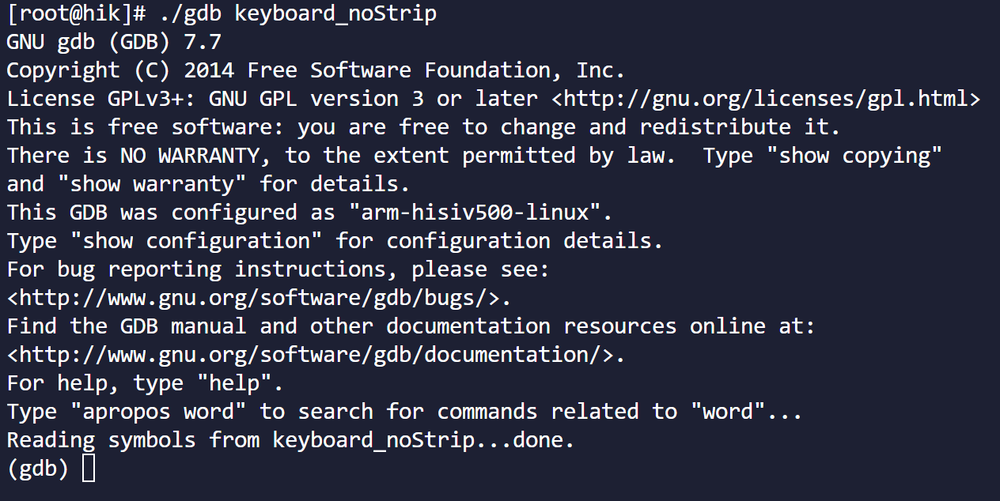
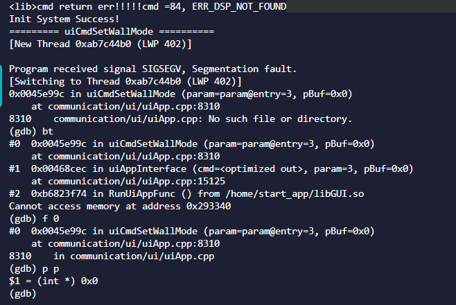

# GDB调试程序案例


## 1、适用场景

符合下列描述的场景适用于本方法：

1、无法生成coredump（受限于空间或者权限等）

2、偶现，因此加打印效率低，或者加打印无法确认原因

比如当前作者正在维护的控制键盘产品：由于文件系统剩余空间不足以放下几百兆的coredump，挂载的U盘目录又无法正常生成coredump文件

（能生成，但大小为0），当遇到一些比较诡异的问题时，希望能借助下GDB这样方便的工具。下文我们以控制键盘为例介绍下此方法。


## 2、基本思路

GDB不仅可以拿来**解析**coredump文件，触发方式如下：

```shell
./gdb 可执行程序（比如a.out） core dump文件
```

也可以拿来**调试**可执行程序，触发方式如下：

```shell
./gdb 可执行程序（比如a.out）
```

第一种方式进行解析时，只能查看到崩溃时的各项信息。而第二种方式进行调试时，可以打断点、单步调试等，功能更全，

关键的一点是：**调试时程序崩溃，也是能查看bt信息的**。

所以，我们要做的仅仅是：使用解析的方法，在设备开机时不要自动执行可执行文件，而是输入串口命令使用GDB调试可执行文件。

最后操作设备复现崩溃现象，就可以查看崩溃时的bt信息了。


## 3、准备工具

1、对应的GDB可执行文件

2、no Strip版本的可执行文件（带符号表内容）

3、tftp工具和串口工具


## 4、执行步骤

以控制键盘为例，操作步骤如下：

① 控制键盘开机后，BSP执行start.sh脚本，此脚本在执行一系列解压操作后，将启动需要的程序和库放到`/home/start_app`目录并最终启动可执行程序keyboard


```shell
#start.sh中启动可执行文件的语句
./keyboard&
```

所以我们需要将./keyboard& 注释掉，这样设备开机后就不会运行可执行文件keyboard

② 由于调试期间不能输入串口命令，所以无法关闭看门狗，需要修改程序，将看门狗默认设置为关。


③ 将上述修改后的程序烧入设备

④ 为设备设置IP，用tftp将gdb文件和no strip版本的keyboard文件导入设备，并赋予执行权限

```shell
cd /home/start_app
ifconfig eth0 10.12.99.111 netmask 255.255.255.0
tftp -gl gdb 10.12.99.170
tftp -gl keyboard_noStrip 10.12.99.170 -b 8192
chmod 777 gdb 
chmod 777 keyboard_noStrip
```

执行完后还需要为可执行程序指明各种依赖库所在的路径，也就是/home/start_app

```shell
export LD_LIBRARY_PATH=$LD_LIBRARY_PATH:/home/start_app
```

⑤ 执行调试

```shell
./gdb keyboard_noStrip
```

在下面的界面中，可以设置断点，然后输入`run` 启动程序，不需要的话直接输入`run`



```shell
#在函数入口处设置断点
break main  
#在指定行号处设置断点
break filename.c:123
#这将在文件 filename.c 的第123行设置一个条件断点，只有当 foo 等于 bar 时才会暂停。
break filename.c:123 if foo == bar
#查看断点
info break
#删除1号断点断点
delete 1 
#禁用1号断点
disable 1
#启用1号断点
enable 1
```

我们在下图的函数的8307~8309行写了测试代码（会在执行登录平台操作时触发），由于是一定会崩溃的代码，不加断点也无所谓，直接输入`run`


⑥ 上面操作后，键盘就正常启动了，我们执行登录平台操作，程序崩溃，可以通过bt命令查看崩溃前的信息



上面bt可以看到最终崩溃在uiApp.cpp的第8310行，切换到这一帧，打印p的值，可以发现是一个空指针。

这样也就能在不生成coredump的情况下查看崩溃时的堆栈信息了。


## 5、其他gdb调试命令


| 命令                                 | 作用                                                         |
| :----------------------------------- | :----------------------------------------------------------- |
| shell/exit                           | 在GDB与控制台间切换前后台                                    |
| gcore                                | 手动生成coredump文件                                         |
| gdb  <program> [core dump]           | 启动GDB（以及加载core dump）                                 |
| gdb  attach pid                      | 启动GDB并加载进程<pid>                                       |
| run (r)                              | 开始执行加载的程序                                           |
| detach                               | 取消与加载程序的连接                                         |
| x /nfu addr                          | 查看某个地址的值   n表示查看内存地址数量,默认为1,如果为负数,则查看前面地址的值   f表示显示格式,默认为x(16进制),支持的格式跟print一致   u表示单元大小,默认为w(4字节),可设置b(1字节) h(2字节) g(8字节) |
| Ctrl+d/quit(q)                       | 退出GDB调试                                                  |
| bt                                   | 查看当前线程的调用栈                                         |
| bt full                              | 查看详细的调用栈                                             |
| info threads                         | 查看所有线程的信息                                           |
| thread <num>                         | 跳转到某个线程                                               |
| frame <num>                          | 跳转到某个栈帧中位置                                         |
| set scheduler-locking  off\|on\|step | 单步调试时，其他线程是否执行。                               |
| c(ontinue)                           | 继续运行程序直到下一个断点                                   |
| n(ext)                               | 逐过程步进，不会进入子函数                                   |
| s(etp)                               | 逐语句步进，会进入子函数                                     |
| u(ntil)                              | 运行至当前语句块结束                                         |
| f(inish)                             | 运行至函数结束并跳出，并打印函数的返回值                     |
| return                               | 结束当前调用函数并返回指定值，到上一层函数调用处             |
| j(ump)                               | 将当前程序执行流跳转到指定行或地址                           |
| p(print) <what>                      | 打印变量或寄存器值                                           |
| display <what>                       | genzong查看变量或内存，每次中断后自动显示                    |
| b(reak) <where>                      | 添加断点                                                     |
| del(ete) <breakpoint#>               | 删除断点                                                     |
| enable <breakpoint#>                 | 启用某个断点                                                 |
| disable <breakpoint#>                | 禁用某个断点                                                 |
| watch <where>                        | genzong某个变量或内存地址值是否变化                          |
| l(ist)                               | 显示源码                                                     |
| dis(assemble)                        | 查看汇编代码                                                 |
| set solib-search-path + 库路径       | 在指定路径下搜索并关联库的符号表                             |
| i(nfo) display                       | 查看所有display信息                                          |
| i(nfo) sharedlibrary                 | 查看库的符号表链接情况                                       |
| i(nfo) r(egister)                    | 查看当前调用栈的寄存器值                                     |
| i(nfo) locals                        | 查看当前调用栈的所有变量                                     |
| i(nfo) breakpoints                   | 查看所有断点信息                                             |