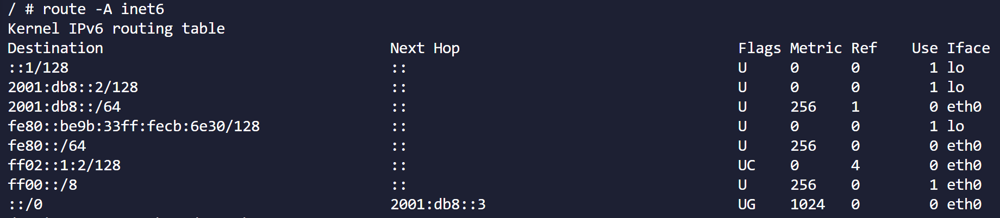
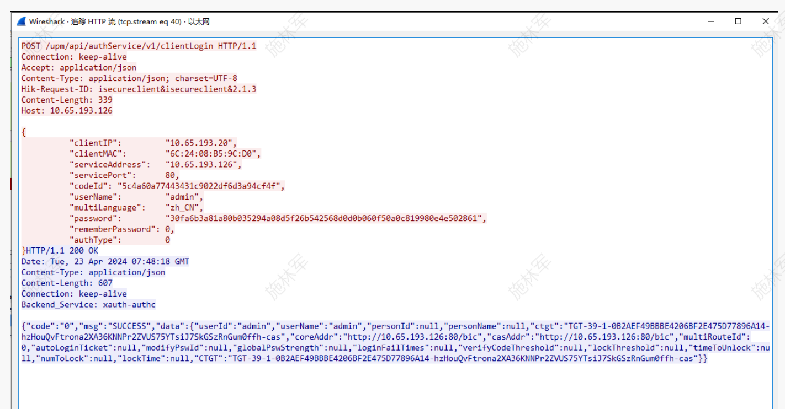
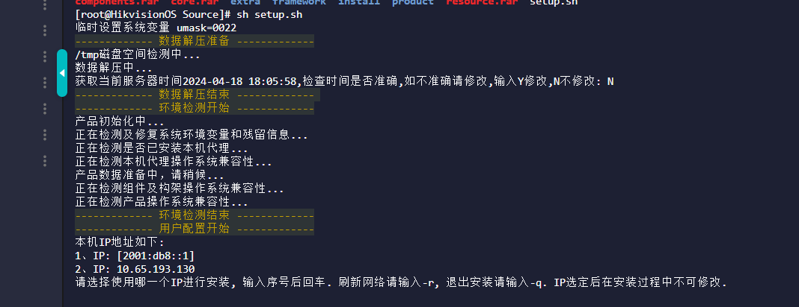
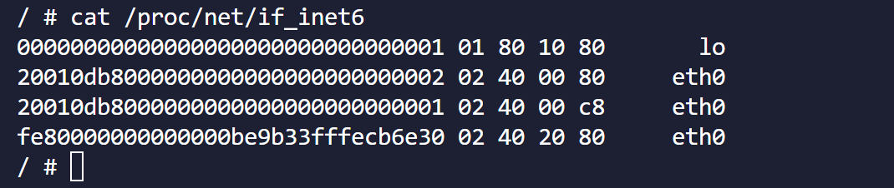

# 键盘支持IPv6介绍

## 1、背景

滁州市第二人民医院精神病院区智能化工程》需要实现网络环境和设备对IPv6的支持。现场部署有海康的球机、解码器、iSecure平台和1100K键盘，现场要求的方案是球机、解码器、平台和键盘均需要支持IPv6，控制方式为：球机和解码器通过IPv4或IPv6添加到iSecure平台上，键盘再通过IPv4或者IPv6登录平台并发送控制命令，实现对球机和解码器的控制。


## 2、 IPv6介绍

### IPv4和IPv6

网际协议版本4（英语：InternetProtocol**v**ersion4，IPv4），又称互联网[通信协议](https://baike.baidu.com/item/通信协议/3351624?fromModule=lemma_inlink)第四版，是[网际协议](https://baike.baidu.com/item/网际协议/4148798?fromModule=lemma_inlink)开发过程中的第四个修订版本，也是此协议第一个被广泛部署的版本。

IPv4使用32位（4字节）地址，因此[地址空间](https://baike.baidu.com/item/地址空间/1423980?fromModule=lemma_inlink)中只有4,294,967,296（2^32）个地址。不过，一些地址是为[特殊用途](https://baike.baidu.com/item/特殊用途/56289322?fromModule=lemma_inlink)所保留的，如[专用网络](https://baike.baidu.com/item/专用网络/795899?fromModule=lemma_inlink)（约1800万个地址）和[多播地址](https://baike.baidu.com/item/多播地址/1541494?fromModule=lemma_inlink)（约2.7亿个地址），这减少了可在互联网上路由的地址数量。IPv4的地址常用表达方式为：X.X.X.X，其中每个X为一个字节，也就是8位0/1，用10进制显示比如：192.168.123.254。

IPv6是英文“Internet Protocol Version 6”（互联网协议第6版）的缩写，是互联网工程任务组（[IETF](https://baike.baidu.com/item/IETF/2800318?fromModule=lemma_inlink)）设计的用于替代[IPv4](https://baike.baidu.com/item/IPv4/422599?fromModule=lemma_inlink)的下一代IP协议，其地址数量号称可以为全世界的每一粒沙子编上一个地址。


### IPv6 地址

#### 地址格式

IPv6的地址长度为128位，是IPv4地址长度的4倍。于是IPv4点分十进制格式不再适用，采用十六进制表示，常用的格式：X:X:X:X:X:X:X:X，其中每个X为2个字节，也就是16位0/1，用16进制展示，比如：2001:0DB8:0000:0023:0008:0800:200C:417A。

其中每个X的前导0是可以省略的，所以上面的地址可以简写为：2001:DB8:0:23:8:800:200C:417A。

如果有多段连续的X均为0，则可以把连续几段0简写为::，但::在地址中仅能出现一次，比如：

FF01:0:0:0:0:0:0:1101 → FF01::1101

0:0:0:0:0:0:0:1 → ::1

0:0:0:0:0:0:0:0 → ::


#### 地址类型

链路本地地址和全球单播地址：


上图中Scope:Link类型的地址就是链路本地地址，仅用于单个链路（链路层不能跨VLAN），不能在不同子网中路由。

上图中Scope:Global类型的地址就是全球单播地址，等同于IPv4中的公网地址，可以在IPv6 Internet上进行全局路由和访问。

需要注意的是：同一台设备可以有多个全球单播地址，这可能是因为设备有多个网络配置，每个配置使用不同的IPv6地址。**如果你希望设备仅有一个全球单播地址，在设置新的IPv6地址前，需要将原来的IPv6地址删除**。


###  IPv6 子网掩码

IPv6也通过子网掩码来定义子网的范围，上图中2001:db8::1/64中的/64就是这个IPv6地址的子网掩码。可以简单的理解为：如果另一个地址和2001:db8::1的前64位一样，则表示它们在同一个子网内，消息直接发给对方的IP，否则认为它们不在同一个子网，消息需要发给2001:db8::1对应的网关地址，由这个网关地址发给目标地址对应的网关地址，再由目标地址的网关地址发给目标地址。


### IPv6 网关

网关地址的作用如上图所示，在不同子网间的IP通信时使用，我们可以通过route -A inet6命令查看本设备的路由表，找到默认网关：



Destination : 目标地址的范围

Next Hop : 如果目标地址符合Destination指定的范围，则下一步走这个地址

上图可以理解为，当你拿到一个目标地址，则逐个和Destination下的地址范围(::/0除外)匹配，匹配到的话将消息发给那一行的Next Hop地址进行路由。如果Next Hop为"::",则表示不需要走路由，消息直接发给目标地址。如果均不匹配，则走::/0所指向的Next Hop地址，因此**::/0所指向的Next Hop地址也就是默认网关地址**。


## 3、IPv6信息的获取和设置

### 地址、子网掩码的获取

由于同一个设备可以有多个IPv6地址，因此在设置和获取IPv6信息时，地址和子网掩码都是一起操作的。不然的话，当你单独设置子网掩码时，就不知道是对哪个IPv6地址进行限定。

也由于同一个设备可以有多个IPv6地址，所以获取IPv6地址无法像IPv4地址那样使用ioctl直接获取到单一的地址，而是需要获取到一个地址列表。系统提供了[getifaddrs](https://blog.csdn.net/weixin_30706691/article/details/98294957)函数实现此功能。它会返回N个struct ifaddrs结构体，每个结构体均保存了本设备某个接口中的IP地址等信息。

我们需要从中找出想要的接口下的Global地址，需要注意的是，接口获取到的子网掩码并不是一个长度，而是X:X:X:X:X:X:X:X的IPv6地址，我们需要将它换算成长度方便显示。

```C++
/*************************************************
* Function:     GetIpV6
* Description:  获取IP
* Input:        maskLen：子网掩码长度
* Output:       ip：本机IPV6地址
* Return:       0/-1
*************************************************/
int GetIpV6(char *ip,int *maskLen)
{
    struct ifaddrs *ifaddr = NULL;  //保存网络接口地址列表
    struct ifaddrs *ifa = NULL;     //用于遍历ifaddr使用的指针
    int scop = -1;
    char ipv6Str[128],maskStr[128];

    //获取网络接口地址列表,返回N个ifaddrs链表的首地址，最后需要用freeifaddrs释放
    if(getifaddrs(&ifaddr) == -1)
    {
        perror("getifaddrs");
        return -1;
    }

    for(ifa = ifaddr; ifa != NULL ;ifa = ifa->ifa_next)
    {
        //只要eth0上的IPV6的地址信息
        if(ifa->ifa_addr == NULL || ifa->ifa_addr->sa_family != AF_INET6 || strcmp(s_ethName,ifa->ifa_name))
        {
            continue;
        }

        memset(ipv6Str,0,sizeof(ipv6Str));
        inet_ntop(AF_INET6,&((struct sockaddr_in6 *)ifa->ifa_addr)->sin6_addr,ipv6Str,46);
        scop = ((struct sockaddr_in6 *)ifa->ifa_addr)->sin6_scope_id;   //0-Global、回环 2 - LINK
        Debug(LEVEL_INFO, MOD, MOD_MISC, "name[%s] ipv6[%s] scop[%d] \n",ifa->ifa_name, ipv6Str, scop);

        //Global地址且非回环地址则找到了
        if(scop == 0 && strcmp(ipv6Str,"::1"))
        {
            sprintf(ip,"%s",ipv6Str);
            if(ifa->ifa_netmask)
            {
                memset(maskStr,0,sizeof(maskStr));
                inet_ntop(AF_INET6,&((struct sockaddr_in6 *)ifa->ifa_netmask)->sin6_addr,maskStr,46);

                //计算得到子网掩码长度
                int i=0;
                *maskLen = 0;
                while(maskStr[i] != 0)
                {
                    if(maskStr[i] != ':')
                    {
                        if(maskStr[i] == 'f') *maskLen += 4;        //1111
                        else if(maskStr[i] == 'e') *maskLen += 3;   //1110
                        else if(maskStr[i] == 'c') *maskLen += 2;   //1100
                        else if(maskStr[i] == '8') *maskLen += 1;   //1000
                    }
                    i++;
                }
                Debug(LEVEL_INFO, MOD, MOD_MISC, "final ipv6[%s] maskStr[%s] maskLen[%d]\n",ipv6Str, maskStr, *maskLen);
            }
            break;
        }

    }

    freeifaddrs(ifaddr);

    return 0;
}
```


### 地址、子网掩码的设置

上文已经说过，如果你希望设备仅有一个全球单播地址，在设置新的IPv6地址前，需要将原来的IPv6地址删除。因此我们在设置新的IPv6地址前，需要先获取当前的IPv6地址并将其删除，删除使用的是ip命令。然后再调用ioctl函数设置新的IPv6地址。

```c++
/*************************************************
* Function:     SetIpV6
* Description:  设置IPV6
* Input:        maskLen：子网掩码长度
* Output:       ip：IPV6地址
* Return:       0/-1
*************************************************/
int SetIpV6(char *ip,int maskLen)
{
    struct ifaddrs *ifaddr = NULL;  //保存网络接口地址列表
    struct ifaddrs *ifa = NULL;     //用于遍历ifaddr使用的指针
    int fd = -1,scop = -1,mask = 0;
    char ipv6Str[128],maskStr[128],delCmd[128];

    //获取网络接口地址列表,返回N个ifaddrs链表的首地址，最后需要用freeifaddrs释放
    if(getifaddrs(&ifaddr) == -1)
    {
        perror("getifaddrs");
        return -1;
    }

    //由于网卡可能存在多个IPV6 地址，需要先删除后再添加保持只有一个IPV6地址
    for(ifa = ifaddr; ifa != NULL ;ifa = ifa->ifa_next)
    {
        //只要对应网口上的IPV6的地址信息
        if(ifa->ifa_addr == NULL || ifa->ifa_addr->sa_family != AF_INET6 || strcmp(s_ethName,ifa->ifa_name))
        {
            continue;
        }

        memset(ipv6Str,0,sizeof(ipv6Str));
        inet_ntop(AF_INET6,&((struct sockaddr_in6 *)ifa->ifa_addr)->sin6_addr,ipv6Str,46);
        scop = ((struct sockaddr_in6 *)ifa->ifa_addr)->sin6_scope_id;   //0-Global、回环 2 - LINK
        Debug(LEVEL_INFO, MOD, MOD_MISC, "name[%s] ipv6[%s] scop[%d] \n",ifa->ifa_name, ipv6Str, scop);

        //Global地址且非回环地址则找到了
        if(scop == 0 && strcmp(ipv6Str,"::1"))
        {
            if(ifa->ifa_netmask)
            {
                memset(maskStr,0,sizeof(maskStr));
                inet_ntop(AF_INET6,&((struct sockaddr_in6 *)ifa->ifa_netmask)->sin6_addr,maskStr,46);   //获取到的maskStr是类似IPV6格式的地址，如ffff:ffe::0

                //计算得到子网掩码长度
                int i=0;
                mask = 0;
                while(maskStr[i] != 0)
                {
                    if(maskStr[i] != ':')
                    {
                        //4位从低到高逐个清零，为f、e、c、8、0
                        if(maskStr[i] == 'f' || maskStr[i] == 'F') mask += 4;           //1111
                        else if(maskStr[i] == 'e' || maskStr[i] == 'E') mask += 3;      //1110
                        else if(maskStr[i] == 'c' || maskStr[i] == 'C') mask += 2;      //1100
                        else if(maskStr[i] == '8') mask += 1;                           //1000
                    }
                    i++;
                }
                Debug(LEVEL_INFO, MOD, MOD_MISC, "final ipv6[%s] maskStr[%s] maskLen[%d]\n",ipv6Str, maskStr, mask);
            }
            //删除该地址
            sprintf(delCmd,"ip -6 addr del %s/%d dev %s",ipv6Str,mask,s_ethName);
            Debug(LEVEL_INFO, MOD, MOD_MISC, "delCmd : %s",delCmd);
            system(delCmd);
        }
    }

    //用于配置IPV6地址和子网前缀长度
    typedef struct
    {
        struct in6_addr addr6;
        unsigned int ifr6_maskLen;
        unsigned int ifr6_ifindex;
    }in6_ifreq;
    in6_ifreq ifrIp6;
    struct sockaddr_in6 addr6;

    ifrIp6.ifr6_ifindex = if_nametoindex(s_ethName);    //获取网口名称对应的索引
    if(!ifrIp6.ifr6_ifindex)    //索引为0表示寻找的网口不存在
        goto exit;

    ifrIp6.ifr6_maskLen = maskLen;
    inet_pton(AF_INET6, ip, &(addr6.sin6_addr));
    memcpy(&ifrIp6.addr6,&addr6.sin6_addr,sizeof(struct in6_addr));

    fd = socket(AF_INET6,SOCK_STREAM,0);
    if(fd < 0)
    {
        perror("socket");
        goto exit;
    }

    if(ioctl(fd,SIOCSIFADDR,&ifrIp6)<0)
    {
        perror("SIOCSIFADDR");
        goto exit;
    }

exit:
    freeifaddrs(ifaddr);
    if(fd > 0)
    {
        close(fd);
        fd = -1;
    }

    return 0;
}
```


### 网关的获取

默认网关可以使用读取IPv6路由表的方式获取

```c++
/*************************************************
* Function:     GetGatewayV6
* Description:  获取网关
* Input:
* Output:       ip：网关
* Return:       0/-1
*************************************************/
int GetGatewayV6(char *ip)
{
    char cmd[128];
    char cmdRes[64];
    int ret = 0;
    int tmpLen = 0;

    if(ip == NULL)
    {
        return -1;
    }

    memset(cmd, 0, sizeof(cmd));
    memset(cmdRes, 0, sizeof(cmdRes));
    memset(ip, 0, 64);

    snprintf(cmd, sizeof(cmd), "route -A inet6 | grep %s | awk '/::\\/0/ && !/lo/ {print $2}'", s_ethName);
    ret = systemWithRes(cmd, cmdRes, sizeof(cmdRes));
    if(ret != 0)
    {
        Debug(LEVEL_ERR, MOD, MOD_MISC, "get if[%s] gatewayv6 failed\n",s_ethName);
        return -1;
    }
    if(cmdRes[0] == '\0')
    {
        Debug(LEVEL_ERR, MOD, MOD_MISC, "get if[%s] gatewayv6[%s]\n",s_ethName,cmdRes);
        return -1;
    }

    // 去除运行结果中的换行符
    tmpLen = strlen(cmdRes);
    if(cmdRes[tmpLen - 1] == '\n')
    {
        cmdRes[tmpLen - 1] = '\0';
    }
    Debug(LEVEL_DBG, MOD, MOD_MISC, "get if[%s] gatewayv6[%s]\n",s_ethName,cmdRes);

    memcpy(ip, cmdRes, sizeof(cmdRes));

    return 0;
}
```

route -A inet6 | grep %s | awk '/::\\/0/ && !/lo/ {print $2} 的意思是执行route -A inet6命令，找到带s_ethName字符串的那一行，如果该行包含"::/0"且不包含"lo"，则打印它的第二列的内容，也就是Next Hop的值。


### 网关的设置

IPv6的网关设置没有找到比较好的方法，最终是使用ip命令实现的，需要注意的是：**在设置新的IPv6网关前，也需要先删除原先的IPv6网关，否则会设置失败**。

```c++
/*************************************************
* Function:     SetGatewayV6
* Description:  设置IPV6网关
* Input:        ip：网关地址
* Output:       N/A
* Return:       -1/0
*************************************************/
int SetGatewayV6(char *ip)
{
    char cmd[128] = "";
    
    system("ip -6 route del default");                      //删除默认网关
    sprintf(cmd, "ip -6 route add default via %s",ip);      //设置新的网关
    system(cmd);
    return 0;
}
```


## 4、其他代码的修改

界面的修改主要如下：

1、在网络界面新增一个tab页，用于展示IPv6地址

2、输入法新增一种输入模式，该模式下只能输入数字、大小写的abcdef、"."和":"。

3、iSecure平台登录界面需要能输入IPv6地址并校验合法性。

其他代码做了如下修改：

1、交互报文中的IPv6地址需要加上[]，下面分别是IPv4下和IPv6下正确的报文格式：




2、Http和Rtsp组件中的解析url的函数parseUrl需要适配IPv6。

parseUrl函数用于解析url中的IP和端口。由于原先IPv4下的url内容固定为IPv4:port，解析时直接寻找":"的位置，前后分别为IP和端口，现在有了IPv6，格式可能是[IPv6]:port，由于IPv6中必定存在":"，按原先的方法会导致解析错误。下面是修改后parseUrl中解析IP和端口的部分:

```c++
int CHttpSession::parseMark(char* pStart,int len,char* pMarks,char* pDst1,char* pDst2)
{
    bool bSecond = false;
    bool bBreakLoop = false;
    int i,j,k,colonNum,colonIdx;  //冒号的个数和最后一个的位置
    char ch;
    int markLen = (int)strlen(pMarks);

    if (pStart == NULL || len == 0 || pMarks == NULL || pDst1 == NULL)
    {
        return -1;
    }

    colonNum = colonIdx = 0;
    for (i=0;i<len;i++)
    {
        ch = pStart[i];

        //找到最靠后的冒号
        if (ch == ':')
        {
            colonNum++;
            colonIdx = i;
        }

        for (j=0; j<markLen; j++)
        {
            if (ch == pMarks[j])    //本段解析结束，整理数据
            {
                if(m_bHttp)   //http模式下填端口，需要将pDst1中的端口内容剥离出来
                {
                    memset(pDst1+colonIdx,0,i-colonIdx);
                    i = colonIdx;
                    bSecond = 1;
                }
                else          //https模式下不填端口，取到的数据全给pDst1
                {
                    bSecond = 0;
                }
                bBreakLoop = true;
                break;
            }
        }

        if(bBreakLoop)
        {
            break;
        }

        pDst1[i] = ch;
    }

    if (bSecond)
    {
        i++;//特殊字符向前跳一个
        bBreakLoop = false;

        for (k=0; i<len; i++,k++)
        {
            ch = pStart[i];
            for (j=0; j<markLen; j++)
            {
                if (ch == pMarks[j])
                {
                    bBreakLoop = true;
                }
            }

            if (bBreakLoop)
            {
                break;
            }
            else
            {
                if (pDst2 != NULL)  //错误保护,默认不传pDst2参数的,所以这里必须保证pDst2存在,才能做相应操作,否则不能这样处理.
                {
                    pDst2[k] = ch;
                }
            }
        }
    }

    return 0;
}
```

3、Http和Rtsp组件中连接接口connectServer需要适配IPv6。

传到connectServer函数的IPv6地址还带着[]外壳，需要剥离，并且此函数socket连接只适配IPv4，需要增加对IPv6的支持，下面是修改后的代码。

```c++
int CHttpSession::connectServer(char* pHost, int port, int timeOut)
{
    int ret = -1,bIpv6 = 0,sockSize=0;
    struct sockaddr_in6 devAddr6;
    struct sockaddr_in devAddr;
    char host[128]="";
    printf("========= connectServer ip:%s ==========\n",pHost);

    //iPv6地址外面套着一个[]，需要把它剥掉
    unsigned int i=0,j=0;
    for(i=0;i<strlen(pHost);i++)
    {
        if(pHost[i]!='[' && pHost[i]!=']')
        {
            host[j]=pHost[i];
            j++;
        }
    }

    if(inet_pton(AF_INET6,host,&(devAddr6.sin6_addr)) > 0)
    {
        //IPV6地址
        bIpv6 = 1;
        devAddr6.sin6_family = AF_INET6;
        devAddr6.sin6_port = htons(port);
        sockSize = sizeof(devAddr6);
    }
    else if(inet_pton(AF_INET,host,&(devAddr.sin_addr)) > 0)
    {
        //IPV4地址
        bIpv6 = 0;
        devAddr.sin_family=AF_INET;
        devAddr.sin_port=htons(port);
        sockSize = sizeof(devAddr);
    }
    else
    {
        return -1;
    }

    if((m_sockFd=socket(bIpv6?AF_INET6:AF_INET,SOCK_STREAM,IPPROTO_TCP))==-1)
    {
        return -1;
    }

    struct timeval tv={5,0};
    if(bIpv6)
        ret = ConnectTimeout(m_sockFd, (struct sockaddr*)&devAddr6, sockSize, &tv, 0);
    else
        ret = ConnectTimeout(m_sockFd, (struct sockaddr*)&devAddr, sockSize, &tv, 0);

    if (ret < 0)
    {
        close(m_sockFd);
        m_sockFd = -1;
        return -1;
    }

    //https连接的时候进行ssl的初始化
    if (!m_bHttp)
    {
        m_ssl = sslInit(m_sockFd);
        if (m_ssl)
        {
            ret = SSL_connect(m_ssl);
            if(ret != 1)
                return -1;
        }
        else
            return -1;
    }


    return 0;
}
```


## 5、测试环境搭建

由于公司的蓝网不支持IPv6路由，所以我们测试的时候只能让平台和键盘处在同一个子网内。这就要求键盘和平台服务器要连在一个交换机上，并且双方的IPv6设置需要指向同一个子网范围。

同时，平台需要以IPv6的方式安装，平台安装方法可以参考《iSecure Center综合安防管理平台 安装部署手册 V2.0.0.pdf》，这份文档没有区分IPv4和IPv6，我们需要做的是：

① 通过串口给平台服务器设置一个IPv6地址

② 按文档进行平台安装，会出现如下的界面，选择IPv6地址进行安装




## 6、IPv6相关命令

实际上设置、获取IPv6的各项参数均可以通过串口命令实现，以下是一些常用的命令：

设置IPV6地址

`ip -6 addr add 2001:db8::1/64 dev eth0`

删除IPV6地址

`ip -6 addr del 2001:db8::1/64 dev eth0`

获取本机IPv6地址

`cat /proc/net/if_inet6`



获取默认网关命令

`ip -6 route show default`


删除默认网关

`ip -6 route del default`

设置默认网关

`ip -6 route add default via 123:456::1`
