# 第一章：认识QT

**MinGW**是 Minimalist GNU for Windows的缩写，MinGW是 Windows平台上使用的GNU工具集导入库的集合。


- Qt Widgets Application，支持桌面平台的有图形 用户界面（Graphic User Interface，GUI）界面 的应用程序。GUI的设计完全基于C++语言，采用Qt 提供的一套C++类库。

- Qt Console Application，控制台应用程序，无 GUI界面，一般用于学习C/C++语言，只需要简单的 输入输出操作时可创建此类项目。 Qt Quick Application，创建可部署的Qt Quick 2 应用程序。

- Qt Quick是Qt支持的一套GUI开发架 构，其界面设计采用QML语言，程序架构采用C++语 言。利用Qt Quick可以设计非常炫的用户界面，一 般用于移动设备或嵌入式设备上无边框的应用程序 的设计。 

- Qt Quick Controls 2 Application，创建基于Qt Quick Controls 2组件的可部署的Qt Quick 2应用 程序。Qt Quick Controls 2组件只有Qt 5.7及以 后版本才有。 

- Qt Canvas 3D Application，创建Qt Canvas 3D QML项目，也是基于QML语言的界面设计，支持3D画布。

  

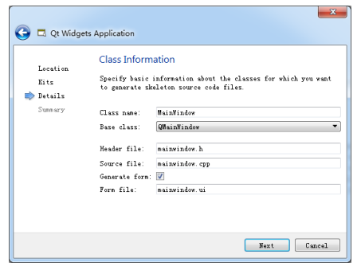

- QMainWindow是主窗口类，主窗口具有主菜单栏、 工具栏和状态栏，类似于一般的应用程序的主窗 口； 
- QWidget是所有具有可视界面类的基类，选择 QWidget创建的界面对各种界面组件都可以支持； 
- QDialog是对话框类，可建立一个基于对话框的界面。


- samp1_1.pro是项目管理文件，包括一些对项目的设置项。 
- Headers分组，该节点下是项目内的所有头文件 （.h），图1-9中所示项目有一个头文件 mainwindow.h，是主窗口类的头文件。 
- Sources分组：该节点下是项目内的所有C++源文件 （.cpp），图1-9中所示项目有两个C++源文件， mainwindow.cpp是主窗口类的实现文件，与 mainwindow.h文件对应。main.cpp是主函数文件， 也是应用程序的入口。
-  Forms分组：该节点下是项目内的所有界面文件 （.ui）。图1-9中所示项目有一个界面文件 mainwindow.ui，是主窗口的界面文件。界面文件 是文本文件，使用XML语言描述界面的组成。


# 第2章：GUI应用程序设计基础


## 2.1 UI文件设计与运行机制

.pro文件的内容

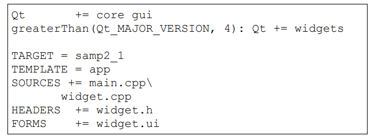

- 第一行 “Qt += core gui” 表示项目中加入core gui模 块。core gui是Qt用于GUI设计的类库模块，如果创建 的是控制台（Console）应用程序，就不需要添加core gui。

   Qt类库以模块的形式组织各种功能的类，根据项 目涉及的功能需求，在项目中添加适当的类库模块支 持。例如，如果项目中使用到了涉及数据库操作的类 就需要用到sql模块，在pro文件中需要增加如下一 行：

```c++
Qt +=sql
```

- 第二行是个条件执行语句，表示当Qt主版本大于4时， 才加入widgets模块。
- “TARGET = samp2_1”表示生成的目标可执行文 件的名称，即编译后生成的可执行文件是 samp2_1.exe。
- “TEMPLATE = app”表示项目使用的模板是app， 是一般的应用程序。 
- 后面的SOURCES、HEADERS、FORMS 记录了项目中 包含的源程序文件、头文件和窗体文件（.ui文件）的 名称。这些文件列表是Qt Creator自动添加到项目管 理文件里面的，用户不需要手动修改。当添加一个文 件到项目，或从项目里删除一个文件时，项目管理文 件里的条目会自动修改。

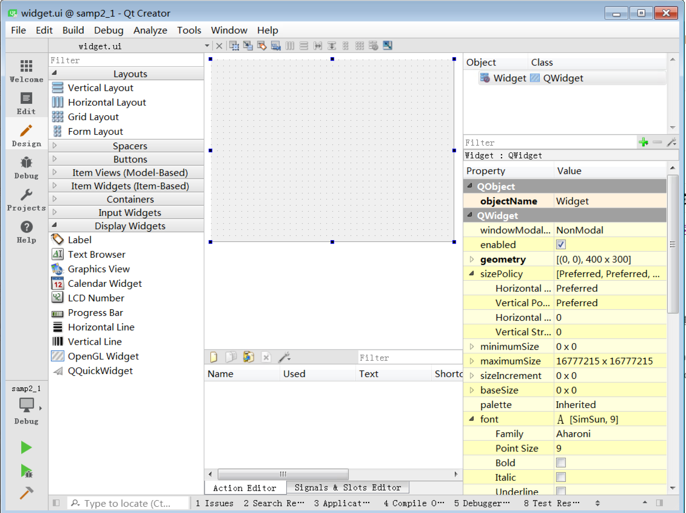

- 组件面板。窗口左侧是界面设计组件面板，分为多 个组，如Layouts、Buttons、Display Widgets等， 界面设计的常见组件都可以在组件面板里找到。 
- 中间主要区域是待设计的窗体。如果要将某个组件 放置到窗体上时，从组件面板上拖放一个组件到窗 体上即可。例如，先放一个Label和一个Push Button到窗体上。 
- Signals和Slots 编辑器与Action编辑器是位于待设 计窗体下方的两个编辑器。Signals和Slots 编辑器 用于可视化地进行信号与槽的关联，Action编辑器 用于可视化设计Action。
- 布局和界面设计工具栏。窗口上方的一个工具栏， 工具栏上的按钮主要实现布局和界面设计。 
- 对象浏览器（Object Inspector）。窗口右上方是 Object Inspector，用树状视图显示窗体上各组件 之间的布局包含关系，视图有两列，显示每个组件 的对象名称（ObjectName）和类名称。
- 属性编辑器（Property Editor）。窗口右下方是属 性编辑器，是界面设计时最常用到的编辑器。属性 编辑器显示某个选中的组件或窗体的各种属性及其 取值，可以在属性编辑器里修改这些属性的值


属性编辑器的内容分为两列， Property列是属性的名称，Value列是属性的值。属性又分为多个组，实际上表示了类的继承关系，如图，可以看出QLabel的继承关系是 QObject→QWidget→QFrame→QLabel。


objectName表示组件的对象名称，界面上的每个组 件都需要一个唯一的对象名称，以便被引用。界面上的 组件的命名应该遵循一定的法则，具体使用什么样的命 名法则根据个人习惯而定，主要目的是便于区分和记 忆，也要便于与普通变量相区分。

所以虽然上图中的`Label`和`PushButton`的默认`objectName`是`Label`和`pushButton`，但是我们应该把他们改成像`labelDemo`、`btnClose`这样一眼看了就知道指的是谁的名字，这样后面使用时会比较方便

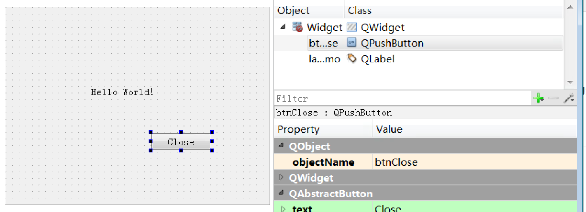

下面我们为btnClose按钮增加一个功 能，就是单击此按钮时，关闭窗口，退出程序。使用 Signals和Slots 编辑器完成这个功能

这样设置表示当按钮btnClose被单击时，就 执行Widget的close()函数，实现关闭窗口的功能。

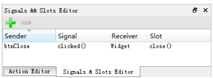


**main.cpp**

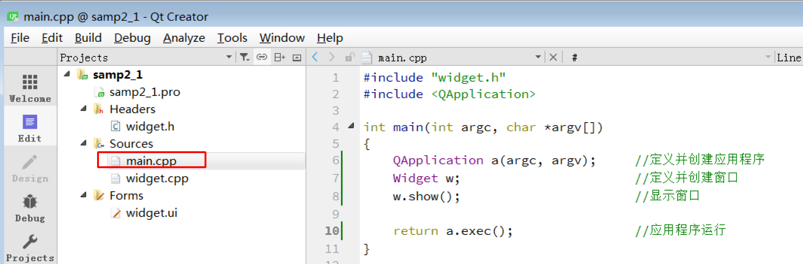


**widget.h文件**


**widget.cpp文件**


其中5~6行是构造函数的初始化列表，初始化列表中的代码在构造函数体之前执行，参考链接：

[C++中的初始化列表 - 青山牧云人 - 博客园 (cnblogs.com)](https://www.cnblogs.com/ArsenalfanInECNU/p/18080526)


**ui_widget.h文件**

ui_widget.h是在对widget.ui文件编译后生成的一 个文件，ui_widget.h会出现在编译后的目录下，或与 widget.ui同目录

ui_widget.h是对widget.ui文件编译后自动 生成的，widget.ui又是通过UI设计器可视化设计 生成的。

所以，对ui_widget.h手工进行修改没有 什么意义，所有涉及界面的修改都应该直接在UI 设计器里进行。**所以，ui_widget.h也没有必要添加到项目里**。


## 2.2 可视化UI设计

在界面设计时，对需要访问的组件修改其 objectName，如各个按钮、需要读取输入的编辑框、 需要显示结果的标签等，以便在程序里区分。

对于不 需要程序访问的组件则无需修改其objectName，如用 于界面上组件分组的GroupBox、Frame、布局等，让UI 设计器自动命名即可。

窗体的objectName就是窗体的类名称，在UI 设计器里不要修改窗体的objectName，窗体的实例名 称需要在使用窗体的代码里去定义。

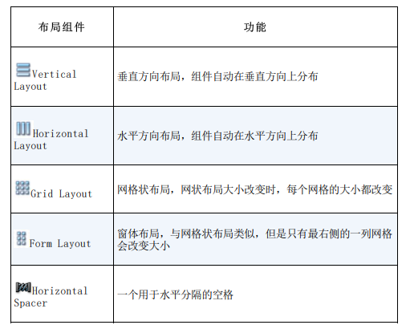


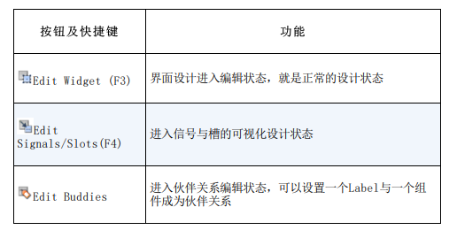


伙伴关系（Buddy）是指界面上一个Label和一个 组件相关联

伙伴关系是为了在程序运行时，在窗体上用快捷 键快速将输入焦点切换到某个组件上。

例如，在图2-9 的界面上，设定“姓名”标签的Text属性为“姓名 (&N)” ，其中符号“&”用来指定快捷字符，界面上并 不显示“&” ，这里指定快捷字母为N。那么程序运行 时，用户按下Alt+N，输入焦点就会快速切换到“姓 名”关联的输入框内。


在UI设计器工具栏上单击“Edit Tab Order”按钮进入Tab顺序编辑状态。Tab顺序是指在程序运行时，按下键盘上的Tab键时输入焦点的 移动顺序。


**信号和槽**

- 信号（Signal）就是在特定情况下被发射的事件，GUI程序设计的主要内容就是对界面上各组件的信 号的响应，只需要知道什么情况下发射哪些信号，合理地去响应和处理这些信号就可以了。
- 槽（Slot）就是对信号响应的函数。槽就是一个 函数，与一般的C++函数是一样的，可以定义在类的任 何部分（public、private或protected），可以具有任何参数，也可以被直接调用。槽函数与一般的函数不同的是：槽函数可以与一个信号关联，当信号被发 射时，关联的槽函数被自动执行。

信号与槽关联是用QObject::connect()函数实现 的，其基本格式是：

```c++
QObject::connect(sender, SIGNAL(signal()),receiver, SLOT(slot()));
```

connect()是QObject类的一个静态函数，而 QObject是所有Qt类的基类，在实际调用时可以忽略前 面的限定符，所以可以直接写为：

```c++
connect(sender, SIGNAL(signal()), receiver,SLOT(slot()));
```

其中，sender是发射信号的对象的名称， signal()是信号名称。信号可以看做是特殊的函数， 需要带括号，有参数时还需要指明参数。receiver是 接收信号的对象名称，slot()是槽函数的名称，需要带括号，有参数时还需要指明参数。

SIGNAL和SLOT是Qt的宏，用于指明信号和槽，并 将它们的参数转换为相应的字符串。


关于信号与槽的使用，有以下一些规则需要注意。

**1、一个信号可以连接多个槽**

```c++
connect(spinNum, SIGNAL(valueChanged(int)), this,SLOT(addFun(int));
connect(spinNum, SIGNAL(valueChanged(int)), this,SLOT(updateStatus(int));
```

这是当一个对象spinNum的数值发生变化时，所在 窗体有两个槽进行响应，一个addFun()用于计算，一 个updateStatus()用于更新状态。

当一个信号与多个槽函数关联时，槽函数按照建 立连接时的顺序依次执行。

当信号和槽函数带有参数时，在connect()函数 里，要写明参数的类型，但可以不写参数名称。


**2、多个信号可以连接同一个槽**


**3、一个信号可以连接另一个信号**

```c++
connect(spinNum, SIGNAL(valueChanged(int)), this,SIGNAL (refreshInfo(int));
```

这样，当一个信号发射时，也会发射另外一个信 号，实现某些特殊的功能。


**4、严格的情况下，信号与槽的参数个数和类型 需要一致，至少信号的参数不能少于槽的参数。如果不匹配，会出现编译错误或运行错误。**


**5、在使用信号与槽的类中，必须在类的定义中 加入宏Q_OBJECT。**


**6、当一个信号被发射时，与其关联的槽函数通 常被立即执行，就像正常调用一个函数一样。只有当 信号关联的所有槽函数执行完毕后，才会执行发射信 号处后面的代码。**


窗体在设计模式下，选中chkBoxUnder组件，单击 右键调出其快捷菜单。在快捷菜单中单击菜单项“Go to slot…”


信号clicked(bool)会将CheckBox组件当前的选择 状态作为一个参数传递，在响应代码里可以直接利用这 个传递的参数。

而如果用信号clicked()，则需要在代码里读取CheckBox组件的选中状态。


选择clicked(bool)，然后单击“OK”按钮，在 QWDialog的类定义中，会在private slots部分自动增 加一个槽函数声明，

函数名是根据发射对象及其信号名 称自动命名的

void on_chkBoxUnder_clicked(bool checked);


**Action**

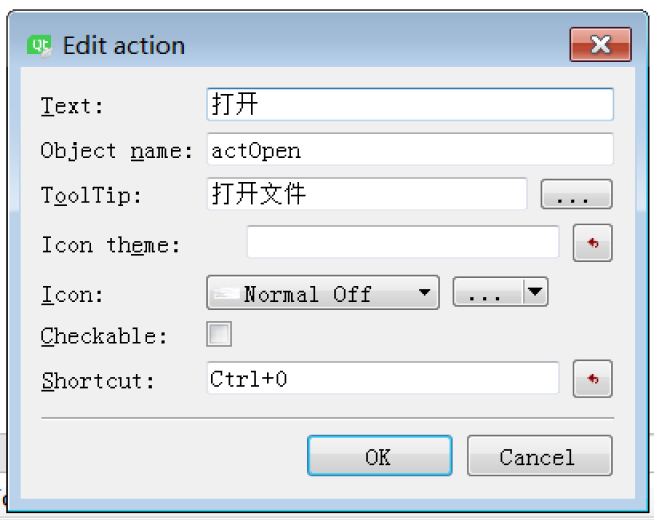

- Text：Action的显示文字，该文字会作为菜单标题 或工具栏按钮标题显示。若该标题后面有省略号， 如“打开…” ，则在工具栏按钮上显示时会自动忽 略省略号，只显示“打开”。 
- Object name：该Action的objectName。应该遵循 自己的命名法则，如以“act”开头表示这是一个 Action。图2-19中显示的是打开文件的Action，命名为actOpen。如果一个界面上Action比较多，还 可以分组命名，如actFileOpen、actFileNew和 actFileSave表示“文件”组，而actEditCut、 actEditCopy、actEditPaste等表示“编辑”组。 
- ToolTip：这个文字内容是当鼠标在一个菜单项或 工具栏按钮上短暂停留时出现的提示文字。 Icon：设置Action的图标，单击其右侧的按钮可以 从资源文件里选择图标，或者直接选择图片文件作 为图标。 
- Checkable：设置Action是否可以被复选，如果选中此选项，那么该Action就类似于QCheckbox可以改变其复选状态。 
- Shortcut：设置快捷键，将输入光标移动到 Shortcut旁边的编辑框里，然后按下想要设置的快 捷键即可，如“Ctrl+O”。


- copyAvailable(bool) 信号在有内容可以被复制时发射，并且传递了一个布尔参数，可以利用此信号 来改变actCut，actCopy的enabled属性。 
- selectionChanged() 信号在选择的文字发生变化时发射，利用此信号，可以读取当前文字的格式，从而更新粗体、斜体和下划线3种字体设置Action的 checked属性。


**快捷键**

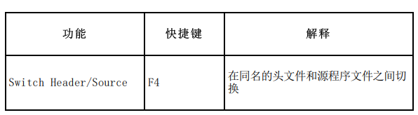


# 第3章：QT类库概述


## 3.1 QT核心特点

**元对象系统**

Qt的元对象系统（Meta-Object System）提供了 对象之间通信的信号与槽机制、运行时类型信息和动态属性系统。

元对象系统由以下三个基础组成。 

1. QObject类是所有使用元对象系统的类的基类。 
2. 在一个类的private部分声明Q_OBJECT宏，使得类 可以使用元对象的特性，如动态属性、信号与槽。 
3. MOC（元对象编译器）为每个QObject的子类提供必要的代码来实现元对象系统的特性。

除了信号与槽机制外，元对象还提供如下一些功能。

1、QObject::metaObject()函数返回类关联的元对 象，元对象类QMetaObject包含了访问元对象的一 些接口函数，例如QMetaObject::className()函数 可在运行时返回类的名称字符串。

```c++
QObject *obj = new QPushButton;
obj->metaObject()->className(); // 返回
"QPushButton"
```

2、QMetaObject::newInstance()函数创建类的一个新的实例。

3、QObject::inherits(const char *className)函数 判断一个对象实例是否是名称为className的类或 QObject的子类的实例。例如：

```c++
QTimer *timer = new QTimer; // QTimer 是QObject的子类
timer->inherits("QTimer"); // 返回 true
timer->inherits("QObject"); // 返回 true
timer->inherits("QAbstractButton");//返回 false，不是QAbstractButton的子类
```

4、QObject::tr()和QObject::trUtf8()函数可翻译字 符串，用于多语言界面设计，在第16章会专门介绍 多语言界面设计。

5、QObject::setProperty()和QObject::property() 函数用于通过属性名称动态设置和获取属性值。


**属性系统**

定义：

Qt提供一个Q_PROPERTY()宏可以定义属性，它也 是基于元对象系统实现的。

Qt的属性系统与C++编译器 无关，可以用任何标准的C++编译器编译定义了属性的 Qt C++程序。


在QObject的子类中，用宏Q_PROPERTY()定义属 性，其使用格式如下：

```c++
Q_PROPERTY(type name (READ getFunction [WRITE setFunction] | MEMBER memberName [(READ getFunction| WRITE setFunction)])
        [RESET resetFunction]
        [NOTIFY notifySignal]
        [REVISION int]
        [DESIGNABLE bool]
        [SCRIPTABLE bool]
        [STORED bool]
        [USER bool]
        [CONSTANT]
        [FINAL] )

```

Q_PROPERTY宏定义一个返回值类型为type，名称 为name的属性，用READ、WRITE关键字定义属性的读 取、写入函数，还有其他的一些关键字定义属性的一 些操作特性。属性的类型可以是QVariant支持的任何 类型，也可以用户自定义类型。

- READ指定一个读取属性值的函数，没有MEMBER关键字时必须设置READ。 
- WRITE指定一个设定属性值的函数，只读属性没有 WRITE设置。 
- MEMBER指定一个成员变量与属性关联，成为可读可写的属性，无需再设置READ和WRITE。 
- RESET是可选的，用于指定一个设置属性缺省值的 函数。 
- NOTIFY是可选的，用于设置一个信号，当属性值变 化时发射此信号。 
- DESIGNABLE表示属性是否在Qt Designer里可见， 缺省为true。 
- CONSTANT表示属性值是一个常数，对于一个对象实 例，READ指定的函数返回值是常数，但是每个实例 的返回值可以不一样。具有CONSTANT关键字的属性 不能有WRITE和NOTIFY关键字。
- FINAL表示所定义的属性不能被子类重载。

QWidget类定义属性的一些例子如下：

```c++
Q_PROPERTY(bool focus READ hasFocus)
Q_PROPERTY(bool enabled READ isEnabled WRITE setEnabled)
Q_PROPERTY(QCursor cursor READ cursor WRITE setCursor RESET unsetCursor)
```


**属性的使用**

不管是否用READ和WRITE定义了接口函数，只要知 道属性名称，就可以通过QObject::property()读取属性值，并通过QObject::setProperty()设置属性值。 例如：

```c++
QPushButton *button = new QPushButton;
QObject *object = button;
object->setProperty("flat", true);
bool isFlat= object->property("flat");
```


**动态属性**

QObject::setProperty()函数可以在运行时为类定义一个新的属性，称之为动态属性。动态属性是针对类的实例定义的。

动态属性可以使用QObject::property()查询，就 如在类定义里用Q_PROPERTY宏定义的属性一样。

例如，在数据表编辑界面上，一些字段是必填字 段，就可以在初始化界面时为这些字段的关联显示组 件定义一个新的required属性，并设置值为 “true” ，如：

```c++
editName->setProperty("required", "true");
comboSex-> setProperty("required", "true");
checkAgree-> setProperty("required", "true");
```


**类的附加信息**

属性系统还有一个宏Q_CLASSINFO()，可以为类的元对象定义“名称——值”信息，如：

```c++
class QMyClass : public QObject
{
    Q_OBJECT
    Q_CLASSINFO("author", "Wang")
    Q_CLASSINFO("company", "UPC")
    Q_CLASSINFO("version ", "3.0.1")
public:
    ...
};
```

用Q_CLASSINFO()宏定义附加类信息后，可以通过 元对象的一些函数获取类的附加信息，如 classInfo(int )获取某个附加信息，函数原型定义如下：

```c++
QMetaClassInfo QMetaObject::classInfo(int index) const
```

返回值是QMetaClassInfo类型，有name()和 value()两个函数，可获得类附加信息的名称和值


**信号与槽**

**connect()函数的不同参数形式**

```c++
QMetaObject::Connection QObject::connect(const QObject *sender, const char *signal, constQObject *receiver, const char *method,
									  Qt::ConnectionType type = Qt::AutoConnection);
```

使用这种参数形式的connect()进行信号与槽函数 的连接时，一般句法如下：

```c++
connect(sender, SIGNAL(signal()), receiver,SLOT(slot()));
```

这里使用了宏SIGNAL()和SLOT()指定信号和槽函 数，而且如果信号和槽函数带有参数，还需注明参数类型，如：

```c++
connect(spinNum, SIGNAL(valueChanged (int)),this, SLOT(updateStatus(int));
```


另外一种参数形式的connect()函数的原型是：

```c++
QMetaObject::Connection QObject::connect(const QObject *sender, const QMetaMethod &signal, const QObject *receiver, 
									 const QMetaMethod &method,Qt::ConnectionType type = Qt::AutoConnection);
```

对于具有默认参数的信号与槽（即信号名称是唯一的，没有参数不同而同名的两个信号），可以使用这种函数指针形式进行关联，如：

```c++
connect(lineEdit, &QLineEdit::textChanged, this,&widget::on_textChanged);
```

QLineEdit只有一个信号textChanged(QString), 在自定义窗体类widget里定义一个槽函数 on_textChanged(QString)，就可以用上面的语句将此 信号与槽关联起来，无需出现函数参数。这在信号的 参数比较多时更简便一些。


不管是哪种参数形式的connect()函数，最后都有 一个参数Qt::ConnectionType type，缺省值为 Qt::AutoConnection。

枚举类型Qt::ConnectionType 表示了信号与槽之间的关联方式，有以下几种取值。

| 值                           | 含义                                                         |
| ---------------------------- | ------------------------------------------------------------ |
| Qt::AutoConnection（缺省值） | 如果信号的接收者与发射者在同一个线程，就使用Qt::DirectConnection方式；否则使用Qt::QueuedConnection 方式，在信号发射时自动确定关联方式。 |
| Qt::DirectConnection         | 信号被发射时槽函数立即执行，槽函数与信号在同一个线程。       |
| Qt::QueuedConnection         | 在事件循环回到接收者线程后执行槽函数，槽函数与信号在不同的线程。 |
| Qt::BlockingQueuedConnection | 与 Qt::QueuedConnection相似，只是信号线程会阻塞直到槽函数执行完毕。当信号与槽函数在同一个线程时绝对不能使用这种方式，否则会造成死锁。 |


**使用sender()获得信号发射者**

在槽函数里，使用QObject::sender()可以获取信 号发射者的指针。如果知道信号发射者的类型，可以 将指针投射为确定的类型，然后使用这个确定类的接口函数

例如，在QSpinBox的valueChanged(int )信号的 槽函数里，可以通过sender() 和qobject_cast获得信 号发射者的指针，从而对信号发射者进行操作。

```c++
QSpinBox *spinBox = qobject_cast<QSpinBox *> (sender());
```


**自定义信号及其使用**

在自己设计的类里也可以自定义信号，信号就是 在类定义里声明的一个函数，但是这个函数无需实 现，只需发射（emit）。 

例如，在下面的自定义类QPerson的signals部分 定义一个信号ageChanged(int )。

```c++
class QPerson : public QObject
{ 
	Q_OBJECT
private:
	int m_age=10;
public:
    void incAge();
signals:
	void ageChanged( int value);
}

```

信号函数必须是无返回值的函数，但是可以有输 入参数。信号函数无需实现，只需在某些条件下发射 信号。例如，在incAge()函数中发射信号，其代码如下

```c++
void QPerson::incAge()
{ 
	m_age++;
	emit ageChanged(m_age);//发射信号
}
```

在incAge()函数里，当私有变量m_age变化后，发 射信号ageChanged(int)，表示年龄发生了变化。至于是否有与此信号相关联的槽函数，信号发射者并不 管。

如果在使用QPerson类对象的程序中为此信号关联 了槽函数，在incAge()函数里发射此信号时，就会执行相关联的槽函数。


QMetaObject用于属性操作的函数有以下几种。

1. propertyOffset()：返回类的第一个属性的序号， 第一个属性的序号不一定是0
2. propertyCount()：返回类的属性个数。
3. QMetaProperty property(int index)：返回序号 为index的属性对象，返回值是QMetaProperty类 型，它封装了对属性的更多特征查询功能，以及属 性值的读写功能。


## 3.2 QT全局变量


**数据类型定义**

为了确保在各个平台上各数据类型都有统一确定 的长度，Qt为各种常见数据类型定义了类型符号，如 qint8就是signed char的类型定义，即：

```c++
typedef signed char qint8;
```

<QtGlobal>中定义的数据类型:


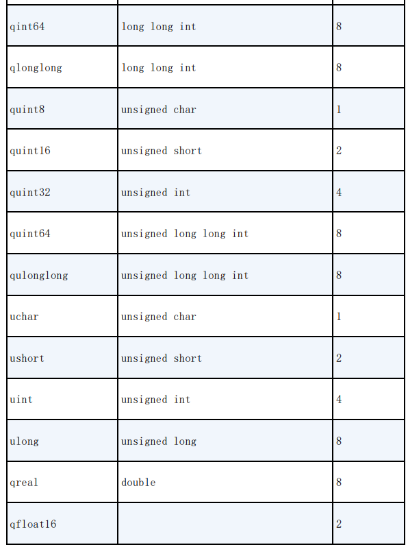

其中qreal缺省是8字节double类型浮点数，如果 Qt使用-qreal float选项进行配置，就是4字节float 类型的浮点数。

qfloat16是Qt 5.9.0中新增的一个类，用于表示 16位的浮点数，要使用qfloat16，需要包含头文件<QFloat16>


**函数**

<QtGlobal>中常用的全局函数定义，列出 了函数的输入和输出参数（若存在double和float两种 参数版本，只列出double类型参数的版本）。


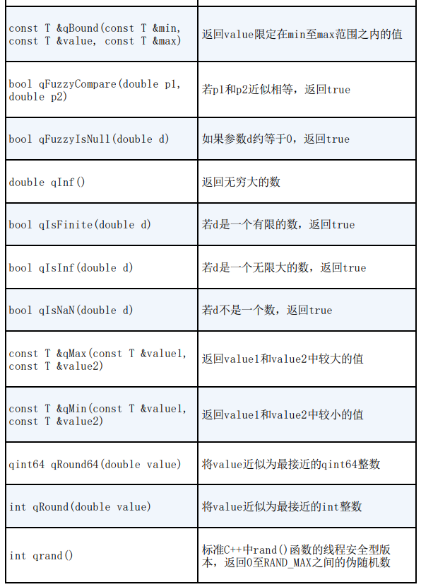

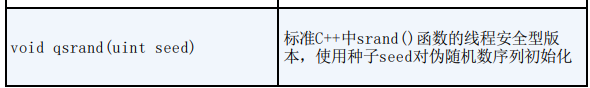

还有一些基础的数学运算函数在头文件<QtMath> 中定义，比如三角运算函数、弧度与角度之间的转换函数等


**宏定义**

<QtGlobal>头文件中定义了很多宏，以下一些是 比较常用的。

- **QT_VERSION**：这个宏展开为数值形式0xMMNNPP (MM = major, NN = minor, PP = patch)表示Qt编译器版本，例如Qt 编译器版本为Qt 5.9.1，则QT_VERSION为0x050901。
- **QT_VERSION_CHECK**：这个宏展开为Qt版本号的一个整数表示，例如

```
#if (QT_VERSION >= QT_VERSION_CHECK(5, 0, 0))
#include <QtWidgets>
#else
#include <QtGui>
#endif
```

- **QT_VERSION_STR**：这个宏展开为Qt版本号的字符串，如“5.9.0”。
- **Q_BYTE_ORDER**：表示系统内存中数据的字节序
- **Q_BIG_ENDIAN**：表示大端字节序
- **Q_LITTLE_ENDIAN**：表示小端字节序
- **Q_DECL_IMPORT**和**Q_DECL_EXPORT**：在使用或设计共享库时，用于导入或导出库的内 容，12.4节有其使用实例。
- **Q_DECL_OVERRIDE**：在类定义中，用于重载一个虚函数，例如在某个 类中重载虚函数paintEvent()，可以定义如下：

```c++
void paintEvent(QPaintEvent*) Q_DECL_OVERRIDE;
```

​	使用Q_DECL_OVERRIDE宏后，如果重载的虚函数没 有进行任何重载操作，编译器将会报错。

- **Q_DECL_FINAL**：这个宏将一个虚函数定义为最终级别，不能再被 重载，或定义一个类不能再被继承，示例如下：

```c++
class QRect Q_DECL_FINAL { // QRect不能再被继承
// ...
};
```

- Q_UNUSED(name):这个宏用于在函数中定义不在函数体里使用的参 数，示例如下：

```c++
void MainWindow::on_imageSaved(int id, const
QString &fileName)
{
    Q_UNUSED(id);
    LabInfo->setText("图片保存为： "+fileName);
}
```

​	在这个函数里，id参数没有使用。如果不用 Q_UNUSED(id)定义，编译器会出现参数未使用的警 告。

- **foreach(variable, container)** : foreach用于容器类的遍历，例如：

```c++
foreach (const QString &codecName, recorder->supportedAudioCodecs())
ui->comboCodec->addItem(codecName);
```

- **forever** :  用于构造一个无限循环，例如：

```c++
forever {
	...
}
```

- **qDebug(const char *message, ...)**  ： 在debugger窗体显示信息，如果编译器设置了 Qt_NO_DEBUG_OUTPUT，则不作任何输出，例如：

```c++
qDebug("Items in list: %d", myList.size());
```

类似的宏还有qWarning、qCritical、qFatal、 qInfo等，也是用于在debugger窗体显示信息。


## 3.3 容器类

容器类是基于模板的类，如常用的容器类 QList，T是一个具体的类型，可以是int、float等 简单类型，也可以是Qstring、QDate等类，

但不能是 QObject或任何其子类。T必须是一个可赋值的类型， 即T必须提供一个缺省的构造函数，一个可复制构造函 数和一个赋值运算符

例如用QList定义一个字符串列表的容器，其 定义方法是：

```c++
QList<QString> aList;
```

这样定义了一个QList容器类的变量aList，它的 数据项是QString，所以aList可以用于处理字符串列 表，例如：

```c++
aList.append("Monday");
aList.append("Tuesday");
aList.append("Wednesday");
QString str=aList[0];
```

Qt的容器类分为**顺序容器**（sequential containers）和**关联容器**（associative containers）。

容器迭代类用于遍历容器里的数据项，有Java类 型的迭代类和STL类型的迭代类。Java类型的迭代类易 于使用，提供高级功能，而STL类型的迭代类效率更高 一些。 

Qt还提供了foreach宏用于遍历容器内的所有数据项


**顺序容器类**

Qt的顺序容器类有QList、QLinkedList、 QVector、QStack和QQueue。

**QList**

QList是最常用的容器类，虽然它是以数组列表 （array-list）的形式实现的，但是在其前或后添加数据非常快，QList以**下标索引**的方式对数据项进行访问。

QList用于添加、插入、替换、移动、删除数据项 的函数有：insert()、replace()、removeAt()、 move()、swap()、append()、prepend()、 removeFirst()和removeLast()等。

QList提供下标索引方式访问数据项，如同数组一 样，也提供at()函数，例如：

```c++
QList<QString> list;
list << "one" << "two" << "three";
QString str1=list[1]; //str1=="two"
QString str0=list.at(0); //str0=="one"
```


**QLinkedList**

QLinkedList是链式列表（linked-list），数 据项不是用连续的内存存储的，它基于迭代器访问数 据项，并且插入和删除数据项的操作时间相同。 

除了不提供基于下标索引的数据项访问外， QLinkedList的其他接口函数与QList基本相同。


**QVector**

QVector提供动态数组的功能，以下标索引访 问数据。 

QVector的函数接口与QList几乎完全相同， QVector的性能比QList更高，因为QVector 的数据项是连续存储的。


**QStack**

QStack是提供类似于堆栈的后入先出（LIFO） 操作的容器类，push()和pop()是主要的接口函数。例如：

```c++
QStack<int> stack;
stack.push(10);
stack.push(20);
stack.push(30);
while (!stack.isEmpty())
cout << stack.pop() << endl;
```

程序会依次输出30，20，10。


**QQueue**

QQueue是提供类似于队列先入先出（FIFO）操 作的容器类。enqueue()和dequeue()是主要操作函 数。例如：

```c++
QQueue<int> queue;
queue.enqueue(10);
queue.enqueue(20);
queue.enqueue(30);
while (!queue.isEmpty())
	cout << queue.dequeue() << endl;
```

程序会依次输出10，20，30


**关联容器类**

Qt还提供关联容器类QMap、QMultiMap、QHash、 QMultiHash和QSet。

**QMultiMap**和**QMultiHash**支持一个键关联多个值， **QHash**和**QMultiHash**类使用散列（Hash）函数进行查 找，查找速度更快。


**QSet**

QSet是基于散列表的集合模板类，它存储数据的 顺序是不定的，查找值的速度非常快。QSet 内部 就是用QHash实现的。

定义QSet容器和输入数据的实例代码如下：

```c++
QSet<QString> set;
set << "dog" << "cat" << "tiger";
```

测试一个值是否包含于这个集合，用contains() 函数，示例如下：

```c++
if (!set.contains("cat"))
```


**QMap**

QMap提供一个字典（关联数组），一个 键映射到一个值。QMap存储数据是按照键的顺序，如 果不在乎存储顺序，使用QHash会更快。

定义QMap类型变量和赋值的示例 代码如下：

```c++
QMap<QString, int> map;
map["one"] = 1;
map["two"] = 2;
map["three "] = 3;
```

也可以使用insert()函数赋值，或remove()移除 一个键值对，示例如下：

```c++
map.insert("four", 4);
map.remove("two");
```

要查找一个值，使用运算符“[ ]”或value()函 数，示例如下

```c++
int num1 = map["one"];
int num2 = map.value("two");
```

如果在映射表中没有找到指定的键，会返回一个 缺省构造值（default-constructed values），例 如，如果值的类型是字符串，会返回一个空的字符 串。

在使用value()函数查找键值时，还可以指定一个 缺省的返回值，示例如下：

```c++
timeout = map.value("TIMEOUT",30);
```

这表示如果在map里找到键“TIMEOUT” ，就返回 关联的值，否则返回值为30。


**QMultiMap**

QMultiMap是QMap的子类，是用于处理多值映射的便利类。

多值映射就是一个键可以对应多个值。

QMultiMap使用示例如下：

```c++
QMultiMap<QString, int> map1, map2, map3;
map1.insert("plenty", 100);
map1.insert("plenty", 2000); // map1.size() ==2
map2.insert("plenty", 5000); // map2.size() ==1
map3 = map1 + map2; // map3.size() ==3
```

QMultiMap不提供“[ ]”操作符，使用value()函 数访问最新插入的键的单个值。如果要获取一个键对 应的所有值，使用values()函数，返回值是QList 类型。

```c++
QList<int> values = map.values("plenty");
for (int i = 0; i < values.size(); ++i)
	cout << values.at(i) << endl;
```


**QHash**

QHash是基于散列表来实现字典功能的模板类， QHash存储的键值对具有非常快的查找速度。 QHash与QMap的功能和用法相似，区别在于以下几 点：

- QHash比QMap的查找速度快； 
- 在QMap上遍历时，数据项是按照键排序的，而 QHash的数据项是任意顺序的；
- QMap的键必须提供“<”运算符，QHash的键必须提 供“==”运算符和一个名称为qHash()的全局散列 函数。


**QMultiHash**

QMultiHash是QHash的子类，是用于处理多值映射 的便利类，其用法与QMultiMap类似。


## 3.4  容器类的迭代


**java类型的迭代器类**

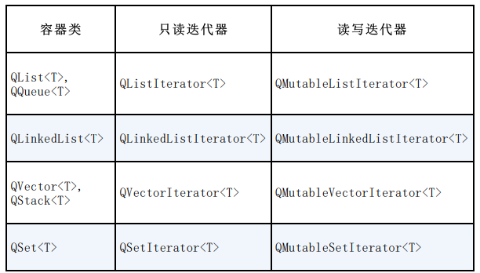

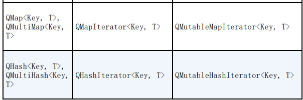


**顺序容器类的迭代器的使用**

Java类型迭代器的指针不是指向一个数据项，而 是在数据项之间


下面是遍历访问一个QList容器的所有 数据项的典型代码：

```c++
QList<QString> list;
list << "A" << "B" << "C" << "D";
QListIterator<QString> i(list);
while (i.hasNext())
	qDebug() << i.next();
```

QListIterator常用函数

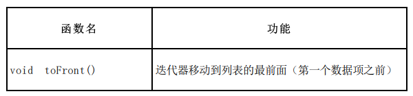

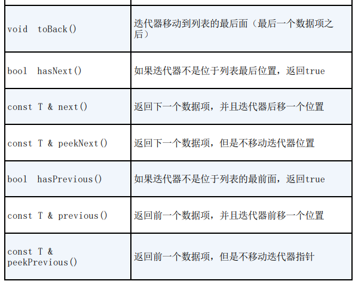


**关联容器类的迭代器的使用**

对于关联容器类QMap，使用QMapIterator 和QMutableMapIterator迭代器类，它们具有表3-4所 示的所有函数，

主要是增加了key()和value()函数用 于获取刚刚跳过的数据项的键和值。


**STL类型迭代器**

STL迭代器与Qt和STL的原生算法兼容，并且进行了 速度优化。

对于每一个容器类，都有两个STL类型迭代器：一 个用于只读访问，一个用于读写访问。无需修改数据时 一定使用只读迭代器，因为它们速度更快。

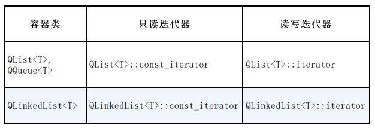


STL类型的迭代器是数组的指针，所以“++”运算 符使迭代器指向下一个数据项， “*”运算符返回数据 项内容。

与Java类型的迭代器不同，STL迭代器直接指 向数据项

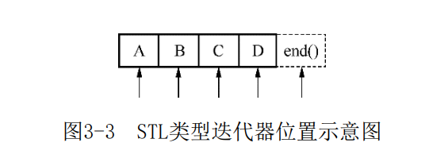

begin()函数使迭代器指向容器的第一个数据项， end()函数使迭代器指向一个虚拟的表示结尾的数据 项，end()表示的数据项是无效的，一般用作循环结束 条件。


**顺序容器类的迭代器的用法**

下面的示例代码将QList list里的数据 项逐项输出。

```c++
QList<QString> list;
list << "A" << "B" << "C" << "D";
QList<QString>::const_iterator i;
for (i = list.constBegin(); i != list.constEnd();
++i)
qDebug() << *i;
```


**关联容器类的迭代器的用法**

对于关联容器类QMap和QHash，迭代器的“*”操作 符返回数据项的值。如果想返回键，使用key()函数。 对应的，用value()函数返回一个项的值。

例如，下面的代码将QMap map中所有项 的键和值输出。

```c++
QMap<int, int> map;
...
QMap<int, int>::const_iterator i;
for (i = map.constBegin(); i != map.constEnd();++i)
	qDebug() << i.key() << ':' << i.value();
```


Qt API包含很多返回值为QList或QStringList的函 数，**要遍历这些返回的容器，必须先复制**。

由于Qt使用 了隐式共享，这样的复制并无多大开销。例如下面的代 码是正确的。

```c++
const QList<int> sizes = splitter->sizes();
QList<int>::const_iterator i;
for (i = sizes.begin(); i != sizes.end(); ++i)
...
```


**隐式共享**（Implicit Sharing）是对象的管 理方法。一个对象被隐式共享，只是传递该对象 的一个指针给使用者，而不实际复制对象数据， 只有在使用者修改数据时，才实质复制共享对象 给使用者。如在上面的代码中，splitter- >sizes()返回的是一个QList列表对象 sizes，但是实际上代码并不将splitter- >sizes()表示的列表内容完全复制给变量sizes， 只是传递给它一个指针。只有当sizes发生数据修 改时，才会将共享对象的数据复制给sizes，这样 避免了不必要的复制，减少了资源占用。


而下面的代码是错误的。

```c++
QList<int>::const_iterator i;
for (i = splitter->sizes().begin(); i != splitter->sizes().end(); ++i)
	...
```


**foreach关键字**

如果只是想遍历容器中所有的项，可以使用 foreach关键字。foreach是头文件中定义的 一个宏。使用foreach的句法是：

```c++
foreach (variable, container)
```

使用foreach的代码比使用迭代器更简洁。例如， 使用foreach遍历一个QLinkedList的示例代 码如下：

```c++
QLinkedList<QString> list;
...
foreach (const QString &str, list) {
	if (str.isEmpty())
		break;
	qDebug() << str;
}
```

对于QMap和QHash，foreach会自动访问“键—— 值”对里的值，所以无需调用values()。如果需要访问 键则可以调用keys()，示例代码如下：

```c++
QMap<QString, int> map;
...
foreach (const QString &str, map.keys())
	qDebug() << str << ':' << map.value(str);
```


**注意：**foreach关键字遍历一个容器变量是创建了容 器的一个副本，所以不能修改原来容器变量的数 据项


## 3.5 QT类库的模块

- Qt类库里大量的类根据功能分为各种模块，这些 模块又分为几大类。
- Qt基本模块（Qt Essentials）：提供了Qt在所有 平台上的基本功能。 
- Qt附加模块（Qt Add-Ons）：实现一些特定功能的 提供附加价值的模块。 
- 增值模块（Value-Add Modules）：单独发布的提 供额外价值的模块或工具。 
- 技术预览模块（Technology Preview Modules）： 一些处于开发阶段，但是可以作为技术预览使用的 模块
- Qt工具（Qt Tools）：帮助应用程序开发的一些工 具。


Qt基本模块

Qt基本模块是Qt在所有平台上的基本功能，它们 在所有的开发平台和目标平台上都可用


Qt附加模块

Qt附加模块可以实现一些特定目的。这些模块可 能只在某些开发平台上有，或只能用于某些操作系 统，或只是为了向后兼容。

用户安装时可以选择性地 安装这些附加模块。


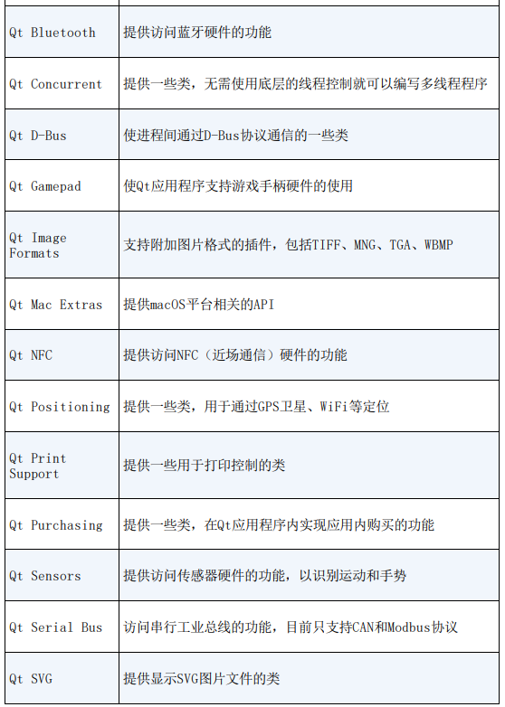

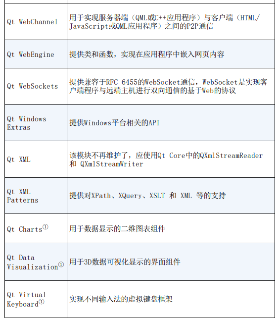


增值模块

除了随Qt5发布的上述这些模块，还有一些模块 （见表3-8）是单独发布的，这些模块只在商业版许可 的Qt里才有。

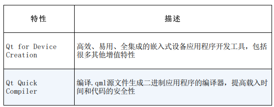


技术预览模块

技术预览模块就是一些还处于开发和测试阶段的 模块，一般技术预览模块经过几个版本的发布后会变 成正式的模块。

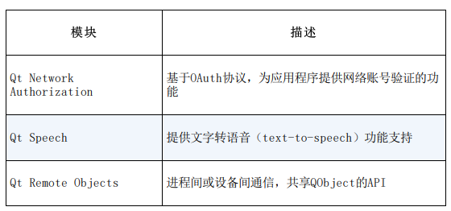


Qt工具

Qt工具（见表3-10）在所有支持的平台上都可以 使用，用于帮助应用程序的开发和设计。


# 第4章：常用界面软件设计


## 4.1 字符串与输入和输出


### 4.1.1 字符串与数值之间的转换

**QLabel** 用于显示字符串

**QLineEdit**  用于显示和输入字符串


QString类从字符串转换为整数的函数有：

```c++
int toInt(bool *ok = Q_NULLPTR, int base = 10) const
long toLong (bool *ok = Q_NULLPTR, int base = 10) const
short toShort (bool *ok = Q_NULLPTR, int base = 10) const
uint toUInt (bool *ok = Q_NULLPTR, int base = 10) const
ulong toULong (bool *ok = Q_NULLPTR, int base = 10) const
```

这些函数如果不设置参数，缺省表示从十进制表 示的字符串转换为整数；若指定整数基参数，还可以直接将二进制、十六进制字符串转换为整数。


QString将字符串转换为浮点数的函数有：

```c++
double toDouble(bool *ok = Q_NULLPTR) const
float toFloat (bool *ok = Q_NULLPTR) const
```


将一个整数转换为不同进制的字符串，可以使用 QString的函数**setNum()**或静态函数**number()**

```c++
Qstring &setNum (int n, int base = 10)
QString number (int n, int base = 10)
```

其中n是待转换的整数，base是使用的进制，缺省 为十进制，也可以指定为十六进制和二进制。、


### 4.1.2 QString的常用功能

- **append()和prepend()**

  append()在字符串的后面添加字符串，prepend() 在字符串的前面添加字符串，如：

  ```c++
  QString str1="卖", str2="拐";
  QString str3=str1;
  str1.append(str2); //str1="卖拐"
  str3.prepend(str2); //str3="拐卖"
  ```

- **toUpper()和toLower()**

  toUpper()将字符串内的字母全部转换为大写形 式，toLower()将字母全部转换为小写形式，如：

  ```c++
  QString str1="Hello, World", str2;
  str2=str1.toUpper(); //str2="HELLO,WORLD"
  str2=str1.toLower(); //str2="hello, world"
  ```

- **count()、size()和length()**

  count()、size()和length()都返回字符串的字符 个数，这3个函数是相同的，但是要注意，字符串中如 果有汉字，一个汉字算一个字符。

  ```c++
  QString str1="NI好"
  N=str1.count() //N=3
  N=str1.size() //N=3
  N=str1.length() //N=3
  ```

- **trimmed()和simplified()**

  trimmed()去掉字符串首尾的空格，simplified() 不仅去掉首尾的空格，中间连续的空格也用一个空格 替换。

  ```c++
  QString str1=" Are you OK? ", str2;
  str2=str1.trimmed(); //str1="Are you OK? "
  str2=str1.simplified(); //str1="Are you OK? "
  ```

- **indexOf ()和lastIndexOf ()**

  indexOf()函数的原型为：

  ```c++
  int indexOf (const QString &str, int from = 0,
  Qt::CaseSensitivity cs = Qt::CaseSensitive) const
  ```

  其功能是在自身字符串内查找参数字符串str出现 的位置，参数from是开始查找的位置， Qt::CaseSensitivity cs参数指定是否区分大小写。

   `lastIndexOf()`函数则是查找某个字符串最后出现 的位置。

  ```c++
  QString str1="G:\Qt5Book\QT5.9Study\qw.cpp";
  N=str1.indexOf("5.9"); // N=13
  N=str1.lastIndexOf("\\"); //N=21
  ```

- **isNull()和isEmpty()**

  两个函数都判读字符串是否为空，但是稍有差 别。如果一个空字符串，只有“\0” ，isNull()返回 false，而isEmpty()返回true；

  只有未赋值的字符 串，isNull()才返回true。

  ```c++
  QString str1, str2="";
  N=str1.isNull(); // N=true 未赋值字符串变量
  N=str2.isNull(); // N=false 只有"\0"的字符串，也不是Null
  N=str1.isEmpty(); // N=true
  N=str2.isEmpty(); // N=true
  ```

- **contains()**

  判断字符串内是否包含某个字符串，可指定是否区分大小写。

  ```c++
  QString str1="G:\Qt5Book\QT5.9Study\qw.cpp";
  N=str1. contains (".cpp", Qt::CaseInsensitive);
  // N=true，不区分大小写
  N=str1. contains (".CPP", Qt::CaseSensitive);
  // N=false，区分大小写
  ```

- **endsWith()和startsWith()**

  startsWith ()判断是否以某个字符串开头， endsWith()判断是否以某个字符串结束。

  ```c++
  QString str1="G:\Qt5Book\QT5.9Study\qw.cpp";
  N=str1. endsWith(".cpp", Qt::CaseInsensitive);
  // N=true，不区分大小写
  N=str1. endsWith(".CPP", Qt::CaseSensitive);
  // N=false，区分大小写
  N=str1. startsWith("g: ");
  // N=true，缺省为不区分大小写
  ```

- **left()和right()**

  left表示从字符串中取左边多少个字符，right表 示从字符串中取右边多少个字符。注意，一个汉字被 当作一个字符。

  ```c++
  QString str2, str1="学生姓名，男，1984-3-4，汉族，山东";
  N=str1.indexOf ("，");
  // N=4，第一个"，"出现的位置
  str2=str1.left(N);
  //str2="学生姓名"
  N=str1.lastIndexOf ("，");
  // N=18，最后一个逗号的位置
  str2=str1.right(str1.size()-N-1); //str2="山东"，提取最后一个逗号之后的字符串
  ```

- **section()**

  section()函数的原型为：

  ```c++
  QString section (const QString &sep, int start,int end = -1, SectionFlags flags = SectionDefault) const
  ```

  其功能是从字符串中提取以sep作为分隔符，从 start端到end端的字符串。

  ```c++
  QString str2, str1="学生姓名，男，1984-3-4，汉族，山东";
  str2=str1. section ("，",0,0);
  // str2="学生姓名"， 第1段的编号为0
  str2=str1. section ("，",1,1);
  // str2="男"
  str2=str1. section ("，",0,1);
  // str2="学生姓名，男"
  str2=str1. section ("，",4,4);
  // str2="山东"
  ```


## 4.2 SpinBox的使用

QSpinBox用于整数的显示和输入，一般显示十进制 数，也可以显示二进制、十六进制的数，而且可以在显示框中增加前缀或后缀。

QDoubleSpinBox用于浮点数的显示和输入，可以设 置显示小数位数，也可以设置显示的前缀和后缀。


QSpinBox和QDoubleSpinBox的主要属性


提示 一个属性在类的接口中一般有一个读取函数 和一个设置函数，如QDoubleSpinBox的decimals 属性，

读取属性值的函数为int decimals()，设置属性值的函数为void setDecimals(int prec)。