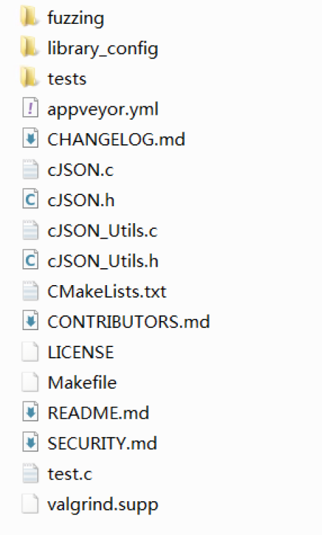
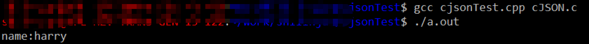

## 格式规则

- JSON中的键值对是由一个键（key）和一个值(value)组成。
- 键值之间用冒号`:`分割。
- 多个键值对之间用逗号`,`分割。
- 键必须为字符串类型，值可以是字符串、数字、布尔值、对象、数组或null。
- 键和字符串都必须使用双引号括起来。


示例：

**字符串**：

```json
{"name":"学习JSON"}
```


**数字**：

```json
{"number1":1,"number2":2.2}
```


**布尔值**：

```json
{"value1":true,"value2":false}
```


**对象（Object）**：

JSON中的对象是一组键值对的集合（类似结构体），每个键值对都用逗号分隔，值书写在`{}`中。JSON对象可以包含多个名称/值对。

```c
typedef struct
{
	char name[64];
	int  age;
	char city[64];
}PEOPLE;
```

上述的结构体的对象`PEOPLE John`可以存放在下面的json中：

```json
{"name":"John","age":18,"city":"New York"}
```


**数组 （Array）**：

JSON中的数组是一组有序的值的集合，每个值都用逗号分隔，简单的如`[1,2,3]`，复杂的比如每个元素又是一个json对象。

比如`PEOPLE array[3]`的值可以存放在下面的json中。

```json
{
    "array":[
        {"name":"张三","age":18,"city":"杭州"},
        {"name":"李四","age":19,"city":"北京"},
        {"name":"王五","age":20,"city":"上海"}
    ]
}
```


**NULL**:

JSON中的null表示没有任何值

```json
{"number1":null}
```


## CJSON

C/C++环境下可以使用CJSON进行json解析。

源码下载：

github：https://github.com/DaveGamble/cJSON/releases

gitee：https://gitee.com/mirrors/cJSON

解压后（1.7.18）：




### 使用方法

常用的方法有两种：直接使用和使用库


**直接使用：**

将源码中的`cJSON.c`和`cJSON.h`拷贝到源码中，使用的时候进行引用即可。

```c++
#include <stdio.h>
#include "cJSON.h"

int main()
{
    cJSON *jsonRoot,*jsonName;
    char jsonStr[100] = "{\"name\":\"harry\"}";

    jsonRoot = cJSON_Parse(jsonStr);
    jsonName=cJSON_GetObjectItem(jsonRoot,"name");
    if(jsonName && jsonName->valuestring)
        printf("name:%s\n",jsonName->valuestring);
	
    cJSON_Delete(jsonRoot);
    
    return 0;
}
```




**使用库：**

在解压后的目录按下述步骤生成库文件：

```cmake
mkdir build
cd build
cmake ..
make
```

上述操作后会在`build`目录下生成动态库文件，如果还想生成静态库文件，请将上面第3行改为

```cmake
cmake .. -DBUILD_SHARED_AND_STATIC_LIBS=On
```

如果需要交叉编译得到指定编译工具链生成的库，需要在CMakeLists.txt中指定使用的编译工具，增加例如下面的语句

```cmake
SET(CMAKE_C_COMPILER /opt/trans-toolchains/aarch64-linux-gnu/bin/aarch64-linux-gnu-gcc)
SET(CMAKE_CXX_COMPILER /opt/trans-toolchains/aarch64-linux-gnu/bin/aarch64-linux-gnu-g++)
SET(CMAKE_STRIP /opt/trans-toolchains/aarch64-linux-gnu/bin/aarch64-linux-gnu-strip)
```

这种情况下的，需要把库文件放到程序能访问到的路径，并在程序中加载

```c++
#include <stdio.h>
#include <dlfcn.h>
#include "cJSON.h"

int main()
{
    void *handle = dlopen("./libcjson.so",RTLD_LAZY);

    if(!handle) return 1;

    cJSON *jsonRoot,*jsonName;
    char jsonStr[100] = "{\"name\":\"harry\"}";

    jsonRoot = cJSON_Parse(jsonStr);
    jsonName=cJSON_GetObjectItem(jsonRoot,"name");
    if(jsonName && jsonName->valuestring)
        printf("name:%s\n",jsonName->valuestring);

	cJSON_Delete(jsonRoot);
	
    return 0;
}
```


### 解析语法

基本流程：

```c++
//基本流程与相关API
//1.创建cJsoN指针
cJSON *json=NULL;
//2.解析整段JsON数据,返回cJsoN指针
(cJSON*) cJSON_Parse (const char *value) ;
//3.根据键值对的名称从链表中取出对应的值，返回该键值对的地址
(cJSON*) cJsON_GetObjectItem(const cJSON * const object，const char * const string);
//4.根据类型提取相关值
//5.释放
void cJSON_Delete(cJSON* item) ;
```


解析单个键值对，如上文的`{\"name\":\"harry\"}`

```c++
cJSON *jsonRoot,*jsonName;
char jsonStr[100] = "{\"name\":\"harry\"}";

jsonRoot = cJSON_Parse(jsonStr);
jsonName=cJSON_GetObjectItem(jsonRoot,"name");
if(cJSON_IsString(jsonName))
	printf("name:%s\n",jsonName->valuestring);

cJSON_Delete(jsonRoot);
```


解析多个键值对，如{\"name\":\"harry\","age":18}

```c++
cJSON *jsonRoot,*jsonName,*jsonAge;
char jsonStr[100] = "{\"name\":\"harry\",\"age\":18}";

jsonRoot = cJSON_Parse(jsonStr);
jsonName=cJSON_GetObjectItem(jsonRoot,"name");
if(cJSON_IsString(jsonName))
	printf("name:%s\n",jsonName->valuestring);

jsonAge=cJSON_GetObjectItem(jsonRoot,"age");
if(cJSON_IsNumber(jsonAge))
	printf("age:%s\n",jsonAge->valueint);

cJSON_Delete(jsonRoot);
```


解析键值对，如果值是一个json对象，比如：

```json
{"John":{"name":"John","age":18,"city":"New York"}}
```

解析步骤如下，也就是将value再次使用`cJSON_GetObjectItem`进行解析：

```c++
typedef struct
{
    char name[64];
    int  age;
    char city[64];
}PEOPLE;

PEOPLE john = {0};
cJSON *jsonRoot,*jsonJohn,*jsonName,*jsonAge,*jsonCity;
char jsonStr[100] = "{\"John\":{\"name\":\"John\",\"age\":18,\"city\":\"New York\"}}";

jsonRoot = cJSON_Parse(jsonStr);
jsonJohn = cJSON_GetObjectItem(jsonRoot,"John");

if(!jsonJohn)
{
    cJSON_Delete(jsonRoot);
    return 0;
}

jsonName = cJSON_GetObjectItem(jsonJohn,"name");
if(cJSON_IsString(jsonName))
{
    sprintf(john.name,"%s",jsonName->valuestring);
    printf("name:%s\n",john.name);
}

jsonAge = cJSON_GetObjectItem(jsonJohn,"age");
if(cJSON_IsNumber(jsonAge))
{
    john.age = jsonAge->valueint;
    printf("age:%d\n",john.age);
}

jsonCity = cJSON_GetObjectItem(jsonJohn,"city");
if(cJSON_IsString(jsonCity))
{
    sprintf(john.city,"%s",jsonName->valuestring);
    printf("city:%s\n",john.city);
}

cJSON_Delete(jsonRoot);
```


解析数组，简单的比如解析`[1,2,3,4]`：

```c++
int i;
cJSON *jsonRoot,*jsonList,*jsonItem;
char jsonStr[100] = "{\"list\":[1,2,3,4]}";

jsonRoot = cJSON_Parse(jsonStr);
jsonList = cJSON_GetObjectItem(jsonRoot,"list");
if(cJSON_IsArray(jsonList))
{
    for(i=0;i<cJSON_GetArraySize(jsonList);i++)
    {
        jsonItem = cJSON_GetArrayItem(jsonList,i);
        if(cJSON_IsNumber(jsonItem))
            printf("%d\n",jsonItem->valueint);
    }
}
cJSON_Delete(jsonRoot);
```

或者：

```c++
int i;
cJSON *jsonRoot,*jsonList,*jsonItem;
char jsonStr[100] = "{\"list\":[1,2,3,4]}";

jsonRoot = cJSON_Parse(jsonStr);
jsonList = cJSON_GetObjectItem(jsonRoot,"list");
if(cJSON_IsArray(jsonList))
{
	jsonItem = jsonList->child;
	while(jsonItem)
	{
		if(cJSON_IsNumber(jsonItem))
            printf("%d\n",jsonItem->valueint);

         jsonItem = jsonItem->next;
	}
}
cJSON_Delete(jsonRoot);
```


解析复杂数组,如上文说的

```json
{
    "array":[
        {"name":"张三","age":18,"city":"杭州"},
        {"name":"李四","age":19,"city":"北京"},
        {"name":"王五","age":20,"city":"上海"}
    ]
}
```

```c++
int i;
cJSON *jsonRoot,*jsonList,*jsonItem,*jsonName,*jsonAge,*jsonCity;
char jsonStr[1024] = "{\"list\":[{\"name\":\"John\",\"age\":18,\"city\":\"New York\"},{\"name\":\"harry\",\"age\":19,\"city\":\"London\"},{\"name\":\"limei\",\"age\":20,\"city\":\"Beijing\"}]}";

jsonRoot = cJSON_Parse(jsonStr);
jsonList = cJSON_GetObjectItem(jsonRoot,"list");
if(cJSON_IsArray(jsonList))
{
	jsonItem = jsonList->child;
    for(i=0;i<cJSON_GetArraySize(jsonList);i++)
    {
    	jsonName = cJSON_GetObjectItem(jsonItem,"name");
    	if(cJSON_IsString(jsonName))
    		printf("name:%s\n",jsonName->valuestring);

		jsonAge = cJSON_GetObjectItem(jsonItem,"age");
		if(cJSON_IsNumber(jsonAge))
			printf("age:%d\n",jsonAge->valueint);

		jsonCity = cJSON_GetObjectItem(jsonItem,"city");
		if(cJSON_IsString(jsonCity))
			printf("city:%s\n",jsonCity->valuestring);
	}
}
cJSON_Delete(jsonRoot);
```

或者

```c++
cJSON *jsonRoot,*jsonList,*jsonItem,*jsonName,*jsonAge,*jsonCity;
char jsonStr[1024] = "{\"list\":[{\"name\":\"John\",\"age\":18,\"city\":\"New York\"},{\"name\":\"harry\",\"age\":19,\"city\":\"London\"},{\"name\":\"limei\",\"age\":20,\"city\":\"Beijing\"}]}";

jsonRoot = cJSON_Parse(jsonStr);
jsonList = cJSON_GetObjectItem(jsonRoot,"list");
if(cJSON_IsArray(jsonList))
{
	jsonItem = jsonList->child;
	while(jsonItem)
	{
		jsonName = cJSON_GetObjectItem(jsonItem,"name");
		if(cJSON_IsString(jsonName))
			printf("name:%s\n",jsonName->valuestring);

		jsonAge = cJSON_GetObjectItem(jsonItem,"age");
		if(cJSON_IsNumber(jsonAge))
			printf("age:%d\n",jsonAge->valueint);

		jsonCity = cJSON_GetObjectItem(jsonItem,"city");
		if(cJSON_IsString(jsonCity))
			printf("city:%s\n",jsonCity->valuestring);
        
		jsonItem = jsonItem->next;
	}
}
cJSON_Delete(jsonRoot);
```


### 生成语法

创建

```c++
cJSON* cJSON_CreateObject();	//创建空的json对象
cJSON* cJSON_CreateArray();		//创建空的数组

cJSON* cJSON_CreateNumber(double num);			//创建num对应的json对象
cJSON* cJSON_CreateString(const char*string);	 //创建string对应的json对象
```

添加

```c++
cJSON_AddNumberToObject(cJSON * const object, const char * const name, const double number)		//添加name:number的键值对
cJSON_AddStringToObject(cJSON * const object, const char * const name, const char *string)		//添加name:string的键值对
cJSON_AddItemToArray(cJSON *array,cJSON *item);												//向数组array中添加item值
cJSON_AddItemToObject(cJSON *object,const char*string,cJSON *item);							  //添加string:item的键值对
```

打印

```c++
char *cJSON_Print(const cJSON*item)
```


例如：

```c++
//添加基本内容
cJSON_AddStringToObject(root,"name","harry");
cJSON_AddNumberToObject(root,"age",18);
printf("%s\n",cJSON_Print(root));

//添加嵌套
cJSON *address = cJSON_CreateObject();
cJSON_AddStringToObject(address,"city","hangzhou");
cJSON_AddItemToObject(root,"address",address);
printf("\n%s\n",cJSON_Print(root));

//添加数组
cJSON *score = cJSON_CreateArray();
for(int i =0; i < 5;i++)
{
    cJSON_AddItemToArray(score,cJSON_CreateNumber(i));
}
cJSON_AddItemToObject(root,"score",score);
printf("\n%s\n",cJSON_Print(root));

cJSON_Delete(root);
```


### 参考资料

[cJSON的使用](https://blog.csdn.net/qq_67582098/article/details/138260256)

