# 《代码大全》读书笔记


## 第1章：欢迎进入软件构建的世界

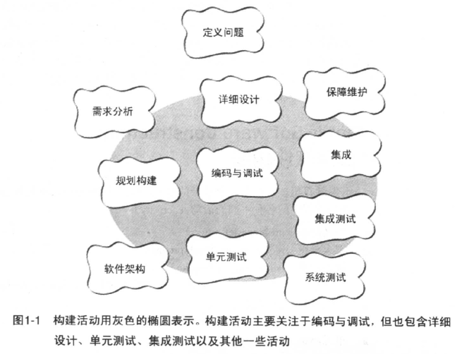

.软件构建是软件开发的核心活动;构建活动是每个项目中唯一一项必不可少的工作。
.软件构建的主要活动包括:详细设计、编码、调试、集成、开发者测试( developer testing(包括单元测试和集成测试)。
.构建也常被称作“编码”和“编程”。
.构建活动的质量对软件的质量有着实质性的影响。


## 第2章：用隐喻来更充分地理解软件开发

软件中的书法：写作代码（像写信一样无规划的一次写完，注重可读性）

软件中的耕作法：培植系统 （一次完成一部分，添加完善到系统中）

软件的牡蛎养殖观点：系统生长（像牡蛎生成珍珠一样，先形成骨架，再完成功能）

软件构造：建造软件（对大型软件而言，规划设计和建造房子一样重要）

应用软件：智慧工具箱（应该尝试使用不同的软件开发方法，丰富自己的工具）

组合各个隐喻：使用不同的隐喻解释你想解释的方面


## 第3章：三思而后行：前期准备

1、在项目的初期、中期、后期都需要强调质量。

2、在实现一个系统之前，你需要理解“这个系统应该做什么”，以及“它该如何做到这些”。

3、准备工作很重要。在开始做一个大项目之前，应该为这个项目制订计划，这是很有意义的。

从管理的角度看，做计划意味着确定项目所需要用的时间、人数以及计算机台数。

从技术角度讲，做计划意味着弄清楚你想要建造的是什么，以防止浪费钱去建造错误的东西。

有时候用户在一开始并不完全确定自己想要的是什么，因此值得花费比理想情况下更多的力气，找出他们真正想要的东西。

但这至少比“先做一个错误的东西出来，然后扔掉，并从头来过”的成本要低廉。

4、发现错误的时间要尽可能接近引入该错误的时间。

5、花费在问题定义、需求分析、软件架构上的时间，依据项目的需要而变化。

一般说来，一个运作良好的项目会在需求、架构以及其他前期计划方面投入10%-20%的工作量和20%-30%的时间(McConnell 1998, Kruchten 2000)。

这些数字不包括详细设计的时间—那是构建活动的一部分。


## 第4章：关键的“构建”决策

编程约定：在高质量软件中，你可以看到“架构的概念完整性”与“其底层实现”之间的关系。

“实现”必须与(指导该实现的)“架构”保持一致，并且这种一致性是内在的固有的。

这正是变量名称、类的名称、子程序名称、格式约定、注释约定等这些针对“构建活动”的指导方针的关键所在。

Gries对“在一种语言上编程(programming in a language )"和“深入一种语言去编程(programming into a language”做了区分。

“在一种语言上编程”的程序员将他们的思想限制于“语言直接支持的那些构件”。如果语言工具是初级的，那么程序员的思想也是初级的。

“深入一种语言去编程”的程序员首先决定他要表达的思想是什么，然后决定如何使用特定语言提供的工具来表达这些思想。


## 第5章：软件构建中的设计

设计就是把需求分析和编码调试连在一起的活动。


### 5.1 设计中的挑战

设计是一个险恶的问题：有些问题，是得在程序运行后才能发现的

设计是个了无章法的过程：设计时会犯很多错误再改正、优劣方案之间差异很微妙，设计到什么程度、怎样才算是“好的”等等都没有指标。

设计就是确定取舍和调整顺序的过程：在各种指标间取舍，比如运行速度和占用内存、开发时间和运行速度等。

设计收到诸多约束：受软件规格和硬件条件等限制。

设计是不确定的：每个人有每个人的设计思路。

设计是一个启发式过程：在一件工作上十分奏效的工具或技术，在下一个项目上可能并不适用，所有要抱着“试试没准能行”的探索性的心态。

设计是自然而然形成的：设计是在不断的设计评估、非正式讨论、写验证代码以及修改验证代码的过程中演化和完善的


### 5.2 关键的设计概念

复杂度：

当项目因为技术原因导致失败时，往往是因为失控的复杂度。有关的软件变得极端复杂，让人无法知道它究竟是做什么的。

当没人知道对一处代码的改动会对其他代码带来什么影响时，项目也就快停止进展了。

在软件架构的层次上，可以通过把整个系统分解为多个子系统来降低问题的复杂度。

人类更易于理解许多项简单的信息，而不是一项复杂的信息。所有软件设计技术的目标都是把复杂问题分解成简单的部分。

子系统间的相互依赖越少，你就越容易在同一时间里专注问题的一小部分。精心设计的对象关系使关注点相互分离，从而使你能在每个时刻只专注于一件事情。

在更高汇聚的层次上，包(packages)提供了相同的好处。

理想的设计特征：

① 最小的复杂度：做简单易懂的设计，不要做“聪明的”设计，否则难以理解，增加了复杂度。

② 易于维护：想下后续维护的程序员看到你的代码是否会有疑问

③ 松散耦合：设计时让程序的各个组成部分之间关联最小。

通过应用类接口中的合理抽象、封装性及信息隐藏等原则，设计出相互关联尽可能最少的类。减少关联也就减少了集成、测试与维护时的工作量。

④ 可扩展性：可以改动系统的一部分而无需破坏底层结构。

⑤ 可重用性： 所设计的系统的组成部分能在其他系统中重复使用

⑥ 高扇入(本身被调用的量)：让大量的类使用给定的某个类。这意味着设计出的系统很好地利用了在较低层次上的工具类。

⑦ 低扇出(自身调用别的函数的量)：一个类里少量或者适中地使用其他类。

⑧ 可移植性：方便地移动到其他环境中

⑨ 精简性：系统没有多余部分，多余的部分也是要测试和后续维护的。

⑩ 层次性：保持系统各个分解层的层次性，使你可以在任意层面上观察系统。

⑪ 标准技术：用标准化的，常用的方法，让系统给人一种熟悉的感觉。

设计的层次


① 软件系统：避免直接在这一层直接设计类，而是分成子系统和包

② 分解为子系统和包：明确分成哪些子系统、各个子系统之间的关系、各个子系统之间怎么通信。

分成各个子系统的意义就在于限制各个部分之前的通信，降低复杂度。因此要避免所有子系统都能和其他子系统通信。


有一个很好的基本原则：像5-5这样的图，不应该出现任何环形关系。

③ 分解为类：识别出系统中所有的类，同时定义了这些类和系统其他部分打交道的细节，尤其是确定好类的接口。

④ 分解成子程序：③中已经定义了接口，这一层主要定义私有程序

⑤ 子程序内部的设计：完成具体的函数


### 5.3  设计构造块：启发式方法

由于软件设计是非确定性的（很多问题不可预见），因此，灵活熟练地运用一组有效的启发式方法(试探法)，

便成了合理的软件设计的核心工作。下面是一些常用的启发式方法：

① 找出现实世界中的对象：如果你写的是一个收银员相关的程序，可以参看现实中的收银员有哪些属性

② 形成一致的抽象：从各种细节中找出真正有影响的、共性的参数。比如基类抽象出了各个子类的共性，

类的接口让你只要关心怎么调用接口，而不用关心接口怎么实现。

③ 封装实现细节：封装填补了抽象留下的空白。抽象是说:“可以让你从高层的细节来看待一个对象。”而封装则说:

“除此之外，你不能看到对象的任何其他细节层次。”，比如函数封装让你仅关心接口怎么调用，而无需关心实现方式。

④ 当继承能简化设计时就继承：一些共性的操作，子类完全可以继承。

⑤ 隐藏秘密（信息隐藏）：一来可以降低复杂度，二来可以增加安全性和可维护性（只有类内的函数才能访问）

⑥ 找出容易改变的区域：要识别出哪部分后续可能会改变，并为改变做好准备。

⑦ 保持松散耦合：请尽量使你创建的模块不依赖或者很少依赖其他模块。让模块之间的关系像商业合作者一样彼此分离，

而不是像连体婴儿那样紧密相连。函数传参尽量少、类的public接口尽量少、尽量使用传参而不是全局变量传递数据，

让函数的传参更灵活易被识别。

⑧ 查阅常用的设计模式：使用公用的方式方法可以省下很多的理解成本

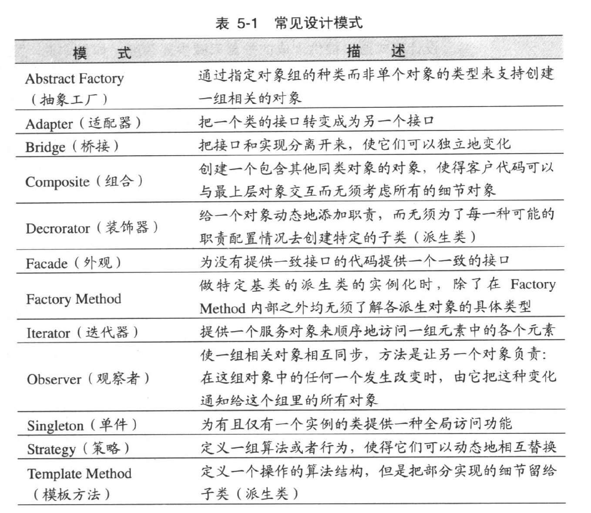

⑨ 使用启发式方法的原则： 不要卡在单一的方式上，不要卡在一个问题上，可以先往下，后续再来解决这个问题。


### 5.4 设计实践

迭代：尝试从高层和底层审视问题，这有助于完善方案。有了好的方案就执行，执行中也能从中学习改善原有的方案。

分而治之：将程序分成不同区域开发

自上而下和自下而上的设计方法：自上而下的设计从某个很高的抽象层次开始。你定义出基类或其他不那么特殊的设计元

素。在开发这一设计的过程中，你逐渐增加细节的层次，找出派生类、合作类以及其他更细节的设计元素。

自下而上的设计始于细节，向一般性延伸。这种设计通常是从寻找具体对象开始，最后从细节之中生成对象以及基类。

建立试验性模型：对有疑虑的问题，写测试程序验证下

合作设计：和同时交流，评审方案等

要做多少设计才够：越多越好

记录你的设计成果：注释、文档、wiki、邮件总结等


### 5.5 对流行的设计方法的评论

介绍了一些别的书籍、文档


## 第6章：可以工作的类

### 6.1 类的基础：抽象数据类型（ADTs）

抽象数据类型(ADT, abstract data type)是指一些数据以及对这些数据所进行的操作的集合。这些操作既向程序的其余部分描述了这些数据是怎么样的，

也允许程序的其余部分改变这些数据。


**需要用到ADT的例子**

```c++
currentFont.size = 16 //将字体大小设置为16
currentFone.attribute = CurrentFont.attribute or 0x02 //将字体设置为粗体
```

上面的调用存在的问题:

1、调用方直接操作了数据成员，并且得知道操作的逻辑。

2、像这样的调用在代码中会到处都是，要修改的话就得都改一遍


**使用ADT的益处**

应该如下使用：

```c++
currentFont.setSizeInPoints(sizeInPoint)	//设置字体大小
currentFont.setBoldOn()		//设置为粗体
```

好处如下：

1、可以隐藏实现细节：使用者不需要知道怎么操作成员。

2、改动不会影响到整个程序：诸如粗体的实现方式改变，不需要调用者修改。

3、让接口提供更多的信息：setSizeInPoints这样的命名就在提醒你要注意传入数据的单位，currentFont.size = 16没有这个功能

4、更容易提高性能：当你想提高修改粗体的性能时，修改一个方法比修改一堆调用省事。

5、让程序的正确性显而易见：currentFone.attribute = CurrentFont.attribute or 0x02 比 currentFont.setBoldOn()  要容易写错

6、程序更具有自我说明性：看setBoldOn这样的名称就知道它干了啥

7、无需在程序内导出传递数据：

没有类的话，凡是想要操作currentFont的成员变量，都得把它做为入参或者把它作为全局变量。

有了类的话，类的成员函数可以直接访问类的成员变量而不用作为参数传入。

8、你可以像在现实世界中那样操作实体，而不用在底层实现上操作它：

程序的绝大部分可以使用setBoldOn这种更接近现实中的字体操作语言，而不是currentFone.attribute = CurrentFont.attribute or 0x02 这样难以理解的代码。


**更多的ADT示例**

总而言之，就是整理出一套对外的浅显易懂的接口，用户只需要调这些接口就行，而不用关心接口的实现方式。

一些建议：

1、把常见的底层数据类型创建为ADT并使用这些ADT，而不是使用底层数据类型：比如为堆栈、列表、链表创建一个类，并对外提供它的各个使用方法函数，而不是直接使用这些数据类型。

2、把像文件这样的常用对象当做ADT：把文件操作定义成一个类的多个函数

3、简单的事情也可以当做ADT：就算是一个事物只有开关两个操作，也是可以定成类的

4、不要让ADT依赖于其存储介质：成员函数名不要带着信息，让使用者知道它存在哪里（内存还是磁盘），否则到时候改了存储方式，名称就错了


**在非面向对象环境中用ADT处理多分数据实例**

比如C语言，结构体没有成员函数的说法，这些函数均以独立的函数形式存在。

那怎么让下面的函数修改同一个字体结构体的数据呢，有以下的方法：

```c++
FONT_TYPE font1
setSizeInPoints(sizeInPoint)	//设置字体大小
setBoldOn()		//设置为粗体
```

1、增加“创建”、“删除”之类的函数，在里面创建和删除一个全局的FONET_TYPE对象，然后每个操作函数调用的时候都传一个id，用于区分操作的是哪个。

2、把每个函数的入参都改为完成的结构体FONT_TYPE，函数直接修改入参的内容，这样就不用传id了。

3、新增一个函数，指定当前操作的是FONT_TYPE结构体数组的哪个，后续的操作函数均操作这个对象。

总而言之，都不好，1需要加id，2会把FONT_TYPE暴露给用户，3增加了复杂度。


**ADT和类**

ADT的思想是类这一概念的基础，类是对ADT思想的一种实现方式。


### 6.2 良好的类接口


**1、好的抽象**

类的接口应该能提供一组明显相关的子程序。比如一个实现雇员的类，其中的子程序应该都和雇员有关系。

如果一个类中杂糅了很多不同功能的子程序，比如命令栈、报表、操作全局数据，那么应该考虑把他们分开到不同的更专一的类中。

下面是一些建议：

1、类的接口应该展现一致的抽象层次。


这个类展现了两个ADT: Emplyee和ListContainer。出现这种混合的抽象，通常是源于程序员使用容器类或其他类库来实现内部逻辑，

但却没有把“使用类库”这一事实隐藏起来。应该修改如下：

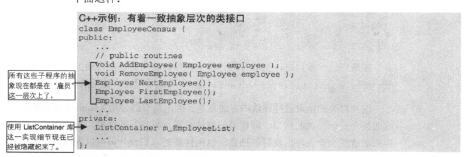

2、一定要理解类所实现的抽象是什么。

一个例子：有一个功能，需要A类的所有15个功能和B类150个功能中的的其中一个，那么如果新建一个包裹类的话，

这个类只需要对外暴露出A类的15个 + B类的1个子程序。

3、提供成对的服务。

写一个操作开的函数的时候，考虑下程序是有有必要写一个操作关的函数。

4、把不相关的信息转移到其他类。

如果你发现你的类中，一半程序在使用一半的数据，另一半程序在使用另一半数据，说明这两部分毫无关系，可以考虑拆成2个类。

5、尽可能让接口可编程，而不是表达语义。

让尽量多的错误能够被程序发现并报错，减少那些需要看注释和理解才能发现的错误。

6、谨防在修改时破坏接口的抽象。

比如在修改的时候，给雇员类加对外接口的时候，加了一堆查邮政编码的接口

7、不要添加与接口抽象不一致的公共成员。

比如在修改的时候，给雇员类加了一个插入链表节点的接口

8、同时考虑抽象性和内聚性。

抽象做的越好，类的各个函数之间的关系也应该是越紧密的。


**2、良好的封装**

抽象让你可以忽略实现的细节，直接调用接口来降低复杂度，而封装强行阻止你看到细节。

也就是说，如果封装得好的话，你也就不得不做抽象了:laughing:。

下面是一些建议：

1、尽可能地限制成员的可访问性

没有公开必要的函数和变量，都定义成private

2、不要公开暴露成员数据

如果你向下面这样直接暴露成员变量，那别的地方将可以自由修改它们，而类甚至不知道它被修改了

```c++
float x;
float y;
float z;
```

应该改成如下：

```c++
float GetX();
float GetY();
float GetZ();
void SetX(float x);
void SetY(float y);
void SetZ(float z);
```

这样的好处是：

① 类能得知外接对变量的访问和修改 

② 向外接隐藏了变量的类型，因为类内部可能是保存成double，然后对外时转成float的

3、避免把私用的实现细节放入类的接口中。

C++头文件的private部分还是会暴露部分细节：比如变量的保存类型


有一种方法，如下：


现在你就可以把实现细节放到EmployeeImplementation类里了，这个类只对Employee类可见，而对使用Employee类的代码来说则是不可见的。

4、不要对类的使用者做出任何假设。

接口不要有潜规则，比如“大家都知道：被除数是0的话会崩溃，所以调用者不会把X=0传进来”。

5、不要因为一个子程序仅使用公用子程序，就把它归入公开接口。

要考虑下把它公开后，接口所展示的抽象是否还一致。

6、让阅读代码比编写代码方便

不要为了编写代码方便而降低它的可读性，因为看代码的时间比写代码的时间要多得多

7、要格外警惕从语义上破坏封装性。

一些例子：

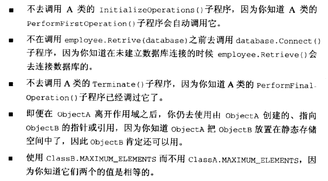

它们让调用代码不是依赖于类的公开接口，而是依赖于类的私用实现。

8、留意过于紧密的耦合关系

一些建议：

① 尽可能地限制类和成员的可访问性

② 避免友元类，因为他们之间是紧密耦合的

③ 在基类中把数据声明为private而不是protected，以降低派生类和基类之间耦合的程度

④ 避免在类的公开接口中暴露成员数据

⑤ 要对从语义上破坏封装性保持警惕

⑥ 察觉“Demeter(得墨忒耳)法则”(见 6.3节)


### 6.3 有关设计和实现的问题

这一节讨论关于包含、继承、成员函数和数据成员、类之间的耦合性、构造函数、值对象与引用对象的问题。


**1、包含（“有一个....”的关系）**

雇员类有一个“姓名”、有一个“电话”之类的数据成员，这样的关系是包含。

一个类包含的数据成员不要太多，超过7个就可以考虑是不是要拆成多个类


**2、继承（“是一个...”关系）**

继承的概念是说一个类是另一个类的特化。

继承可以把多个子类共有的元素（接口、内部实现、数据成员、数据类型等）放到一个基类中，这样就不用反复实现了。

当决定要继承时，需要考虑：

① 对于成员函数：它对派生类应该可见吗？ 是否要有默认实现？ 这个默认实现是否能被覆盖？

② 对于成员变量：它对派生类是否可见

下面是一些建议：

1、没有必要的话不要继承，不然会增加复杂度

2、如果你只是想使用另一个类的某个算法，直接拿来用而不是去继承那个类

3、派生类中的成员函数不要和基类的private函数重名，虽然不会报错，但难以阅读

4、如果子类只有一个实例，是不是不需要派生成类，而是用数据表达和基类之间差异的部分。（单件模式是本条建议的例外）

5、不要创建没必要的集成结构，比如给当前真正工作的类抽象出一个基类

6、把基类的函数集成下来，然后覆盖成一个啥也不做的函数，会让人无法确定调这个接口到底会不会执行

7、不要有过多的继承层次

8、让所有数据都是private（而非protected）。继承会破坏封装，当你从一个对象继承时，你就拥有了访问该对象中

protected子程序和protected数据的特权。


**多重继承**

多重继承指一个子类同时继承多个父类。

常见的应用比如：有多个工具类，比如链表类、显示类，我们的子类需要使用到这些工具，可以多重继承。

多重继承需要注意几个父类之间要相互独立。


**为什么要有这么多继承的规则**

为了控制复杂度，不好的继承会让程序的复杂度提升。

下面是一些归纳总结：


**3、成员函数和数据成员**

一些建议：

1、类中的子函数尽量少

2、类中调用的子程序数量尽量少

3、对其他类的子程序的间接调用要尽可能少（A类对象中生成B类对象，B类对象再生成C类对象，最后在A中执行了C的函数）


**4、构造函数**

一些仅针对构造函数的建议：

1、如果可能，应该在所有构造函数中初始化所有数据成员

2、用私用（private）构造函数来强制实现单件属性

如果你想定义一个类，并需要强制规定它只能有唯一一个对象实例的一话，可以把该类所有的构造函数都隐藏起来，

然后对外提供一个static的子程序来访问该类的唯一实例。它的工作方式如下例所示:


3、优先使用深层复本（深拷贝取得），除非论证可行，才采用浅层复本（浅拷贝取得）


### 6.4 创建类的原因

1、为现实中的对象建模。

2、为抽象对象建模，比如形状类。

3、降低复杂度。让使用者只需要关注接口，而不需要关注具体实现

4、隔离复杂度。一旦发生错误，修改范围也会比较小

5、隐藏实现细节。

6、限制变动的影响范围。

7、隐藏全局数据。

8、让参数传递更顺畅。类中的成员函数可以直接访问类的成员变量而不用传参

9、建立中心控制点。

10、让代码更易于重用。

11、为程序族做计划。把预计会改动的部分放到单独的类中，这样后面更新的时候只要修改它而不会影响别的部分。

12、把相关操作包装在一起

13、实现某种特定的重构


应避免的类：

1、万能的，什么事情都做的类

2、不必要的类：只包含数据，不包含行为

3、避免用动词命名的类：只有行为而没有数据


### 6.5 与具体编程语言相关的问题

不同的语言在类的实现上有差异。

在C++中继承默认不覆盖基类的方法，基类的方法必须被定义成virtual才能被覆盖


### 6.6 超越类：包

模块化的发展：语句   =>  子函数  =>  类   =>  包


## 第7章：高质量的子程序

本章介绍那些关乎子程序好坏的特征。

 ### 7.1 创建子程序的正当理由

1、降低复杂度。

2、引入中间、易懂的抽象。相当于把一段代码抽象成了一行

3、避免代码重复。

4、支持子类化。覆盖一个简短的功能简单的子程序比较简单

5、隐藏顺序。一旦你把"把大象放进冰箱"写成了子程序，使用者就不需要知道 开门-放大象进去-关门 的步骤

6、隐藏指针操作。指针太危险，但如果都在一个函数内，修改起来还是容易的。

7、提高可移植性。可以使用子程序来隔离程序中不可移植的部分。

8、简化复杂的布尔判断。有些地方只想知道判断结果，并不关心细节，可以写子程序

9、改善性能。优化的时候，你只要改子程序一个地方，所有用到的地方都得到了优化。


**似乎过于简单而没有必要写成子程序的操作**

为很短但是很难理解的语句写个子程序，方便阅读，在写程序的时候也会思考更深，做更周全的判断。


### 7.2 在子程序层上设计

对子程序而言，**内聚性**是指子程序中各种操作之前联系的紧密程度。可以简单理解为这个函数完成了几个任务，完成的越少，内聚性越高。

下面是一些内聚性的例子：

1、功能的内聚性。最强也是最好的一种内聚性，也就是说一个子程序仅执行一项操作。

2、顺序上的内聚性。比如需要根据生日得到年龄和退休时间，先根据**生日**得到年龄，再根据**年龄**得到退休时间，则有顺序上的内聚性（按顺序）。

3、通信上的内聚性。比如需要根据生日得到年龄和退休时间，先根据**生日**得到年龄，再根据**生日**得到退休时间，则只有通信上的内聚性（仅共享数据）。

4、临时内聚性。是指一些互不相关，但是需要放一起才能实现某项功能的子程序。

比如StartUp()这种开机做一大堆杂事的函数，但这些杂事都应该写成子函数，让StartUp()去调用。

5、过程上的内聚性。指一个子程序中的操作是按特定的顺序进行的。

比如按屏幕提示，依次输入袁工姓名、地址、电话号码的子程序。

6、逻辑上的内聚性。

那些包含多个if else或者case的函数

7、巧合的内聚性。子程序的操作之间没有任何可以看到的联系

除上述以外的，也可以说是没有内聚性的函数。


### 7.3 好的子程序名字

一些原则：

1、描述子程序做的所有事情。

2、避免使用无意义的、模糊或表达不清的动词。比如 handle、deal with、process等

3、不要仅通过数字来形成不同的子程序名字。比如 fun1、fun2

4、根据需要确定子程序名字的长度。最佳长度在9到15个字符

5、对函数命名时要对返回值有所描述。如果有返回值，函数名最好体现出返回了啥，比如printer.IsReady()

6、给过程起名时使用动词+宾语，在面向对象时则不必要。

比如，面向过程时，printDocument是一个好的函数名，但面向对象时，document.printDocument就显得太臃肿了

7、准确使用反义词


8、为常用操作确立命名规则

下面是没有命名规则下出现的各种获取id的调用方式

```c++
employee.id.Get();
dependent.GetId();
supervisor();
candidate.id();
```

所以，还是统一一下比较好。


### 7.4 子程序可以写多长

有各种函数长度和出错概率的说法，总而言之，尽量不要超过200行。


### 7.5 如何使用子程序参数

子程序之间的接口是最容易出错的部分之一，以下是一些传参方面的建议。

1、按照 输入--修改--输出 的顺序排列参数。

```c++
//input 仅做输入 
//fixed 既是输入又是输出
//out 仅做输出
int func(int input, int *fixed, int *out);  
```

2、考虑自己创建in和out 关键字。

```c++
#define IN
#define OUT
#define IO
int func(IN int input,IO int *fixed,OUT int *out);  
```

3、如果几个子程序使用的参数类似，应该让他们的排列顺序也保持一致。

4、使用所有的参数。既然传了这个参数，就一定要用到。

5、把状态或出错变量放最后。标记函数执行后状态和错误的变量仅作为输出，所以放最后。

6、不要把子程序的参数用作工作变量。比如，不要把传参最后作为返回值

7、在接口中对参数的假定加以说明。

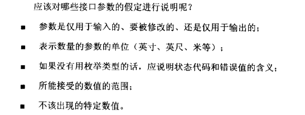

8、把子程序的参数个数限制在大约7个以内。

9、考虑对参数采用某种表示输入、修改、输出的命名规则。比如：i_ , m_ , o_

10、传参不要破坏抽象。我的理解是尽量少

11、实参和形参类型要对应


### 7.6 使用函数时要特别考虑的事情


### 什么时候用函数、什么时候用过程

函数：返回值非void  过程：返回值为void

自家看着办，如果使用函数，那么函数可以使用它的返回值命名


**设置函数的返回值**

每个return都检查下有没有正确返回

不要返回指向局部数据的引用或指针


### 7.7 宏子程序和内联子程序


**宏子程序**： #define FUNC(a) 3*a 之类的

1、把宏表达式整个包含在括号内

```c++
#define Cube(a) a*a*a			//不能正确展开，比如传入的是 x+1
#define Cube(a) (a)*(a)*(a)		 //任然不能正确展开，比如调用Cube前后有比*更优先的运算符
#define Cube(a) ((a)*(a)*(a))    //可以正确展开
```

2、把含有多条语句的宏用大括号括起来

```c++
//错误的示范
#define lookUp(key)	\
	key += 1;	   \
	key += 2;	   \ 
	key += 3;
	
for(int i = 0; i < 10; i++)
	lookUp(i);	//展开后只会执行key += 1 这一行
```

所以应该改成

```c++
//正确的示范
#define lookUp(key)	\
{ \
	key += 1;	   \
	key += 2;	   \ 
	key += 3;	   \
}
	
for(int i = 0; i < 10; i++)
	lookUp(i);	
```


**内联子程序**

关键字 **`inline`** 建议编译器使用函数定义中的代码替换对该函数的每次调用。

因为直接替换代码比走调用流程更快，所以能加速程序运行，作为代价是程序的大小可能会增加。

在以下类声明中，`Account` 构造函数是内联函数，因为它是在类声明的正文中定义的。 成员函数 `GetBalance`、`Deposit` 和 `Withdraw` 是在其定义中指定的 `inline`。 关键字 `inline` 在类声明中的函数声明中是可选的。

```c++
// account.h
class Account
{
public:
    Account(double initial_balance)
    {
        balance = initial_balance;
    }

    double GetBalance() const;
    double Deposit(double amount);
    double Withdraw(double amount);

private:
    double balance;
};

inline double Account::GetBalance() const
{
    return balance;
}

inline double Account::Deposit(double amount)
{
    balance += amount;
    return balance;
}

inline double Account::Withdraw(double amount)
{
    balance -= amount;
    return balance;
}
```

1、节制使用 **`inline `**函数。因为C++要求程序员把内联函数的实现写在头文件中，因此破坏了封装性。


 ## 第8章：防御式编程

防御式编程的主要思想：子程序不因传入错误数据而被破坏，哪怕是由其他子程序产生的错误数据。

本章介绍怎么对你的程序做保护。


### 8.1 保护程序免遭非法输入数据的破坏

1、检查所有来源于外部的数据的值。程序运行中调用外部接口获取到的数据。检查数值是否在范围内、字符串是否超长等

2、检查子程序所有传入参数的值。

3、决定如何处理错误的输入数据。检测到错误，做出恰当的反应


### 8.2 断言

断言（assertion）是指在开发期间使用的、让程序在运行时进行自检的代码(通常是一个子程序或宏)。

断言为真，则表明程序运行正常，而断言为假，则意味着它己经在代码中发现了意料之外的错误。

一般断言被用在开发调试阶段、在生成产品代码时，可以不编译进去，以免降低系统性能。

也就是说：**断言只拿来判断那些发布程序中绝不允许出现的情况**

```c++
#define _assert(ex)    \
{ \
    if ( !(ex) ) \
    { \ 
        (void)syslog(LOG_ERR,"Assertion failed: file \"%s\", line %d\n", __FILE__, __LINE__); \
        exit(1); \
    } \
} \
```


**建立自己的断言机制**


**使用断言的一些建议**

1、断言仅判断那些绝对不应该出现的错误，并且一旦触发，处理措施应该是修复使其不触发而不是给错误打印等

2、避免把需要执行的代码放到断言中，因为发布的时候断言是不编译进去的


3、用断言来注解并验证前条件和后条件

4、对于高建壮性的代码，应该先使用断言再处理错误。

对于每种可能出错的条件，通常子程序要么使用断言，要么使用错误处理代码来进行处理，但是不会同时使用二者。


### 8.3 错误处理技术

断言是处理程序中不应该出现的错误，那么遇到那些能预料的可能发生的错误时，怎么处理呢？

1、返回中立值。比如计算结果返回0

2、换用下一个有效值。如果函数任务是从一堆数据中找出有效数据的话

3、返回与前次相同的数据。测量得到的数据不准，可以直接返回上一次的测量结果

4、换用最接近的合法值。返回温度范围是0~100，如果测得的是负的，可以直接写0

5、把警告信息记录到日志文件

6、返回一个错误码

7、调用错误处理则程序或对象

8、错误发生时显示错误信息

9、用最稳妥的方式在局部处理错误

10、关闭程序


**健壮性和正确性**

正确性意味着永远不返回不准确的结果。

健壮性意味着要不断尝试采取某些措施，以保证软件可以持续地运行下去，哪怕有时做出一些不准确的结果。

不同场合采取不同的倾向。


**高层次的设计对错误处理方法的影响**

检查函数的返回值。


### 8.4 异常

C++已移除支持，不讨论。


### 8.5 隔离程序，使之包容由错误造成的损害

划出几个类专门用于校验数据，经过检验的数据后续都被认为是可靠的。


### 8.6 辅助调试的代码

1、在开发期间牺牲一些速度和资源做一些有助于开发、测试的工具、代码是值得的

2、这种测试工具和代码有需要的话尽早做，帮助很大

3、采用进攻式编程：把出错的处理写得尽量严重（比如直接退出程序），这样错误才会被重视并修复

4、计划移除调试辅助的代码：发布前把调试用的测试代码删了


### 8.7 确认在产品代码中保留多少防御性代码

以下是一些保留多少防御性代码的建议：

1、保留那些检查重要错误的代码。

2、去掉检查细微错误的代码。一些无关紧要的错误处理可以注释掉

3、去掉可以导致程序硬件崩溃的代码。用户总是希望在程序崩溃前能保存数据，不要让错误的处理指向崩溃，给他们留点时间。

4、如果在程序崩溃前，你能收集到有用的信息，把这部分收集信息的代码留下来

5、为技术支持收集信息留下通道，比如改变打印等级，获取更高等级的打印

6、不要在程序输出中出现一些不好的、敏感的词汇


### 8.8 对防御式编程采取防御的姿态

防御式编程也会带来问题：

1、让程序臃肿 

2、增肌了代码复杂度

3、防御式编程的代码中可能也存在bug


## 第9章：伪代码编程过程


### 9.1 创建类和子程序的步骤概述

创建一个类可以有多种不同的方式,但一般而言这都是一个迭代过程：

先对 一个类做总体设计,列出这个类内部的特定子程序,创建这些子程序,然后从整 体上复查这个类的构建结果。如图所示


**创建一个类的步骤**

1、创建类的总体设计：定义类的职责、要隐藏的数据、定义接口抽象概念、父类和子类、公用方法、数据成员

2、创建类中的子程序：实现第一步中确定的子程序，这一步骤可能会返过来补充第一步

3、复审并测试整个类：整个类完成后，做下整体的测试，而不是单个子程序的测试


**创建子程序的步骤**

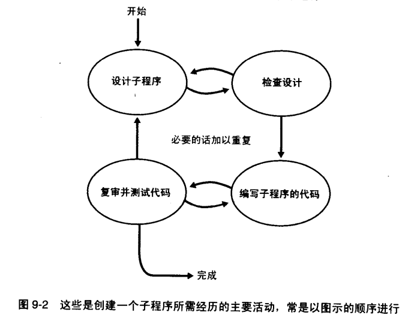


### 9.2 伪代码

描述算法、子程序、类或者完整程序的工作逻辑、非形式的记法，类似于草稿

一些伪代码的建议：

1、用类似英语的语句来精确描述特定的操作。

2、避免使用目标语言中的语法来描述。

3、在意图的层面上编写伪代码，而不是使用目标语言写实现方法

4、在一个足够低的层次上写伪代码（接近用目标代码写，但又不是），这样可以发现更多细节上的困难

伪代码的好处：

1、伪代码方便评审

2、伪代码支持反复的迭代进化

3、设计变化时，修改伪代码比修改真实代码方便

4、伪代码相当于是现成的注释

5、伪代码比其他形式的设计文档容易维护。因为它和代码联系更紧密


### 9.3 通过伪代码编程过程创建子程序

**设计子程序**

1、检查先决条件：这个函数是否有必要

2、定义子程序要解决的问题：明确如下几点

① 子程序要隐藏的信息 

② 各项输入和输出

③ 调用前确保入参的取值在允许范围内或者已经初始化

④ 确保调用的返回数据在允许范围、返回后没有内存泄漏

⑤ 为子程序命名：清晰、无歧义的名字

⑥ 决定如何测试子程序

⑦ 在标准库中找下有没有现成的函数可以用

⑧ 考虑错误处理、考虑效率

⑨ 研究算法和数据类型：翻下算法书有没有可参考的实现

⑩ 编写伪代码、考虑数据类型、检查伪代码


**编写子程序**


1、写出子程序的声明：函数的头注释

2、把伪代码转成高层次的注释。

3、在每条注释下填充代码

4、检查代码是否要进一步分解：有些步骤代码太长，是否要做成函数


**检查代码**

1、在脑海里检查

2、编译检查

3、在调试器中逐行执行代码

4、测试代码

5、修复错误


**收尾工作**

1、检查子程序的接口：所有参数都用到了吗

2、检查整体的设计质量

3、检查程序变量：变量名是否准确、是否存在未使用的变量、未初始化的变量

4、检查子程序的语句和逻辑、布局、文档

5、去除冗余的注释


### 9.4 伪代码编程的替代方案

1、测试先行开发：写代码前先写测试用例

2、重构：参看第24章

3、契约式设计。参看8.2：用断言来注解并验证前条件和后条件

4、东拼西凑：如果你是这样，那么考虑下本章说的伪代码编程


## 第10章：使用变量的一般事项

### 10.1 数据认知

一些常用的数据类型：


### 10.2 轻松掌握变量定义

有些语言支持隐式变量声明，比如Microsoft Visual Basic中未声明变量时，会自动为你申明改变量。

这样的隐式声明是危险的，会让一些错误无法暴露出来，比如写错了变量名等。

一些建议：

1、关闭隐式声明

2、声明全部变量

3、遵循某种命名规则

4、检查变量名


### 10.3 变量初始化原则

不合理的初始化数据是常见的错误之一。比如：

1、从未对变量赋值。

2、变量值已过期。某个地方赋过值，但现在已不再有效。

3、变量的一部分被赋值，另一部分没有。

一些建议：

1、在变量声明的时候进行初始化。

2、在靠近变量第一次使用的地方初始化它。（针对不支持声明时初始化的语言，且和公司的代码规范有冲突，忽视）

3、理想情况下，在靠近第一次使用变量的位置声明和初始化变量。（和公司代码规范冲突，忽略）

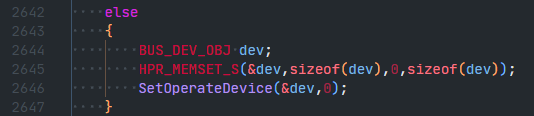

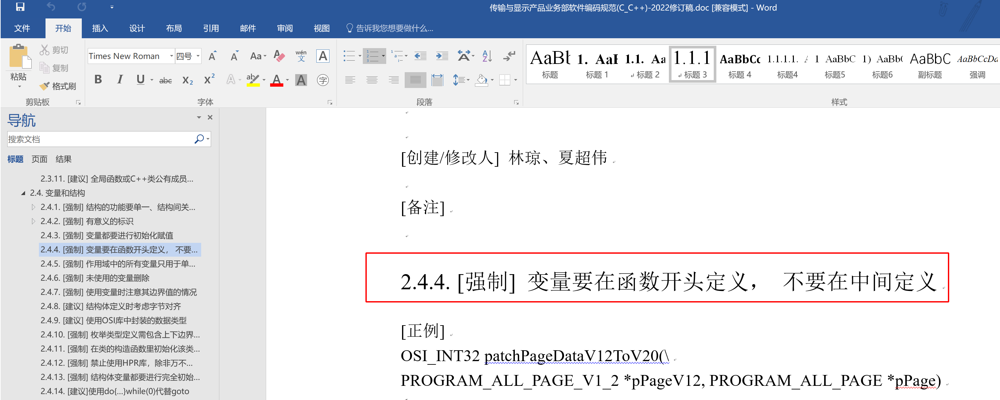

4、在可能的情况下使用final（java）或者const（c++）。这样可以防止在初始化后再被赋值

5、特别注意计数器和累加器。for循环的 i，在下次使用前要再初始化

6、在类的构造函数中初始化该类的数据成员

7、检查是否要重新初始化。比如接收函数返回值的变量

8、一次性初始化具名常量（const修饰的变量）：用可执行代码来初始化变量。在程序开始处对它进行一次初始化就行

9、使用编译器设置来自动初始化所有变量。如果你的编译器支持自动化初始化所有变量的选项，打开它，但不推荐这么做。

10、利用编译器的警告信息

11、检查输入参数的合法性

12、使用内存访问检查工具来检查错误的指针。如果操作系统提供这种服务，或者有第三方工具的话

13、在程序开始时初始化工作内存。


### 10.4 作用域

作用域或者可见性是指变量在程序中的可见和可引用的范围。


**使变量引用局部化**

同一个变量的多个使用代码之间的代码成为攻击窗口（window of vulnerability）。

```c++
int a = 0;
int b = 1;	
int c = 2;
b++;
a++;
c++;
b++;
```

上文中2~4行就是对于a的攻击窗口。因为可能在这里新增代码时可能会错误地修改到a。

那么，怎么衡量这个攻击窗口的大小呢？这里引入**跨度(span)**这个概念：

对上面的例子而言，变量a的跨度就是3，变量b的跨度就是1和2，所以变量b的平均跨度是1.5

尽量缩小跨度，主要的作用是可以增加可读性。


**尽可能缩短变量的存活时间**

存活时间：一个变量存在期间所跨越的语句总数，即：第一次使用到最后一次使用之前跨越的语句总数。（此处不是说这个变量从创建到被销毁的时间）


保持尽量短的存活时间也是我们的目标。

这样可以减小攻击窗口、也可以使自己的代码紧凑、更有可读性，更容易拆分成子函数


**减小作用域的一般原则**

1、在循环的开始再初始化循环中使用的变量，而不是在这个循环所在的函数开头

```c++
//不恰当的示范
func1()
{
	int i = 0;
	int b = 1;
		
	b++;
	while(i<10)
	{
		...
		i++;
	}
}
```

```c++
//恰当的示范
func1()
{
	int i ;
	int b = 1;
		
	b++;
    i = 0;
	while(i<10)
	{
		...
		i++;
	}
}
```

2、直到变量即将被使用时再为其赋值。主要是为了快速找到当前变量的值是多少

3、把相关语句放在一起。把操作同一堆数据的函数调用放一起，这样看的时候关注的变量可以少一点

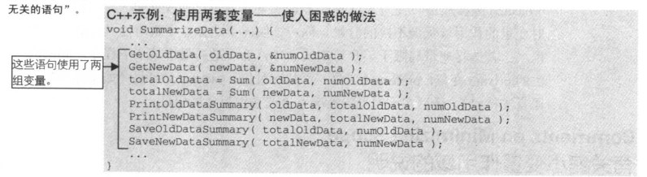


4、把相关语句组提炼成单独的子程序。子程序拥有更短的跨度和存活时间

5、开始时采用最严格的可见性，然后根据需要扩展变量的作用域。

比如最开始都定为private，后续看是否要改为public。从private改为public是简单的，反过来则很困难


**有关缩小变量作用域的说明**

有些人喜欢使用全局变量，这是种偷懒而危险的做法。虽然这很方便，但是会降低可读性，增加危险。


### 10.5 持续性

可以理解为变量从创建到被回收所经历的时间，以下是一些持续性的举例：

1、特定代码段（比如for循环中定义的变量）或者子程序的生命期（局部变量）

```c++
int main(){
      int a,b;//在同个缩进等级内或大于的缩进等级内是能够访问的
      a=10;
      while(a>0){
          int c,d;//在这个缩进内是能够进行访问控制的
          a=a-1;
      }//在这里会销毁 变量c和d
      c = 1;//这里会报错，出了局部变量的作用域
      return 0;
}//在这里会销毁main内定义的所有变量
```

2、只要你允许，它就会持续下去。指程序员自己申请的内存，比如new的内存需要手动delete才会释放

3、程序的生命期。全局变量，static变量等

4、永远持续。保存在数据库、配置文件中的数据，在每次程序起来的时候加载它


为了防止使用的时候变量的值已经不正常了，可以做如下保护：

1、在程序中加入调试代码或者断言来检查那些关键变量的合理取值。

2、抛弃变量后给它赋值为一个不合理的值，比如删除指针后将它指向NULL

3、假设你即将使用的这个变量是没有持续性的。

4、养成在使用所有数据之前声明和初始化的习惯。


### 10.6 绑定时间

绑定时间：把变量和它的值绑定在一起的时间。

绑定的时间点：编写代码时、编译程序时、程序加载时、程序运行时等

采用越晚的时间绑定越有利，虽然复杂度会更高，但灵活性更好


### 10.7 数据类型和控制类型之间的关系

数据一般按下述3种控制方式流动：

1、序列型数据翻译为书序中的顺序语句：也就是顺序执行

2、选择型数据翻译为程序中的``if``和``case``语句

3、迭代型数据翻译为程序中的``for``、``repeat``、``while``等循环结构


### 10.8  为变量指定单一用途

有时候，会有人在一个函数中给一个变量分配2种用途，这样不好。

1、每个变量只用于单一用途：否则会降低可读性

2、避免让代码具有隐含含义：变量``bytesWritten``表示写入文件的字节数，除非它为负数，这种情况下它表示用于输出的磁盘驱动器的号码

3、确保使用了所有已声明的变量


 ## 第11章：变量名的力量


### 11.1 选择好变量名的注意事项

最基础的，不要随便取名字，比如xx、xxx这样不知道什么意思的变量名。

**最重要的命名注意事项：**该名字要完全、准确地描述出该变量所代表的事物。

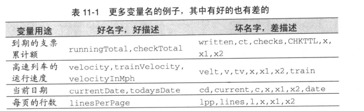

**以问题为导向：**一个好名字通常表达的是“什么”，而不是"如何"，比如一条员工数据记录，应该取名为employeeData，而不是inputRec


**最适合的名字长度：**不要太长（难写难读）也不要太短（信息不够），在9~15，或者10~16个字符最好。


**变量名对作用域的影响：**

1、一般程序员看到``i``这样的变量，都知道它只是个临时变量，作用域不会很大。

较长的名字适合用于很少用到的变量或者全局变量，较短的名字适用于局部变量或者循环变量

2、对位于全局命名空间中的名字加以限定词。这样可以避免命名冲突

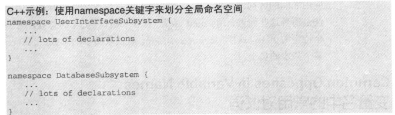


**变量名中的计算值限定词**

比如，在考虑给页码总数取变量名时，在``pageTotal``和``totalPage``之间，应该选择``pageTotal``，因为：

① 应该把变量中重要的部分放前面   ② 做了这样的规定之后变量命名会更整齐


**变量名中的常用对仗词**

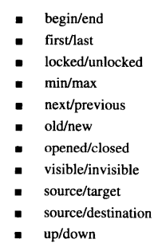、


### 11.2 为特定类型的数据命名

为循环变量、状态变量、临时变量、布尔变量、枚举类型和具名常量命名有关的注意事项。


**为循环下标命名**

``i``、``j``、``k``这样的循环下标仅适用于简单循环。复杂循环的话，还是需要为下标取名。

比如``score[teamIndex] [eventIndex] ``要比 ``score [i] [j]``给出的信息更多。


**为状态变量命名**

为状态变量取一个比`flag`更好的名字。状态也使用枚举或者宏来取代数字。

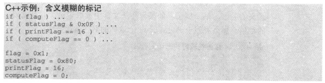


**为临时变量取名**

一般临时变量都取名为`tmp`、`x`等。

但临时变量可能是不必要的，只是偷懒没有搞清楚它到底是拿来干什么的，等你搞清楚的时候，也应该给它们取名。


**为布尔变量命名**

常用的布尔变量名：`done`、`error`、`found`、`success`或`ok`，这些次都是隐含了**“真/假”**含义的名字。

也有些人喜欢在布尔变量名前面加上Is，对我们公司而言，则是加上b，比如`bSuccess`。

注意使用肯定的布尔变量名更容易理解，比如`bSuccess`比`bNotSuccess`要容易理解。


**为枚举类型命名**

在使用枚举时，可以通过增加前缀，来明确表示该类型的成员同属于一个组


**为常量命名**

常量命名应该表达它的含义，而不是表达它的数值

```c++
const int pageMax = 100;	//合适的
const int hundred = 100；    //不合适的
```


### 11.3 命名规则的力量

**为什么要有规则：**

1、有了规则之后可以按规则办事，而省去自己做决定的时间

2、有助于在项目间传递知识。名字的相似性让你更容易、更自信地理解那些不熟悉的变量是什么意思

3、有助于在新项目中更快的学习代码

4、有助于减少名字增生：比如为了表示总点数，没有规则的情况下会出现`pointTotal`和`totalPoint`两个变量

5、弥补编程语言的不足之处。如果不支持枚举，完全可以通过命名多个常量来模拟


**何时采用命名规则**

1、当多个人开发一个项目时

2、当你计划把一个程序转交给另一个程序员来维护时

3、当你所在的组织中的其他程序员评估你写的代码的时候

4、当你写的程序规模太大，以致你无法在脑海中同时了解事情的全貌，而必须分而治之的时候（多个模块保持一样的风格）

5、你写的程序开发周期很长，可能你放了一段时间后还需要再来开发它

6、当一个项目中存在一些不常见的术语，希望开发的时候统一该用什么名称和缩写


**正式程度**

根据具体情况而言，一般程序规模越大，参与人员越多，需要实施越严格的规则。


### 11.4 非正式命名规则

大部分项目使用的都是非正式的命名规则


**与语言无关的命名规则的指导原则**

**区分变量名和函数名：**变量名以小写字母开始，函数名以大写字母开始。（公司的规则是只有对外的函数名以大写字母开头）

**区分类和对象：**有多种方法


**标识全局变量：**在全局变量名前加`g_`

**标识成员变量：**在成员变量前加`m_`

**标识类型声明：**C++的惯用方法是把类型名全部用大写，也可以为类型名增加`t_`前缀

**标识具名常量：**常用的方法是增加`c_`的前缀，C++的规则是全部用大写

**标识枚举类型的元素：**标准方法是全部用大写，或者增加`e_`或者`E_`的前缀

**在不能保证输入参数只读的语言里标记只读参数：**C++中为只读参数增加`const`

**格式化命名以增加可读性：**用大小写和分隔符来分割单词。比如将`totalpagefordamadaquan`可以写成`totalPage_for_daimadaquan`


**与语言相关的命名规则的指导原则**

**C的命名规则**

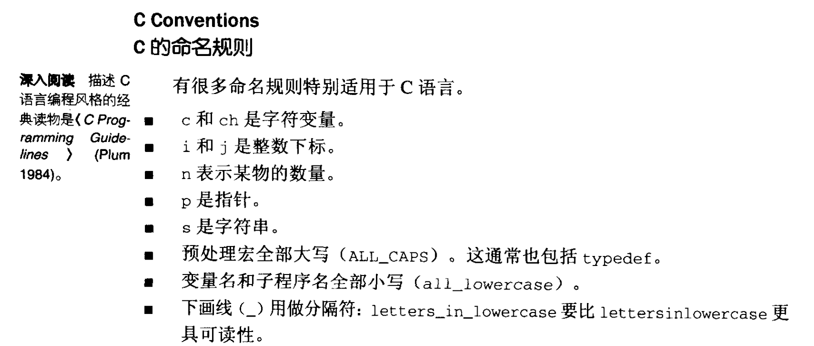


**C++命名规则**

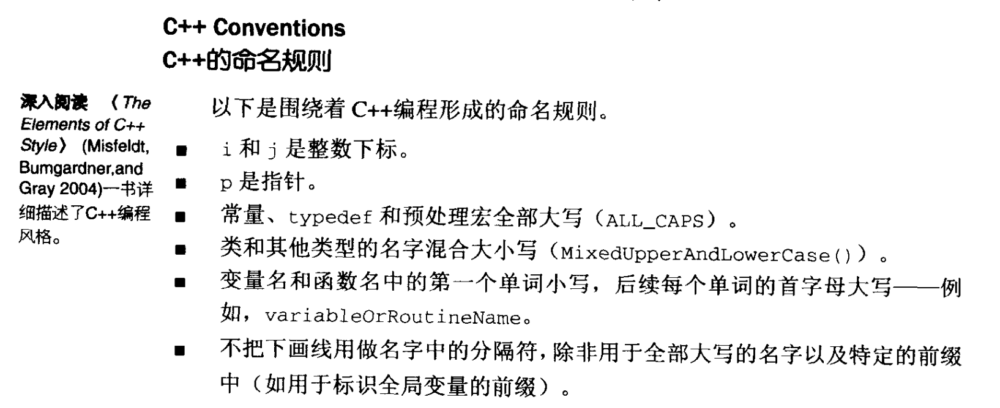


**混合编程语言的注意事项**

如果使用多种语言编写一个程序，需要在上面的基础上再新增一些规则，或者把矛盾的统一一下


**命名规则示例**

一些示例，此处不做展示了，还是以公司的建议为准


### 11.5 标准前缀

对具有通用含义的前缀标准化，为数据命名提供了一种简洁、一致并且可读性 好的方法。有关标准前缀最广为人知的方案是匈牙利命名法，该方案由一组用于指 导变量和子程序命名（而不是指导如何给匈牙利人取名！）的详细原则组成，并且 曾经一度被广泛用于 Microsoft Windows 编程。尽管目前匈牙利命名法已经不再得到 广泛使用，但是使用简洁准确的缩写词的基本命名标准理念却仍然具有价值。

标准化的前缀由两部分组成:用户自定义类型(UDT)的缩写和语义前缀。


**用户自定义类型缩写（UDT）**

UDT用于标识**数据类型**


**语义前缀**

语义前缀标识变量或者对象是**如何使用**的。


语义前缀可以和UDT组合使用，比如第一个段落就可以写成`firstPa`


**标准前缀的优点**

1、由于很多名字都标准化了，所以你在程序中需要记忆的名字更少了。（真的吗？记UDT和语义前缀的表格也很累啊:sweat_smile:）

2、让变量更紧凑，比如`cpa`表示的就是`totalParagraphs`

3、当你看到两个不同UDT的变量之间相互赋值的时候，你可以一眼看出是错误的


### 11.6 创建具备可读性的短名字

虽然C++对名字长度没有限制，但是还是短名字更好一些，下面是一些建议：


**缩写的一般指导原则**

有些是相互冲突的，视情况选择使用

1、使用标准的缩写（公认的或者字典上的）

2、去掉所有非前置元音。（太专业了，忽略:joy:）

3、去掉虚词and、or、the等

4、使用每个单词的第一个或者前几个字母

5、统一的在每个单词的第一、第二或者第三个字母后截断

6、保留每个单词的第一个和最后一个字母

7、使用名字中的每个重要单词，最多不超过3个

8、取出无用的后缀，比如`ing`、`ed`

9、保留每个音节中最引人注目的发音

10、确保不要改变变量的含义

11、反复使用上面的技术，把字符长度控制在8~20个之间


**语音缩写**

比如把`before`写成`b4`，把`to`写成`2`


**有关缩写的评论**

一些避免犯错的规则：

1、不要用从每一个单词中删除一个字符的方式来缩写。写一个字母并不费劲

2、缩写要一致。要不全用`Num`，要不全用`No`

3、创建你能读出来的名字。用`needsCompu`而不是`ndsCmptg`

4、避免使用容易看错或者读错的字符组合。比如表示B的结尾，用`ENDB`比`BEND`更好

5、使用辞典来解决命名冲突。推荐一个网站：[CODELF](https://unbug.github.io/codelf/)

6、在代码里用缩写对照表来解释极短的名字的含义。

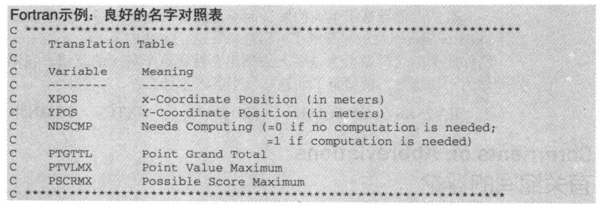

7、在一份项目级的“标准缩写”文档中说明所有缩写

8、记住，名字对于阅读者比作者更重要。


### 11.7 应该避免的名字

1、避免使用令人误解的名字或缩写。比如`FALSE`一般表示错误，如果你把它当做Fig and Almond Season的缩写就不合适了

2、避免使用具有相似含义的名字。比如在一个函数中使用`input`和`inputValue`，这两个变量名太相似了，让人不知道有什么差别

3、避免使用发音相似的变量。比如`wrap`和`rap`，对我们中国人而言可能不是问题?:thinking:

4、避免在变量中用数字。比如用数字区分两个变量`file1`和`file2`

5、避免在名字中拼错单词。

6、避免使用英语中尝尝拼错的单词。

7、不要仅靠大小写拉区分变量名。

8、避免使用多种自然语言。比如一会儿用英语给变量命名，一会儿用日语给变量命名

9、避免使用标准类型、变量和子程序的名称。

10、不要使用与变量含义完全无关的名字。

11、避免在名字中包含易混淆的字符。

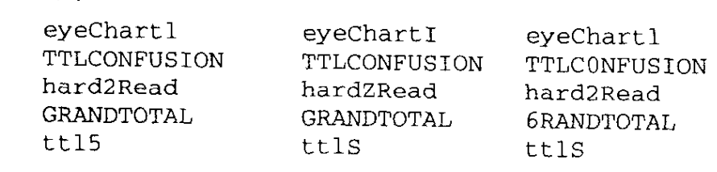


### 11.8 部门的变量命名规则

[《传输与显示产品业务部软件编码规范(C_C++)-2022修订稿.doc》](https://192.0.0.183/Transmission-Share/共享资料库/小组/软件组/团队建设/能力建设/02专题学习/L1-04 代码大全/2022面向新人整合版课件/传输与显示产品业务部软件编码规范(C_C++)-2022修订稿.doc)

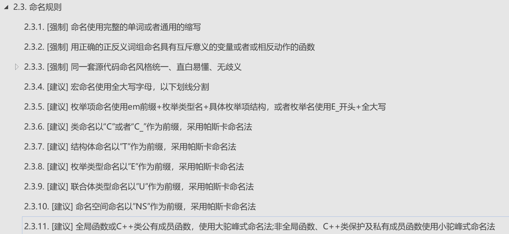


## 第12章：基本数据类型


### 12.1 数值概论

1、避免使用“神秘数值”（指看不出含义的数字）。如果你的语言支持具名常量，可以用它来代替数字。

避免使用神秘数字的好处：

​	① 修改会变得可靠。修改宏而不是修改多个数字，避免遗漏

​	② 修改会变得容易。

​	③ 代码可读性更高

2、如果需要，可以使用硬编码的0和1。一条原则是：程序中仅能出现的文字量就是0和1，其他的文字量应该都用更有描述性的表示

3、预防除零错误。

4、使类型转换变得明显。

```c++
y = x + (float)i;
```

5、避免混合类型的比较。比如拿整型和浮点型比较

6、注意编译器的警告。最好消除编译器的所有警告


### 12.2 整数

使用整数的注意事项：

1、检查整数除法。7/10 不等于0.7，而是0

2、检查整数溢出。做整数乘法或加法时，要注意结果是否溢出


3、检查中间结果溢出。

```c++
int a = 1000000;
int b = 1000000;	
int c = a * b / 1000000;	//a * b 已经溢出了
```


### 12.3 浮点数

浮点数的主要问题是像1/3这样的无限循环小数通常只用7位或者15位精度，这种不精确可能带来麻烦。

以下是一些使用浮点数时应该遵循的原则：

1、避免数量级相差巨大的数之间的加减运算。

2、避免等量判断。

浮点型不要拿来判断相等，但是可以拿来<、>、>=、<=，所以事先定一个可以接受的误差范围，然后判断在这个误差范围内则认为相等。

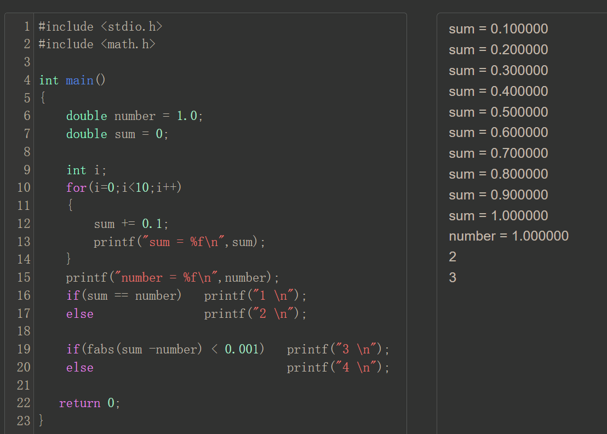

3、处理舍入误差问题。四舍五入导致的误差

一些常见的方案：

​	① 换精度更高的变量类型，比如float换成double

​	② 换用二进制编码的十进制变量。

​	③ 把浮点变量你变成整型变量。比如把3.1415扩大10000倍，变成31415后做整型运算

4、检查语言和函数库对特定数据类型的支持。如果你的语言有专门的机制处理这个问题，可以使用它


### 12.4 字符和字符串

本节给出一些使用字符串的技巧，其中第一条适用于所有语言：

1、避免使用神秘数字和神秘字符串。原因如下：

​	① 一些文字经常要用到，定义成宏会更方便

​	② 为了做多语言版本，需要将需要翻译的内容放到配置文件等地方，而不是直接写在代码中

​	③ 字符串的字面表示形式通常都会占用较多的存储空间。

​	④ 字符和字符串的表面形式是含糊的，而宏可以为此做注释

```c++
if( input_char == 0x1B)
if( input_char == ESCAPE)
```

2、避免off-by-one错误。也就是读写字符串的时候下标偏差1

3、了解你的语言和开发环境是如何支持Unicode的。注意不同模块间字符编码格式之间的转换

4、在程序生命期中尽早决定国际化/本地化策略。国际化意味着多语言版本，需要将字符串做成配置文件还是其他的方式

5、如果你知道只需要支持一种文字的语言，请考虑使用ISO 8859字符集。（对于外国人而言）

6、如果你需要支持多种语言，请使用Unicode

7、采用某种一致的字符串类型转换策略。程序使用同一种格式，尽可能在靠近输入和输出的地方做字符串格式转化


**C语言中的字符串**

C++的string类已经修复了C字符串的很多问题，我们来看下C的字符串有哪些问题：

1、注意字符串指针和字符数组之间的差别：

​	① 警惕任何包含字符串和等号的表达式。

​	因为像strcmp之类的函数都是把字符串作为参数传入，如果你看到 “指针 =  xxx ”的表达式，很可能是错误

​	② 通过命名规则区分变量是字符数组还是字符串指针。

2、把C-style字符串的长度声明为CONSTANT+1。为结束符预留空间

3、用null初始化字符串以避免没有终端的字符串。

4、用字符数组取代C中的指针。有助于避免指针错误，并且编译器也会给更多的警告

5、用`strncpy`取代`strcpy`以避免无终端的字符串。


### 12.5 布尔变量

**一般布尔变量很少用错，下面是一些建议**

1、用布尔变量对程序加以文档说明。你可以把一个表达式的结果赋值给一个布尔变量，再给这个布尔变量取名，增加可读性

```c++
int i = 0,b = 1;
bool zhengShu = (i > 0 && b > 0);
if(zhengShu) .......
```

2、用布尔变量来简化复杂的判断。要是上面的`if`中判断条件很多，用多个布尔变量可以增加可读性

3、如果需要的话，创建自己的布尔类型。C语言没有`bool`类型，你可以自己创建一个

```C
typedef int BOOLEAN;
enum Boolean	//或者这样
{
	FALSE=0,
    TRUE,
};
```


### 12.6 枚举类型

枚举的好处是说明性更强，不用像 “1代表红色、2代表绿色”这样写很多注释，而是用枚举的名字`COLOE_RED`就能看出意思。

**下面是一些如何使用枚举类型的指导原则：**

1、用枚举来提高可读性。

```C
int color = 1; 			//不使用枚举
int color = COLOR_RED;	//使用枚举
```

2、用枚举来提高可靠性。

```c
enum color
{
	COLOR_RED,
	COLOR_BLUE,
};

enum digital
{
	DIGITAL_ONE,
	DIGITAL_TWO,
	DIGITAL_THREE,
};

enum color c;
c = COLOR_RED;		//正确
c = DIGITAL_ONE;	//报错
c = 3;			    //报错
```

3、用枚举来简化修改。只改枚举一个地方就行

4、将枚举类型作为布尔变量的替代方案。枚举是布尔变量的一种扩展

5、检查非法数值。如果你`if else`或者`case`遍历枚举的情况，记得处理`else`和`default`

6、定义出枚举的第一项和最后一项，以便用于循环边界

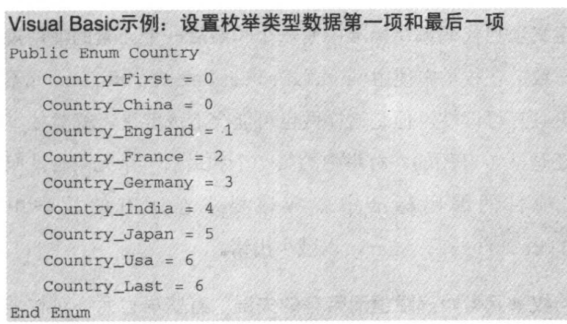

7、把枚举类型的第一个元素留作非法值。比如错误码的枚举，第一个是代表正常的

8、明确定义项目代码编写标准中第一个和最后一个元素的使用规则，并且在使用时保持一致。

​	比如上图有2个0，2个6，循环的时候该拿哪个判断呢？顶一个规则

9、警惕给枚举元素明确赋值带来的失误。


像上图中的枚举，就不能在循环中被用作数组下标


如果你的语言中没有枚举变量：C/C++支持，此节跳过


### 12.7 具名常量

一旦赋值后就不能再修改。

```c
#define MAX 100
const int MAX = 100;	
```

1、在数据声明中使用具名常量

```c
const int LEN_MAX = 100;
char name[LEN_MAX+1];
```

2、避免直接使用数字，即时是安全的。

```c
int i;
for(i = 0; i < 12; i++)		//12是什么意思呢
```

3、用具有适当作用域的变量或者类来模拟具名常量。 C/C++本身支持具名常量，此处忽略

4、统一地使用具名常量。不要一会用`char name[LEN_MAX+1]`，一会用`char name[100]`


### 12.8 数组

**一些使用数组的建议**

1、确认所有的数组下标都没有超出数组的边界。

2、考虑用容器来取代数组，或者将数组作为顺序化结构来使用。

​	比如C++的`vector`、`list`等，一些人建议不要随机访问数组，只能顺序地访问数组。但随机访问不是数组的优点吗？:thinking:

3、检查数组的边界点。说到底和第一条一样

4、如果数组是多维的，确认下标的使用顺序是正确的。

5、提防下标串话。两个`for`循环的时候把`i`和`j`搞错的情况

6、在C中结合`ARREY_LENGTH()`宏来使用数组

```c
#define ARRAY_LENGTH( x ) (sizeof(x)/sizeof(x[0]))		//用于计算数组包含的成员个数
```


### 12.9  创建自己的类型（类型别名）

比如要定义一个变量表示海拔，你起先觉得需要`double`才够精确，但客户说只要`float`就行了，

你担心后续客户会改需求，又改成double，那么，你可以使用`typedef`创建自己的类型来解决

```C
typedef float Coordinate;	//坐标的意思

Coordinate x = 1.234;
```

**创建自己的类型的好处：**

1、易于修改。

2、避免过多的信息分发。

3、增加可靠性。举例是Ada，C/C++不理解

4、弥补语言的不足。比如C中自定义类型模拟布尔类型


**创建自己的类型的一些指导原则：**

1、给创建的类型取功能导向的名字。比如上文中的`Coordinate`而不是定义成`myFudian`，再比如布尔类型的`BOOLEAN`

2、不要重定义一个预定义的类型。比如你又`typedef`了一个``int`

3、定义替代类型以便于移植。

​	比如你定义了一个`INT32`类型，用它代替`int`，用`LONG64`类型来代替long。当你移植平台后，你可重新定义

​	`INT32`和`LONG64`所替换的对象，改成该硬件平台下的类型。

4、考虑创建一个类而不是使用`typedef`


## 第13章：不常见的数据类型

介绍除12章之外的数据类型


### 13.1 结构体

C和C++的`struct`，有时候类和结构体很像（在类没有成员函数的时候）。有些人倾向于使用类，因为私密性和功能性更好，

但结构体也有它的优点，比如：

1、用结构体来明确数据关系。使用结构体把一堆数据包在一起，再取一个结构体名，解释了他们之间的联系

2、用结构体简化对数据块的操作。

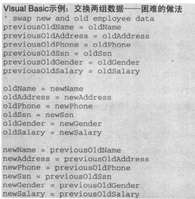

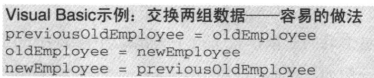

3、用结构体来简化参数列表。传一个结构体指针，而不用传所有结构体成员

4、用结构体来减少维护。那些和结构体没有关系的代码在修改结构体时不会受到影响


### 13.2 指针

指针很容易出错。


**用来理解指针的范例**

1、内存中的位置。

内存中的一个位置就是一个地址。在32位处理器中就是一个32位的值（4字节）。指针变量中存的就是这样一个4字节的地址。

想要使用指针指向的数据，就必须访问该地址。

2、如何解释指针所指的内容

看指针的类型，这个类型决定了指针取地址后的多少大小并解释成哪种类型


**使用指针的一般技巧**

指针错误一般都产生于指针指向了它不应该指向的位置，修改了该位置的数据造成**内存破坏**。

我们需要尽量避免造成指针错误，并且采取一些额外措施使得错误能被发现。下面是一些建议

1、把指针操作限制在子程序或者类中。把操作指针的行为写到一个函数里，可以防止你的程序中到处是指针操作，减小犯错的概率。

2、同时声明和定义指针。 也就是声明的时候就给指针赋值成`NULL`

3、在与指针分配相同的作用域内删除指针。比如你在一个子程序中分配了指针，就该在退出子程序前释放指针

4、在使用指针之前检查指针。先判空再使用指针

5、先检查指针所引用的变量再使用它。比如指针指向的是一个最大100字符的字符串，判空后可以先`strlen`看下它的长度是否超过了100

6、用狗牌字段来检测损毁的内存。

​	比如你只需要申请100个字节，但你申请104个字节，前4个字节存放一个约定的数值作为狗牌。然后仅使用后面的100个字节

​	当你需要free时，先看下狗牌上是不是那个约定的数值，是的话104个字节全释放，否则的话认为已经释放过了，不要重复释放。

7、增加明显的冗余。和狗牌一样的机制

8、用额外的指针变量来提高代码清晰度。和**不要用一个变量代表两个意思**一样，可以用多个指针来增加可读性

9、简化复杂的指针表达式。如果有一个很复杂的指针取值操作，比如a->b->c，那么用一个变量接收它，后续用这个变量

```c
int number = a->b->c;
```

10、画一个图。 画图解释指针指向

11、按照正确的顺序删除链表中的指针。错误的删除会导致有些指针指向的内存无法释放

12、分配一片保留的内存做后备区域。防止你的程序忽然用尽了内存导致无法收尾，此时可以释放这部分后备内存用于收尾工作

13、粉碎垃圾数据。在释放内存前将内存清空

14、在删除或者释放指针之后把它们设置为空值。释放指针后把指针指向NULL。

15、 在删除变量之前检查非法指针。在`free`指针之前先判断指针是否为NULL，避免重复释放

16、跟踪指针分配情况。建一个表和一个查询表的函数，用以释放指针，释放指针后就把它从列表中删除

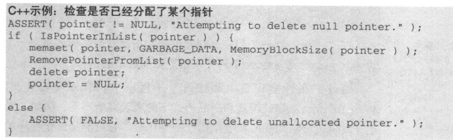

17、编写覆盖子程序，集中实现避免指针问题的策略。比如使用SAFE_NEW和SAFE_DELETE宏

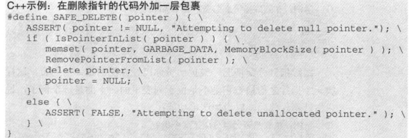

18、采用非指针技术。指针容易出错，可能的话使用别的技术


**C++指针**

1、理解指针和引用之间的区别。在C++中，指针（*）和引用（&）都能够间接地引用对象。

```c++
int a = 2, &ra = a;	//ra是a的引用
int *pa = &a;		//pa是a的指针
ra++;			   //a = 3
*p += 1;		   //a = 4
```

​	引用和指针的差别是，引用必须得有一个对象，而指针是可以指向空的。

2、把指针用于“按引用传递”参数，把`const`引用用于“按值传递”参数。

​	如果直接传参数（而不是指针或引用），函数需要创建一个变量并拷贝入参，这样比较耗时。传指针和引用的话就省去了这部分操作。

​	但是，如果我想要求传入的值不被修改呢？（直接传值就不会被修改），可以给引用加上`const`关键字

```c++
int func(int *pa, const int &ra);	//pa指向的内容可修改，ra引用的对象不可修改
```

​	实际上指针也可以指定指向的内容不可修改

```c++
const int *pa;	//指向整型常量的指针，它指向的值不能修改
int * const pa;	//指向整型的常量指针，它不能指向别的变量，但它指向的变量的值是可以变的
//所以这样也是可以的
int func(const int *pa,const int &ra);	//pa和ra指向的内容都不能修改
```

3、使用`auto_ptr`。（已在C++11中废弃并在C++17中正式从`STL`移除）

大概的意思是，调用`auto_ptr`类申请指针，在`auto_ptr`类的构造函数里会申请内存，它的析构函数会释放内存。

因此你不需要关心释放内存的事。

```c++
void demo()
{
	auto_ptr<double> apd(new double);
	*apd = 25.5;
}
```

但是会存在安全问题，比如下面`p1`和`p2`都指向同一块内存，到时候它们的析构函数都执行一遍，会重复释放内存。

```c++
void demo()
{
	auto_ptr<double> p1(new double);
	auto_ptr<double> p2;
	p2 = p1;
}
```


4、灵活使用智能指针。

参考文章：

[智能指针类模板：auto_ptr、unique_ptr、shared_ptr的原理与使用]([智能指针类模板：auto_ptr、unique_ptr、shared_ptr的原理与使用_智能指针模板-CSDN博客](https://blog.csdn.net/baidu_38797690/article/details/131355601))


**C指针**

1、使用显式指针类型而不是默认类型。分配内存的时候显式地告诉接收方申请的类型，方便编译器检查

```c++
double *p = (double *)mallco(sizeof(double));
```

2、避免强制类型转换。

3、遵循参数传递的星号规则。正确的语法


### 13.3 全局数据

使用全局数据的风险比使用局部数据大。

常见的问题：

1、无意间修改了全局数据

2、与全局变量有关的奇异和令人激动的问题。


因为程序调用时把`globalVal`赋值给了`inputVar`，所以它们实际上是一个值

3、与全局数据有关的代码重入问题。包含全局变量的函数一般是不能重入的

4、全局变量阻碍代码重用。移植函数到别的项目上会很困难

5、与全局数据有关的非确定性的初始化顺序事项。如果你初始化一个全局变量的时候是用了另一个全局变量，不能保证它是已经被初始化了的。

6、全局数据破坏了模块化和智力上的可管理性。破坏模块化，难以跟踪理解


**使用全局数据的理由**

如果遵循如下的原则，那么全局变量在一些场合也是有用的。

1、保存全局数值。一些概念上用于整个程序的数据

2、模拟具名常量。`const`修饰 全局变量，因为不会修改，所以也好理解

3、模拟枚举类型。python等不支持枚举的语言可用

4、简化对极其常用的数据的使用。如果好多函数都需要某个参数，可以把这个参数提成全局变量

5、消除流浪数据。如果有一个变量需要通过N个程序透传到最终的程序，可以把它提成全局变量


**只有万不得已时才使用全局变量**

一些替代方案：

1、首先把一个变量设成局部的，仅当需要的时候才把变量设置成全局

2、区分全局变量和类变量。类变量也可以在类的成员函数内被访问，要思考下是不是用类变量就可以了


**用访问器子程序来取代全局数据**

访问器子程序的优势

1. 你获得了对数据的集中控制
2. 你可以确保对变量的所有引用都得到了保护
3. 自动获取信息隐藏的普遍益处
4. 访问器子程序可以很容易转变为抽象数据类型

如何使用访问器子程序：

1. 要求所有的代码通过访问器子程序来存储数据：比如，所有全局以g_开头，除了访问器，其他代码都不得访问
2. 不要把所有的全局数据都扔在一处：尽量把全局数据和访问器子程序打包到适合的类里面
3. 用锁定来控制对全局变量的访问：锁定要求使用或者更新一个全局变量值之前，该变量必须被签出，完成使用之后再签入。（加锁）
4. 在访问器子程序里构建一个抽象层
5. 对一项数据的所有访问都应该在同一个层次上（操作一致性）

降低全局数据的风险

1. 创建一种命名规则来突出全局变量
2. 为全部的全局变量创建一份注释良好的清单
3. 不要用全局变量来存放中间结果
4. 不要把所有的数据都放在一个大对象中并导出传递，以说明你没有使用全局变量


## 第14章：组织直线型代码

本章介绍最简单的控制流：即按先后顺序放置语句和语句块


### 14.1 必须有明确顺序的语句

指那些必须按照某些顺序执行的语句。有前后依赖关系的语句。


但是也有一些写法，使得这种依赖性被隐藏起来了。


比如上面这种，需要知道季度的数据需要在月度数据算出来之后才能算出，否则就看不出这几行之间有什么依赖性。

或者，一个初始化成员变量的函数和一堆填充成员变量的函数，也有隐藏的先后关系，即：先初始化，再填充。


下面是一些让依赖性更明显的建议：

1、**设法组织代码，使依赖性更明显。**比如成员变量初始化，是否可以写到各自赋值的子函数开头，或者把初始化函数名字取得更明显`initializeExpenseData`

2、**使子程序名更凸显依赖性。**尽量在子程序名字中体现出它的全部功能

3、**利用子程序参数明确显示依赖关系。**如果第二行的入参是第一行修改过的，那他们肯定是有依赖性的

4、**用注释对不明晰的依赖性进行说明。**

5、**用断言或者错误处理代码来检查依赖性。**比如在构造函数中设置一个成员变量`isInit`标识是否已经完成初始化，后续使用到成员变量前都先判断一遍它


### 14.2 顺序无关的语句

有时候一些语句前后并没有顺序关系，它们没有依赖性，但是顺序的确对可读性、性能和可维护性有影响，这个时候怎么决定它们的顺序呢？

你可以使用第二标准来判断语句或者代码的顺序。这其中的指导原则就是**就近原则**：把相关的操作放在一起


**使代码易于自上而下地阅读**

自上而下的顺序对提高可读性最有帮助。

```c++
//不好的例子
int a;
int b;
int c;

a = 1 + 1;
b = 2 + 2;
c = 3 + 3;

//好的例子
int d;
d = 4 + 4;

int e;
e = 5 + 5;
```


**把相关的语句组织在一起**

如果一些语句处理了相同的数据、执行了类似的任务，或者有某种执行顺序上的依赖关系，把他们放在一起。

检查办法：把子程序打印出来，然后在相关的语句上画上框。


## 第15章：使用条件语句

条件语句用来控制其他语句是否执行：其他语句在`if`、`else`、`case`、`switch`等语句里时变为有条件执行。


### 15.1 if语句


**简单`if then`语句**

一些指导原则：

**1、首先写正常代码路径；再处理不常见情况** ：写代码时，让正常情况的代码路径尽量清晰

**2、确保对于等量的分支是正确的**：不要用`>`代替`>=`，或者使用`<`代替`<=`，以避免off-by-one（下标偏差）错误

**3、把正常情况的处理放在`if`后面而不是放在`else`后面**。

**4、让if子句后面跟随一个有意义的语句**：`if`的执行语句不要为空，会很奇怪

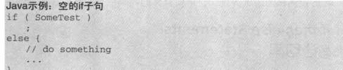

**5、考虑`else`子句**：就算你只需要一个`if`，不需要`else`，你也可以写一个空语句，表示你考虑过了，并注释为什么不需要处理

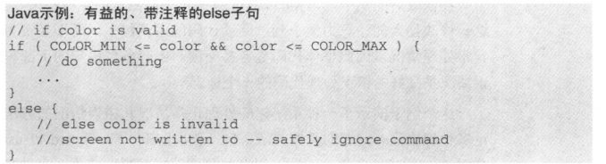

**6、测试else子句的正确性**：测试中应该包含异常情况的测试

**7、检查if和else语句有没有弄反**：一个编程中常见的错误


**`if-else if` 语句串**

一些指导原则：

**1、利用布尔函数调用简化复杂的检测**：`if`的判断内容不要太复杂，如果太复杂，就提成一个布尔函数

**2、把最常见的情况放在最前面**：这样方便阅读，也更有效率（因为正常情况一般是最常出现的）

**3、确保所有的情况都考虑到了**：在最后一个`else`子句里，用出错消息或者断言来捕捉那些你不考虑的情况

**4、如果你的语言支持，用别的语句串替换成其他结构**：比如`case`一样，因为他们更容易编写和阅读


### 15.2 **case语句**

不同的语言对`case`的支持不同，比如C++只支持在`case`中使用有序数类型（整数）

下面是如何有效使用`case`的一些建议

**1、为case选择最有效的排列顺序**

- 按字母顺序或者数字顺序排列各种情况

- 把正常的情况放在前面，并注释说明

- 按执行频率排序`case`子句

  

**2、使用case语句的诀窍**

下面是使用`case`语句的几点提示：

- **简化每种情况对应的操作**：case执行语句太长的话，代码会难以阅读，如果语句很长，可以提成一个函数
- **不要为了使用`case`语句而可以制造一个变量**：如果`case`的判断内容很复杂，那还不如用`if else if`，但也不要为了让判断内容变简单，而创造一个变量


- **把`default`子句只用于检查真正的默认情况**：如果你只有一种情况，并把这种情况的处理写在`default`里，那是不合适的
- **在C++和Java里，避免代码执行行越过一条case子句的末尾**：注意写break
- **在C++里，在case末尾明确无误地标明需要穿越执行的程序流程**：如果有意不写break，要注释说明原因


## 第16章 ：控制循环

能够导致应用程序反复执行一段代码的结构。常用的循环有`for`、`while`、`do-while`。


### 16.1 选择循环的种类

在大多数语言中，你只能用到少数几种循环

- 计数循环（counted loop）：执行的次数是一定的
- 连续求值的循环（continuously evaluated loop）：预先不知道执行多少次，它会在每次迭代时检查是否应该结束
- 无限循环（endless loop）：一旦启动就会一直执行下去
- 迭代器循环（iterator loop）：对容器类里面的每个元素执行一次


不同的循环种类在灵活性上有差别----有些次数是一定的，有些在循环前判断条件是否成立。而这个判断也可以放在开头、中间、结尾

循环的种类


**什么时候使用while循环**

如果预先不知道迭代要迭代多少次，那就使用while循环。检测位于循环开始，那么执行语句不一定会执行到，如果放在结尾，则至少能执行一遍。


**什么时候用带退出的循环**

带退出的循环就是终止条件出现在循环中间而不是开始或者末尾的循环。对C++而言就是带`break`或者`goto`的循环


**1、正常的带退出循环**

带退出循环通常用是在这样的场合下使用：


上图中这样有两部分完全相同的代码，在修改的时候容易忘记。下面的代码更清晰


在写这种循环时，需要考虑如下的细节：

- 不要把退出条件写得到处都是
- 用注释来阐明操作意图


**2、非正常的带退出循环**

下面是另一种情况

```c++
//一种不好的做法
int i = 0, a = 0, b = 0;
goto start;
while( i < 10 )
{
	a++;
start:
    b++;
    i++;
}
```

上图以`goto`进入循环，然后以`while`判断来退出循环，这样的做法很少见，因此也不建议。

```c++
//一种好的做法
int i = 0, a = 0, b = 0;
goto start;
while(1)
{
	b++;
    i++;
	if( i < 10 )
    {
        a++;
    }
}
```


**何时使用for循环**

如果你要一个执行次数固定的循环，那可以使用`for`循环。


**何时使用`foreach`循环**

C++不涉及。


### 16.2 循环控制

循环会出如下的错误：

1、忽略或错误地对循环执行初始化

2、忽略了对累加变量或者其他与循环有关的变量执行初始化

3、不正确的嵌套、不正确的循环终止

4、忽略或错误地增加了循环变量的值

5、不正确的循环下标访问数组元素


两种阻止错误发生的方法：

1、减少能影响循环各种因素的数量：影响循环退出的因素尽量少

2、把循环内部当一个子程序看待


**进入循环**

在代码进入循环的时候的一些指导原则：

1. **只从一个位置进入循环**

   比如上文提到的goto进入循环这种不常见的方式

   

2. **把初始化代码紧放在循环前面**

   比如把循环下标的初始化放在循环前面等。这样便于修改和复制整个循环到别的地方

   

3. **用while(true)表示无限循环**

   或者`for( ; ; )`

   

4. **在适当的情况下多使用for循环**

   由于`for`循环把控制条件都写在一起，修改起来的时候更不容易遗漏。而`while(i > 100)`之类的循环容易忘记修改`i`递增的代码

   

5. **在while循环更适用的情况下，不要使用for循环**

​	for循环的头，应该只包含控制语句（那些用于初始化和终止循环，或者用于使循环终止的语句），而不应该塞进业务语句。

```c++
int i = 0, a = 0, b = 0;
for(i = 0; i < 10; a++)
{
	b++;
	i++;	//这个才应该写到第二行，而不是a++
}
```

有些别的会更适合使用while循环。


**处理好循环体**

下面讲解如何处理循环体：

1. **用`{`和`}`把循环中的语句括起来** 

   增加可读性，避免出错

2. **避免空循环**

   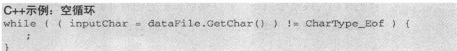

   可以把while那一行的操作拆出来

   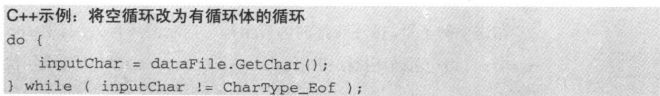

3. **把循环内务操作（i++之类的）要么放在循环开始，要么放在循环末尾**

   把`i++`这类控制循环的语句放开头或结尾，方便查看和修改

4. **一个循环只做一件事**

​	循环应该和子程序一样，一个循环只做一件事


**退出循环**

下面讲如何处理循环尾

1. **设法确认循环能够终止**

   基本要求，要考虑正常、异常情况下都能终止

   

2. **使循环终止条件看起来很明显**

   如果不使用`goto`、`break`，那么终止条件就是明显的，总之，把终止条件放在一个地方

   

3. **不要为了终止循环而胡乱改动for循环下标**

   

   这样明显是不合适的，一旦写好了for循环，那么它的循环计数器`i`就不应该受你控制了

   

4. **避免出现依赖于循环下标最终取值的代码**

   

   这种做法很容易出错，如箭头指的地方`<`和`<=`用错之类的，更好的做法

   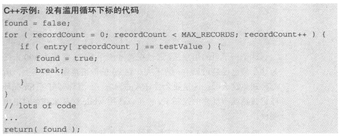

   

5. **考虑使用安全计数器**

安全计数器是一个变量，你在每次循环之后都递增它，一遍判断该循环的执行次数是不是过多。

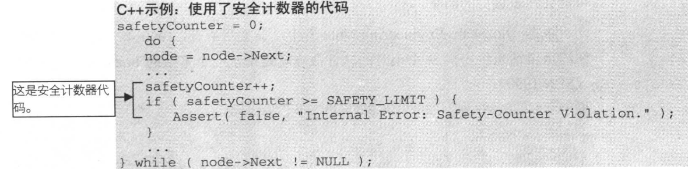

这种方法不能包治百病，因为它增加了复杂度，在修改的时候可能会忘记修改安全计数器相关的代码。


**提前退出循环**

指`break`、`goto`等中途退出循环的方式

一些建议：

1. **考虑在while循环中使用break语句而不用布尔标记**

   直接break，而不是产生布尔标记让循环的判断条件去判断。这样容易理解

   

2. **小心那些有很多break散步其中的循环**

   这可能意味着程序员对该循环的结构或者对循环在围绕它的代码中的角色缺乏清晰的认识。break的位置也可能出错导致意想不到的后果

   

3. **在循环开始处使用continue进行判断**

   一种continue的使用场景：循环中要阅读记录、忽略掉某一种记录而处理另一种

   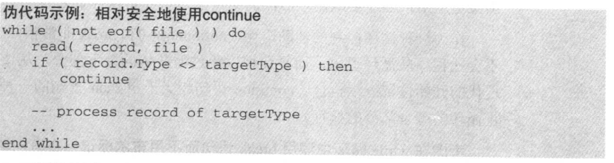

   

4. **如果语言支持，请使用带标号break结构**

   指的是break能指定自己退出的是哪个循环，C++不支持

   

5. **使用break和continue时要小心谨慎**

​	break让循环体无法再作为一个函数了，让人不得不去研究下循环体。所以能不用尽量不用


**检查端点**

检查循环开始的条件、循环过程中的处理、循环结束的条件是否合理正确。


**使用循环变量（i，j之类的）**

一些指导原则

1. **用整数或者枚举类型表示数组和循环的边界**

   

2. **在嵌套循环中使用有意义的变量名来提高可读性**

   比如遍历二维数组，可以把`i`、`j`替换成 `row` 、`col`

   

3. **用有意义的名字来避免循环下标串话（用错下标变量）**

   和第二点差不多，也是给`i`、`j`取个别的名字，因为它们没有意义，所以太容易弄混了

   

4. **把循环下标变量的作用域限定在本循环内**

   ```c++
   for(int i = 0; i < 10; i++);
   //do somethings else
   for(int i = 0; i < 10; i++);
   ```

   像这样在循环只定义循环变量是最好的，上文中的`i`的作用域都仅限于自己处于的`for`循环，但不同的编译器得到的结果不一样，所以还是尽量小心。


**循环应该有多长**

1. 循环要尽可能地短，以便能够一目了然
2. 把嵌套限制在3层以内
3. 把长循环的内容移到子程序内
4. 要让长循环格外清晰


### 16.3 轻松创建循环 -- 由内而外

下面是一般的过程：

从字面量来编写代码，然后缩进它，在外面加上一层循环，然后用循环下标或计算式替换掉那些字面量

先写伪代码注释


将伪代码转成代码


填入下标

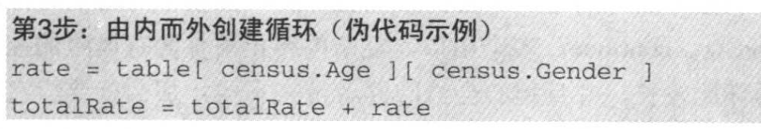

套循环


细化


填写初始化


### 16.4 循环和数组的关系

循环常用来操纵数组


## 第17章：不常见的控制结构


### 17.1 子程序中的多处返回

指通过`return`、`exit`等控制结构，在任何需要的时候退出子程序。下面是一些指导原则

1. **如果能增强可读性，那么使用`return`。**

   某些子程序里，一旦知道了答案就马上返回

2. **用防卫子句（guard clause）（早返回或者早退出）来简化复杂的错误处理。**

   指函数开始时的各种异常判断，如果发现异常，则提前退出，这样形成的多处返回。

   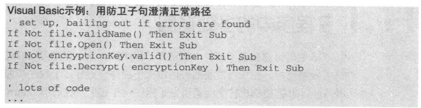

3. **减少每个子程序中`return`的数量。**

   太多的话可能会导致看后面的代码时意识不到前面已经退出了。


### 17.2 递归

在递归 （recursion）里面，一个子程序自己负责解决某个问题的一小部分， 它还把问题分解成很多的小块，然后调用自己来分别解决每一小块。当问题的小部分很容易解决，而问题的大部分也很容易分解成众多的小部分时，常常会用到递归。

使用得好的话，可以显得很优雅


**递归的例子**

假设你有一个表示迷宫的数据类型。从本质上来说，迷宫就是一个网格，在 网格的每一个点，你都有可能向上下左右四个方向移动。

你通常可以往不止一个方向移动。

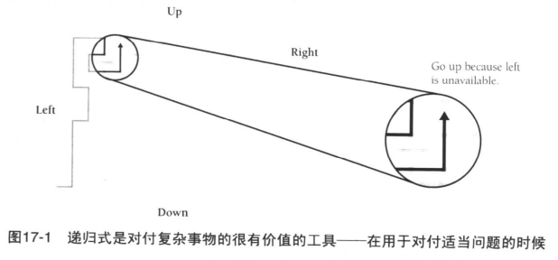

```c++
bool FindPathThroughMaze ( Maze maze, Point position ) 
{
	// if the position has already been tried, don't try it again
	if ( AlreadyTried ( maze, position ) ) {return false;}
	
	// if this position is the exit, declare success
	if (ThisIsTheExit (maze, position) ) {return true;}
	
	// remember that this position has been tried
	RememberPosition ( maze, position );
	
	// check the paths to the left, up, down, and to the right; if
	// any path is successful, stop looking
	if ( MoveLeft ( maze, position, &newPosition ) ) 
	{
		if ( FindPathThroughMaze ( maze, newPosition ) ) 
		{
			return true;
		}
	}
	
	if ( MoveUp ( maze, position, &newPosition ) ) 
	{
		if ( FindPathThroughMaze ( maze, newPosition ) ) 
		{
			return true;
		}
	}
	
	if( MoveDown ( maze, position, &newPosition ) )
    {
    	if (FindPathThroughMaze (maze, newPosition )) 
    	{
    		return true;
    	}
    }
    
    if( MoveRight ( maze, position, &newPosition ) ) 
    {
    	if (FindPathThroughMaze ( maze, newPosition ) ) 
    	{
    		return true;
    	}
    }
    return false;
}
```


**使用递归的技巧**

1. **确认递归能够停止**

   检查子程序以确认其中包含一条非递归的路径，像上文的`AlreadyTried`和`ThisIsTheExit`

2. **使用安全计时器防止出现无穷递归**

   通过安全计时器限制执行的次数，防止无穷递归

3. **把递归限制在一个子程序内**

   不要循环递归（A调用B，B调用C，C调用A），这样很难理解，也容易出错

4. **留心栈空间**

   由于函数一直没退出，每调一次就申请栈，当递归层次太深，容易导致线程的栈溢出。可以考虑改用堆（malloc或者new）内存

5. **不要用递归去计算阶乘或者斐波那契数列**

   可以用递归实现，但使用循环会更容易懂。所以不要把代码写复杂了


### 17.3 goto

针对`goto`的争议一直存在，下面是一些论点：


**反对goto的论点**

1. **没有`goto`的代码更容易证明其正确性。**

2. **含有`goto`的代码很难安排好格式。**

   它影响缩进

3. **使用`goto`会破坏编译器的优化特性。**

   有些优化要求程序的控制流程位于不多的几个语句之间，而无条件的goto会使得流程很难分析

4. **使用`goto`的示例中，它会使运行速度更慢，而且代码更大。**


**支持goto的论点**

**支持者也普遍强调要在特定的场合下谨慎地使用`goto`**

1. **如果使用位置恰当，goto可以减少重复的代码。**
2. **goto在分配资源、使用资源后再释放资源的子程序中非常有用。**
3. **在某些情况下，使用`goto`会让代码运行速度更快，体积更小。**
4. **编程水平高不等于不使用`goto`。**
5. **在对`goto`做了几十年研究后，人们还是无法证明它是有害的。**
6. **很多现代语言已经包含`goto`。**


**关于`goto`的虚假辩论**

人们对于`goto`的争论很肤浅，仅仅是用于说明用或者不用带来了某个很小的好处，然后就说应该在任意场合都使用或者不使用。

下面是一些多数程序员都赞成使用`goto`的场景举例：


**错误处理和goto**


如果你不想使用goto，那可以使用以下的几种方法代替：

1. 用嵌套的`if`语句重写

2. 用一个状态变量重写代码

   比如创建一个变量叫`errState`，记录当前程序的状态

3. 用try-finally重写

   C++不支持，不做叙述

   

**各种方法之前的比较**

**goto**的方法避免了深层的嵌套和不必要的检测

嵌套`if`的方法避免了使用`goto`,但它的嵌套太多了，并且增加了子程序的复杂度

使用状态变量避免了了使用`goto`和深层嵌套，但也引入了额外的检测。


**goto和在else子句中的代码共享**


上图这种场景下可以使用goto，如果是C++的话，也可以使用下面的写法：

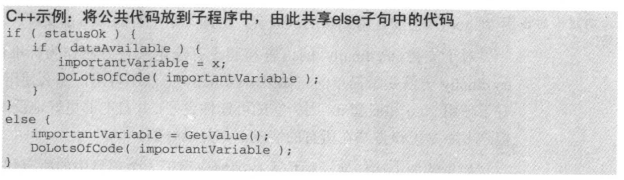


**goto使用原则总结**

- 在那些不支持结构化控制语句的语言中，使用goto去模拟那些控制结构，但要准确地模拟
- 在已经支持结构化控制语句的语言中，不要用goto
- 如果为了提升效率而使用goto，评估下提升的效果多大，是否有必要
- 除非你要模拟结构化语句，否则尽量在每个子程序中只使用一个goto标号
- 除非你要模拟结构化语句，否则尽量让goto向前跳转而不是向后
- 确认所有的goto标号都被用到
- 确认goto不会产生某些执行不到的代码
- 如果你是经理，需要知道使用goto也不是不可以，没必要纠结


### 17.4 针对不常见控制结构的观点

软件开发对这些不常见的控制结构的观点也在不断变化。


## 第18章：表驱动法

表驱动法是一种编程模式（scheme）一从表里面查找信息而不使用逻辑语 句（if和case）。

事实上，凡是能通过逻辑语句来选择的事物，都可以通过查表来选择。对简单的情况而言，使用逻辑语句更为容易和直白。

但随着逻辑链的越来越复杂，查表法也就愈发显得更具吸引力。


### 18.1 表驱动法使用总则

在适当的环境下,采用表驱动法,所生成的代码会比复杂的逻辑代码更简单、 更容易修改,而且效率更高。

假设你希望把字符划分成字母、标点符号和数字三类,那么你也许会用到下面这种复杂的逻辑链:

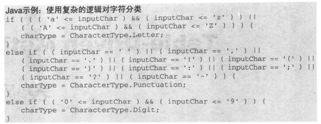

如果使用一个查询表，就可以把每一个字符的类型保存在一个用字符编码访问的数组里，那么上面的代码可以替换为：


**使用表驱动法的两个问题**

1、怎么从表中查询条目。

如果你希望把数据按月进行分类，那么创建一个月份表是非常直截了当的，你可以创建一个下标从1~12的数组实现它。

另一些数据可能很难直接用于查表。例如，假设你希望按照社会安全号码做 数据分类，那么除非你可以承受在表里面存放999-99-9999条记录，

否则就不能用 社会安全号码直接查表。你会被迫采用一种更为复杂的方法。下面是从表里面查 询记录的方法列表：

- 直接访问（Direct access）
- 索引访问（Indexed access）
- 阶梯访问（Stair-step access）

2、你应该在表里面存些什么。

有时候，表查询出来的结果是数据，那么应该存数据。有时候查询出来的结果是动作，，那么应该存描述该动作的代码（函数）


### 18.2 直接访问表

直接访问是因为你无需绕很多复杂的圈子就能够在表里找到你想要的信息。


**示例一：一个月中的天数**

如果要计算计算每个月的天数（不考虑闰月），那么笨办法是写一堆`if else`。


如果用直接访问表的方法的话，可以简化为：

```c++
int daysPerMonth[12] = {31,28,31,30,31,30,31,31,30,31,30,31};
int days = daysperMonth[month - 1];
```


**示例二：保险费率**

假设你在写一个计算医疗保险费率的程序,这些费率是随着年龄、性别、婚姻状况以及吸烟与否的不同情况而变化的。

如果你不得不用逻辑控制结构来表示 不同费率的话,那么可能会写出下面的代码:

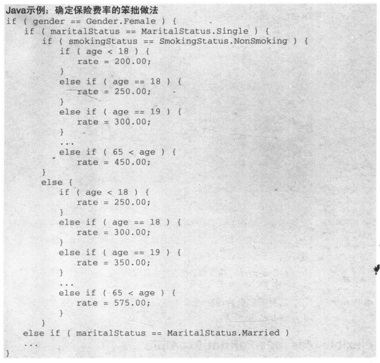

上面的代码已经简化过了，没有显示已婚女性、所有的男士或者16~65岁之间的人士，这样的判断太复杂了。

更好的方法是把这些费率存入所有因素（年龄、性别、婚姻、抽烟情况等）索引的表里。

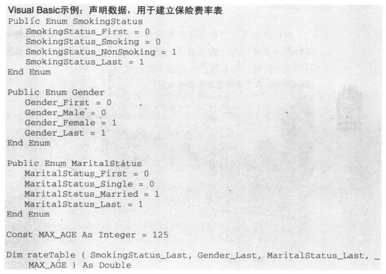

在声明了这个数组以后,你还需要找一种把数据存进去的方法。你可以使用赋值语句、从磁盘文件中读入数据、计算出这些数据、或者执行任何合适的操作。

 一旦备好了这些数据,在需要计算费率时,你就可以直接获取结果了。前面那段 复杂的逻辑就可以用类似于下面这样简单的语句取而代之:


**例子:灵活的消息**

如果使用场景是读取一大堆文件，每个文件中有若干个数据，每个数据都有个ID标识它代表什么，是什么类型。需要设备读取文件后将这些数据打印出来。

假设文件中有如下几类数据：

```
ID = 1 代表：平均温度 数据类型：float
ID = 2 代表：经度     数据类型：double
ID = 3 代表：维度	 数据类型：double
ID = 4 代表：采样点数  数据类型：int
......
```

基于逻辑的方法就需要判断ID的值，有多少个ID种类，就定义多少个子函数用于打印该种类数据。

```c++
if(ID == 1) 		printAvangeTemper();	//打印“平均温度:20”
else if(ID == 2)	printlongitude();		//打印“经度：111”
......
```

而使用表的话，可以更简洁，将ID对应的文字和打印函数都写到表内，这样就可以只写几个打印基本数据类型的函数就可以了

```c++
DATA_FORMART data[10] = 
{
    //ID   文字          打印函数
	{1,    "平均温度："，printFloat},
	{2,    "经度："，    printDouble},
	......
};
```

这样只要拿着ID，就可以取出文字，然后用打印函数打印下数据就可以了，不需要创建那么多子函数。


**构造查询键值**

上面的例子中，我们查询表的时候使用的是`月份`、`ID`这样容易获取的数据，但是有时候键值会很难定，比如上面保险费率的例子。

关于`age`这个键值，由于小于等于17岁是费率A，18~65是费率B，大于65是费率C，所以你拿15去查表的时候可能查不到，因为1~17只有一条数据。

```c++
DATA data[]=
{
	//年龄，费率
	{17,  0.01},
    {18,  0.02},
    {19,  0.03},
    ......
    {65,  0.11},
    {66,  0.22},
};
```

所以，我们应该使用什么键值呢？下面是一些构造键值的方法

- 复制消息从而能够直接使用键值

  上面例子而言，就是给在表中塞入17条一样的数据，只有年龄不一样

- 转换键值以使其能够直接使用

  上面的例子而言，如果表中17岁及以下使用的key都是17，那么用户在查询的时候，要把1~17的键值统一改成17再查询

- 把键值转换提取成独立的子程序

  上面的这种转化，可以考虑写成一个专门的函数

  

### 18.3 索引访问表

有时候，很难像上面的age那样简单的转化得到键值。这个时候可以使用索引查询表

当你使用索引的时候,先用一个基本类型的数据从一张索引表中查出一个键 值,然后再用这一键值查出你感兴趣的主数据。

假设你有一家商店，有100种商品，你要查询某个商品的说明，可以通过4位商品编码（0000~9999）查询。

那么你需要查询一张10000行的表（虽然大部分是空的），从里面可以得到一个索引，拿着这个索引可以从另一张表中得到商品说明。

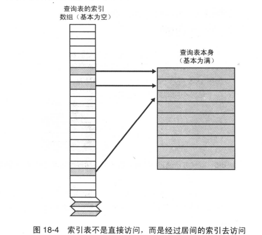

索引访问技术的优点：

- 如果主查询表中每一条数据都很大，那么创建一个10000大小的索引数组比创建一个10000大小的主查询表要节省空间
- 更灵活，对同一份查询表，可以创建多份索引表，比如上面的例子除了可以创建商品编码的索引表外，还可以创建入库时间的索引表等


### 18.4 阶梯访问表

还有另外一种访问表的方法,那就是阶梯访问。这种访问方法不像索引结构 那样直接,但是它要比索引访问方法节省空间。

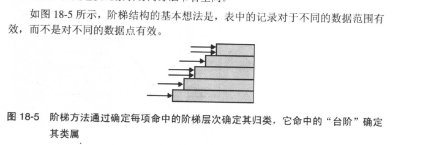

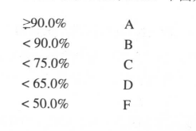

上面的例子里，查询键值就很难定，因为是浮点数，所以列不完，这里比较适合用阶梯访问。

为了使用阶梯方法,你要把每一区间的上限写入一张表里,然后写一个循环, 按照各区间的上限来检查分数。

当分数第一次超过某个区间的上限时,你就知道相应的等级了。在使用阶梯方法的时候,你必须要谨慎地处理范围的端点。

下面就是根据这个例子写的、 用 Visual Basic 来为一组学生成绩评判等级的代码:

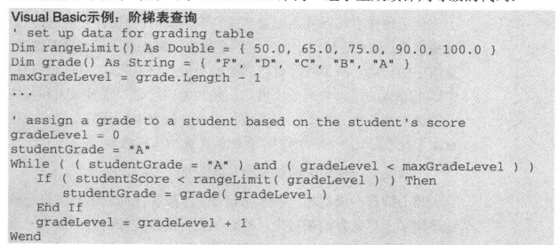

这样的写法和灵活，修改起来很方便

在使用阶梯技术的时候要注意一些细节：

**留心端点**

每个阶梯之间的边界不要写错

**考虑用二分查找取代顺序查找**

查找数据处于哪个阶梯时，如果阶梯很多，二分查找会更快

**考虑用索引访问来取代阶梯技术**

阶梯访问可能会比较耗时，如果对时间要求高的话，可以考虑使用索引

**把阶梯表查询操作提取成单独的子程序**


## 第19章：一般控制问题


### 19.1 布尔表达式

除了最简单的、要求语句按顺序执行的控制结构之外，所有的控制结构都依赖于布尔表达式的求值。


**用true和false做布尔判断**

在布尔表达式中应该用true和false，而不是使用0或者1。如果使用0和1，会难以看出究竟是结尾为真还是假的时候执行这些函数调用。


**隐式地比较布尔值与true和false**

比如`if(a>b)`，这样可以使代码更简洁


**简化复杂的表达式**

简化表达式的多种方法：

- **拆分复杂的判断并引入新的布尔变量**

  把复杂的判断拆成多个简单的判断，并用中间变量承接

- **把复杂的表达式做成布尔函数**

  如果某项判断需要重复做，或者会搅乱对程序主要流程的理解，可以把它写成一个函数，然后判断它的返回值

- **用决策表代替复杂的条件**

  C++不支持

  

**编写肯定形式的布尔表达式**

“我并非不是一个不傻的人”，像这样的话很难懂，应该尽量避免把复杂否定形式的逻辑表达式引入程序：

**在`if`语句中，把判断条件从否定形式转化为肯定形式，并且互换if和else子句中的代码**


**用狄默根定理简化否定的布尔判断**


**用括号使布尔表达式更清晰**

```c++
if(a < b == c == d)	//括号过少
if((a < b) == (c == d)) //加了括号后
```


**用一种简单的计数技巧来使括号对称**

没多大意义，现在的编译器都会报错了


**把布尔表达式全放在括号里面**

这是一种好习惯


**理解布尔表达式是如何求值的**

有些语言的计算表达式时，会将每个项的值都算出来，再组合起来得到最后的值。

而有的语言，会采用短路（short-circuit）或者惰性（lazy）求值，只求那些必须的部分。比如两个&&的项，第一个失败了，那第二个就不用算了。

所以，要清楚自己使用的语言属于哪种(C++属于第二种)

```c++
int a[10];
if(i < 10 && a[i] != 0)		//这种写法可能错误
```


**按照数轴的顺序编写数值的表达式**

```c++
if(10 < i && i < 20 )	//按照数轴的顺序容易阅读
if(20 > i && i > 10)    //逆数轴顺序不容易理解
```


**与0比较的指导原则**

**隐式地比较逻辑变量**

```c++
while(!done)
```

**把数和0相比较**

```c++
while(balance != 0)
```

**在C中显式地比较字符和终止符`\0`**

```c
while(*charPtr != '\0')
```

**把指针与NULL进行比较**

```c++
while(bufferPtr != NULL)
```


**布尔表达式常见问题**

- **在C家族语言中，把常量放在比较的左端**

  ```c++
  if(1 == a)	//保险的写法
  ```

- **在C++中，可以考虑创建预处理宏来替换&&，||和==（不得已才这么做）**

  上面的情况的另一种解决办法是把`==`写成一个宏

- **在Java中，应理解`a==b`和`a.equals(b)`的差异**

  不介绍了

  

### 19.2 复合语句（语句块）

也就是那些使用`{ }`包裹起来的语句，下面是一些指导原则：

- **把括号对一起写出**

- **用括号来把条件表达清楚**

  把`if`后面的执行语句用括号括起来


### 19.3 空语句

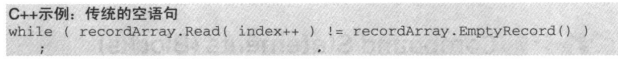

**小心使用空语句**

因为不多见，所以要凸显出来，比如像上面那样单独一行，甚至用{}包起来

**为空语句创建一个`DoNothing`预处理宏或内联函数**

也是为了凸显出这个空语句

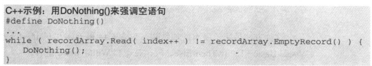

**考虑如果换用一个非空的循环体，是否会让代码更清晰**


### 19.4 驯服危险的深层嵌套

过分深层的缩进，或者嵌套，会让代码难以理解，增加出错的概率，应该避免，下面是一些建议：

- 通过重复检测条件中的某一部分来简化嵌套的`if`语句

  ```
  if(a)
  {
  	if(b)
  	{
  		if(c)
  		{
  			if(d)
  		}
  	}	
  }
  ```

  可以改为

  ```c
  if(a)
  {
  	if(b)
  	{
  	}	
  }
  
  if(a && b && c)
  {
  	if(d){}
  }
  ```

- 用`break`块来简化嵌套`if`

  可以改成

  ```c++
  do
  {
  	if(!a)	break;
  	//do something 
  	
  	if(!b)	break;
  	//do something 
  	
  	if(!c)	break;
  	//do something 
  	
  	if(!d) break;
  	//do something 
  }while(0);
  ```

- 把嵌套`if`转换成一组`if-then-else`语句

  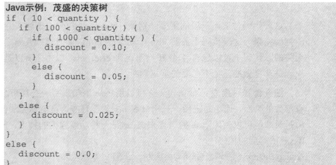

  可以修改为

  

- 把嵌套`if`转换成`case`语句

  如果你使用的语言支持`case 0 to 10`这样的写法，可以将上面的例子写成`switch case`

- 把深层嵌套的代码抽取出来放进单独的子程序

  把嵌套的一部分提出来做成函数

- 使用一种更面向对象的方法

  使用多态

  

- 重新设计深层嵌套的代码

​	重新设计。在面向对象的语言中出现case，说明代码没有做好分解


### 19.5 编程基础：结构化编程

结构化编程的核心思想很简单,那就是一个应用程序应该只采用一些**单入单出的控制结构**(也称为单一入口、单一出口的控制结构)。

单入单出的控制结构指的就是一个代码块,它只能从一个位置开始执行,并且只能结束于一个位置。除此之外再无其他入口或出口。

结构化编程和结构化的、自上而下的设计不完全一样。前者只适用于具体编码层。

一个结构化的程序将按照一种有序的且有规则的方式执行,不会做不可预知的随便跳转。

你可以按自上而下的方式阅读它,而它执行起来也大体是遵循这个顺序的。

使用规则性不强的方法所生成的源代码,很难有意义且形象地反映出程序是如何在机器上执行的。可读性差意味着不容易理解,最终导致应用程序的低质量。


**结构化编程的三个组成部分**

**顺序：**"顺序"指一组按照先后顺序执行的语句。典型的顺序型语句包括赋值和调用子程序。

**选择：**选择是一种有选择的执行语句的控制结构。

**迭代：**也就是循环结构


### 19.6 控制结构和复杂度

控制结构用得不好就会增加复杂度，反之能降低复杂度。


**复杂度的重要性**

复杂度相关的可以参考 **5.2 关键的设计概念-复杂度**


## 第20章：软件质量概述

本章从构建的角度审视保障软件质量的技术。


### 20.1 软件质量的特性

软件同时拥有**外在**的和**内在**的质量特性。

**外在**特性是指该产品的用户所能感受到的部分，包括：

- **正确性。**缺陷尽量少
- **可用性。**用户学习和使用的容易程度
- **效率。**尽可能少地占用资源，包括内存和时间
- **可靠性。**在指定的必需条件下，应该有很长的平均无故障时间
- **完整性。**对非法访问的限制和保证并行访问的正确性
- **适应性。**使用场景变化后还能正常运行
- **精确性。**输出结果的误差程序，表示完成工作的优劣程度
- **健壮性。**在收到无效输入或者处于压力环境下还能正常运行

质量的外在特性是用户关心的唯一软件特性。用户只会关心软件是否容易使 用,而不会关心对于程序员来说修改起来是否容易。

他们关心软件是否能正确运行,而不关心里面的代码是否可读,或者是否有良好的结构。 

而程序员除了关心软件质量的外在特性之外,还要关心它的内在特性。本书的核心是代码,所以它更关注软件**内在**的质量特性。

内在质量特性如下：

- **可维护性。**是否能够很容易地对系统进行修改，改变或者增加功能，提高性能，以及修正缺陷。
- **灵活性。**如果这个系统是为特定环境设计的，当环境变化时，需要修改的量有多大
- **可移植性。**在原来设计的特定环境之外是否能运行
- **可重用性。**系统的某些部分能不能被用到别的系统中，是否容易
- **可读性。**阅读代码的难易程度
- **可测试性。**能否通过单元测试或者系统测试验证功能的实现程度
- **可理解性。**在系统组织和细节语句的层次上理解整个系统的难易程度（理解框架的难易程度？）

内在质量特性会影响外在质量特性。比如内部都难以理解的代码，在外部就会更大概率地暴露缺陷。

内在特性强调让程序员维护起来方便，外在特性强调让用户使用起来方便，有时候两者是冲突的。


### 20.2 改善软件质量的技术

软件质量中的某些要素：

- **软件质量目标。**明确指出项目追求的是哪些特性
- **明确定义质量保证要求。**在组织内宣扬软件质量的重要性，不要输出“快速但糟糕”的代码
- **测试策略。**测试要根据需求、架构和设计相关联的测试策略，别瞎测。要通过测试验证质量
- **软件工程指南。**按软件开发流程走，定义问题 - 需求分析 - 架构设计 - 构建 - 系统测试
- **非正式技术复查。**代码走读
- **正式技术复查。**越早发现问题越好，所以开发流程进入下一个环节的时候，都要有验收标准，达到指标才能走下一个流程
- **外部审查。**让开发组织以外的人审查


**开发过程**

上面的要素，和软件开发流程都有关系，具备下面各项质量保证活动的开发流程，能生产出更好的软件。

- **对变更进行控制的过程。**需求变更、设计变更、代码变更都会引入风险。所以要严格控制变更
- **结果的量化。**质量保证计划到底有没有起效果，要能够用数据体现出来
- **制作原型。**先写关键功能的demo来验证可行性和评估时间


**设置目标**

明确告诉程序员软件的质量目标，也就是看重哪一方面。如果你强调了追求的方向，程序员也会往这方面努力。

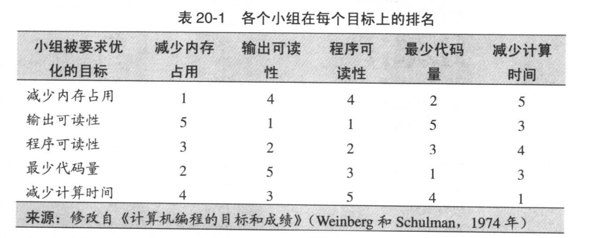


### 20.3 不同质量保障技术的相对效能

各种质量保证方法的效能不同，人们研究了它们在检出缺陷和排除缺陷方面的效能。


**缺陷检测率**

不同的方法能检测出不同类型的缺陷，指标是检出缺陷数占总缺陷数的比例。下面是几种常见的缺陷检出方法的缺陷检测率。

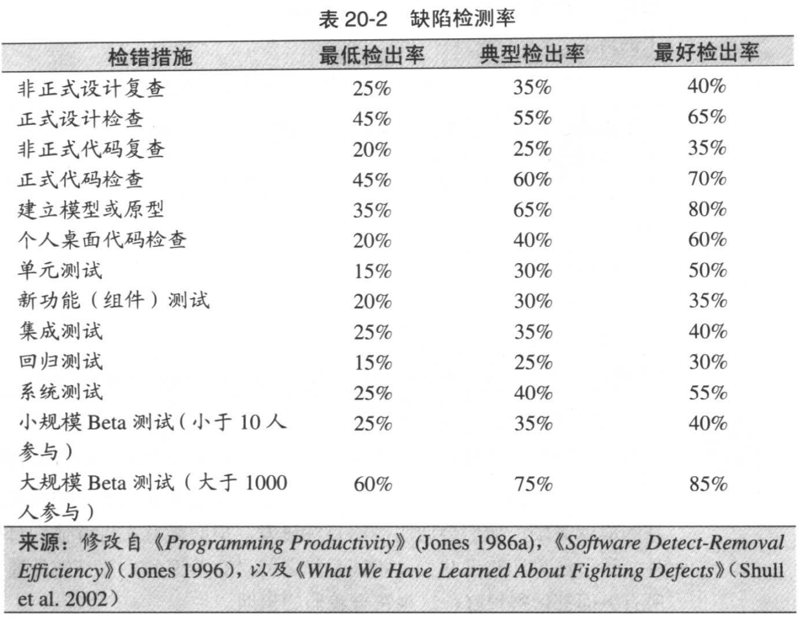

上面可以看到，单独使用任意一项方法，其典型检出率都没有超过75%，并且平均下来只有40%左右，典型的单元测试和集成测试的检出率也只在30%~35%。

所有，我们要综合使用各项检测技术，来提高缺陷检出率。组合使用多个方法的效果比单独使用某个方法的效果要好。

研究显示：阅读代码能找到更多的接口缺陷，功能测试能检测出更多的控制缺陷。


**找出缺陷的成本**

检测也要考虑成本，最经济的方法是找出缺陷的成本最低，而其他方面和别的方法差不多。

大部分研究表明，检查代码比测试的成本更小，也就是缺陷越早发现越好，最好是在开发阶段发现。


**修正缺陷的成本**

一个缺陷存在的时间越长，消除它的代价就越昂贵。因此越早发现缺陷也能降低修正缺陷的成本。

检查代码可以一次性确定现象和原因，而测试只能找到现象，无法找到原因，所以要在开发阶段多注意检查。


下面是一台推荐的测试策略：

- 对所有的需求、架构以及系统关键部分的设计进行正式检查
- 建模或者创建模型
- 代码阅读或者检查
- 执行测试


### 20.4 什么时候进行质量保证工作

越早引入的缺陷，在后面的环节中就会引入越多越严重的错误，所以在软件工程的早期就要开始强调质量保证。


### 20.5 软件质量的普遍原理

软件质量的普遍原理是改善质量以降低开发成本。

提高生产效率和改善质量的最佳途径是减少花在代码返工上的时间。

程序员每天花大量的时间在调试和解决缺陷中，所以只要避免引入错误，就能减少调试时间，从而提高生产率 :thinking:。


上图可以看出，写出高质量程序的方法有两个：

1、在编码前做足准备，减少调试的时间

2、在开发中做足检查，以时间换质量


## 第21章：协同构建

- 当你在和别人介绍自己的代码，整理逻辑时，更容易发现错误。
- 当你自己写代码时，会犯一些错误，自己没发现，但别人是能很容易发现的。

协同构建就是为了把上面两种情况的错误更方便地暴露出来。


### 21.1 协同开发实践概要

协同构建包括结对编程、正式检查、非正式技术复查、文档阅读，以及其他让开发人员共同承担创建代码和其他工作产品责任的技术。


**协同构建是其他质量保证技术的补充**

协同构建的首要目的是改善软件质量。也是一种质量保证技术。

各种报告指出，使用了各种协同构建技术后，能起到各种质量提升或者减少时间、经济支出的效果。


**协同构建有助于传授公司文化和编程专业知识**

代码走读和代码审核就是一种协同构建的方法，有助于宣贯公司的代码规范，

也有助于相互借鉴学习彼此的代码，方便老员工指导新员工。


**集体所有权适用于所有形式的协同构建**

在集体所有权下，代码属于团队而不是个人，团队中所有人都能访问和修改，这样有以下的好处：

- 更多人检查，更多人编写，使质量更好。
- 某个人离开项目的影响更小。
- 总体上缺陷解决周期会变短，因为更多的人在维护它。


**在构建前后都应保持协作**

在评估、计划、需求、架构、详细设计、编码和测试、维护阶段都可以应用协同构建的方法。


### 21.2 **结对编程**

在进行结对编程的时候，一位程序员敲代码，另一位注意有没有出现错误，并考虑某些策略性的问题（编写是否正确，是否必要等）。

结对编程最初由极限编程所普及推广，现在已经使用得相当广泛了:thinking:


**成功运用结对编程的关键**

需要遵守如下几条准则：

- **用编码规范来支持结对编程。**不要在争论代码风格上花时间，把这个留个编码规范
- **不要让结对编程变成旁观。**不写代码的那个人不要打酱油
- **不要强迫在简单的问题上使用结对编程。**绝大部分组织只是对部分工作采用结对编程，而不是全部
- **有规律地对结对人员和分配的工作进行轮换。**有规律地轮换能让不同的人熟悉系统的不同部分
- **鼓励双方跟上对方的步伐。**要跟得上才能看得懂，跟不上的话考虑拆开重组
- **确保两个人都能够看到显示器。**都能看到显示器，字体不要太小等
- **不要强迫程序员和自己关系紧张的人组对。**影响效率
- **避免新手组合。**两个人中至少有一个有结对经历的话，效果会更好
- **指定一个组长。**协调工作、对结果负责以及和项目外的人联系

结对编程的好处：

- **与单独编程相比，结对能够使人在压力下保持更好的状态。**因为有人监督
- **它能够改善代码质量。**提升代码可读性和可理解性
- **它能缩短进度时间表。**结对往往能更快地编写代码
- **其他好处，比如传播公司文化，指导初级员工，培养集体归属感等。**


### 21.3 正式检查

详查(正式检查)是一种特殊的复查,种种迹象表明它在侦测缺陷方面特别有效, 并且相对测试来说更加经济合理。

详查是由 `Michael Fagan` 首先提出来的, 并且 在 `Fagan` 发表相关论文并公诸于众之前已经在 IBM 内部应用多年。 

详查和普通的复查的差别，感觉是一种更正式的代码审核会议：

- 详查表关注的是复查者过去遇到的问题。
- 详查专注于缺陷的检测，而非修正。
- 复查人员要为详查会议做好预先准备，并带来一份他们所发现的已知问题列表。
- 参与者都被赋予了明确的角色。
- 详查的主持人不是被检查产品的作者。
- 详查的主持人应该已经接受过支持详查会议方面的培训。
- 只有在与会者都做好充分准备的时候才会召开详查会议。
- 每次详查所收集的数据都会被应用到以后的详查会议里，以便对详查进行改进。
- 高层管理人员不参加，除非他们要详查一个项目的计划，或者其他管理方面的资料。


**你期望详查能带来什么结果**

独立的详查能捕捉到60%的缺陷。

设计和代码的联合详查能去除产品中70%到85%，甚至更多的缺陷。

详查还可以用来评估进度：完成的程度和和完成的质量


**详查中的人员角色**

- **主持人。**保证会议按进度进行，要能理解有关的细节。
- **作者。**解释设计和代码中不清晰的部分，偶尔还需要解释为什么有些地方看起来有错，实际上是正确的
- **评论员。**职责是找出缺陷，通常在会议前就已经找出了部分缺陷
- **记录员。**记录发现的错误
- **经理。**经理参加不是件好事，详查应该是件技术上的事，经理参加会把会议转到别的方面，经理可以只知道会议记录


**详查的一般步骤**

详查由几个明显的阶段组成：

1. **计划。**作者提交代码给主持人，主持人决定参与人、时间，并提前分发要详查的代码给与会者
2. **概述。**会议开头作者介绍要详查的项目
3. **准备。**评论员应该提前理解代码，从中找出缺陷或考虑设计是否能满足需求
4. **详查会议。**主持人选评论员来解释代码，记录员记录期间发现的错误。控制速度，理想的速度是每小时90行。不要花时间讨论怎么解决缺陷。会议时间控制在2小时以内，因为人的精力是有限的。
5. **详查报告。**记录每个缺陷，包括它的类型和严重程度。这也是对详查的效果的数据说明
6. **返工。**作者修复缺陷
7. **跟进。**检查缺陷是否被修复
8. **第三个小时的会议。**如果有人对怎么解决缺陷感兴趣，主持人可以开个临时会议让这部分人单独讨论。


**对详查进行细调**

当你能熟练地主持详查时，有时候会觉得上述的步骤有些可以优化的地方。但是做修改前要慎重。

只有在做过定量分析，清楚地知道修改有利于你的工作，才进行修改。

另外，做过多次详查后，会发现某些类型的错误更容易出现，可以建立一个核查表，帮助评论员往这些方向上观察，提高效率。并且这核查表应该经常更新。


**详查中的自尊心**

详查的目的是发现代码中的缺陷，而不是为了探索替代方案，也不是为了争论对错。详查能给团队和作者都带来提升，所以不要有自尊心上的挫败感。


**详查和《代码大全》**

作者写这本书的时候也让朋友给自己详查过，发现了不少错误。


### 21.4 其他类型的协同开发实践


**走查**

比较随意的一种复查方式，几个人之间针对代码或者设计进行的讨论。走查有几个共同点：

- 走查通常由需要复查的设计或者代码的作者举行和主持。
- 走查的焦点在技术事宜上--这是一个工作会议。
- 走查的所有参与者通过阅读设计或者代码来进行准备，并从中找出错误。
- 这也是老程序员和新程序员交流的一种渠道。
- 走查通常要30~60分钟。
- 重点在于检测错误，而并非修正它们。
- 经理不会参加。
- 走查的概念很灵活，能适应采纳它的组织的各种特殊需要


**你期望走查能带来什么结果**

通常能找到程序中20%~40%的错误


**代码阅读**

通过阅读代码的方式找到缺陷（从代码的设计、风格、可读性、可维护性等角度）

代码阅读通常会有2~3人参与，他们独立阅读代码，然后与代码的作者开会讨论，下面说下如何进行代码阅读：

- 在会议准备阶段，作者将代码分发给参与者。
- 至少两个人以上参加。
- 评论员独立地进行代码阅读，阅读速度估计为每天1000行。
- 大家都看完后，作者组织会议，在会议上直接看大家发现的问题。
- 作者修改发现的缺陷

代码阅读与详查、走查之间的区别,就在于代码阅读更多地关注对代码进行 的独立复查,而不是关注会议本身。

其结果是每一个评论员的时间更多地花费在 从代码中找出错误上面,而将较少的时间花费在会议上。


**公开演示**

给客户演示成果。由于客户只关注效果，所以这不是一种技术复查。


**协同构建技术的比较**


## 第22章：开发者测试

测试是最常见的改善质量的活动，软件可以通过许多的方法进行测试。

- **单元测试。**测试某个完整的类、子程序或者小程序
- **组件测试。**测试一个类、包、小程序或者其他程序元素
- **集成测试。**对两个或者更多的类、包、组件或者子系统进行的联合测试
- **回归测试。**重复测试以前的用例，看之前测试通过的用例现在还是否正常
- **系统测试。**运行整个软件，测试安全、性能、资源消耗、时序等方面的问题

测试分为两类：**黑盒测试**和**白盒测试**

黑盒测试：测试者无法了解测试对象内部的工作机制的测试

白盒测试：测试者清楚测试对象的内部工作机制的测试

本章是由开发者完成的测试，所以是白盒测试。


### 22.1 开发者测试在软件质量中的角色

测试是一个重要的组成部分，并且有时候有些项目仅靠测试保证质量，这样是不好的。

测试对大部分开发人员而言是一种煎熬，原因如下：

- **测试目标和开发目标相反。**测试是为了发现错误，开发是为了减少错误
- **测试永远不可能彻底证明程序中没有错误。**这是一个无止境的工作
- **测试本身并不能改善软件质量。**测试只是反映了软件的质量，想改善质量，多做测试是没用的
- **测试时要求你假设会在代码里找到错误。**自己写的程序但是希望它有错误，这有悖常理，而且人是有盲点的，一旦你认为没问题，就很难再发现错误（但我们提测的时候肯定都认为已经没问题了）。


**开发者测试应该占用多少时间？**

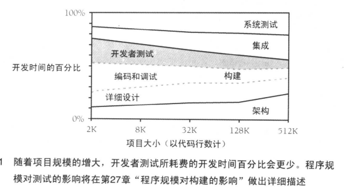

**怎么利用开发者测试的结果？**

- 可以拿来评估软件的可靠性。
- 可以拿来指导对软件的修正。
- 有助于归纳常见的错误，做成培训材料，设计未来的测试用例。


**构建中测试**

在写代码的时候，写了一个子程序或者类，应该想好怎么对它进行测试，在拿它和别的部分对接前测试它。（单元测试）

这样虽然麻烦，但是单独调试一个函数比集成之后测试要简单得多，因为集成后出错，就不能直接知道是哪个函数的原因了。


### 22.2 开发者测试的推荐方法

采用系统化的开发者测试方法，能最大限度提高你发现各种错误的能力，同时花费最少。

- **对每一项需求进行测试，以确保需求都已经被实现。**注意对一些需求通常不提及的方面进行测试，比如安全、数据存储、安装过程等
- **对每一个相关的设计关注点进行测试，以确保设计已经被实现。**在设计的时候就想好怎么测试这一部分的功能
- **用基础测试来扩充针对需求和设计的详细测试用例。**增加数据流测试（输入各种类型的数据，查看软件反应），然后补充其他所需的测试用例。
- **使用检查表，里面记录本项目和以往项目中犯的错误类型。**


**测试先行还是测试后行**

到底是先写代码还是先写测试用例？

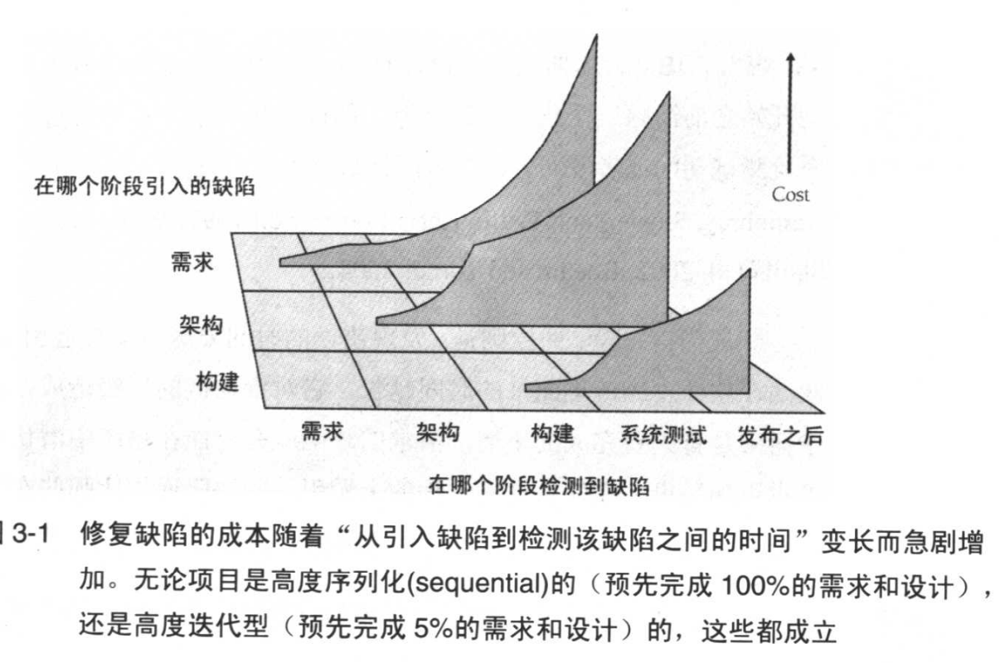

由上图可知，发现缺陷的时间离引入缺陷时间越短，修复它的代价越小。而先写测试用例可以在写代码前就发现一部分缺陷，所以先写测试用例：

- 先写测试用例并不增加工作量，只是和编码调了下顺序而已。
- 如果先编写测试用例，可以更早地发现缺陷，同时更容易修正。
- 先编写测试用例，将迫使你写代码前考虑需求和设计，写出来的代码质量更高。
- 先写测试用例，更容易尽早暴露需求问题，因为不合理的需求写测试用例时可能会有冲突。
- 如果你保存着之前的测试用例，那也可以最后再测试。


**开发者测试的局限性**

- **开发者测试倾向于“干净测试”。**

  开发人员往往关注代码能否工作，而不是哪些可能让代码无法工作。实际上成熟的代码测试中后者更重要

- **开发者测试对覆盖率有过于乐观的估计。**

  程序员坚信自己的测试覆盖率很高，但实际上往往很低

- **开发者测试往往会忽略一些更复杂的测试覆盖率类型。**

  大多数开发人员看到的是“100%的语句覆盖率”，这是个好的开始，但应该追求更高的“100%分支覆盖率”（比如对判断语句，要测试真和假两种情况）

开发者测试有价值，但是仅仅靠开发者测试不够，我们需要补充其他的方法，包括独立测试技术以及协同构建技术。


### 22.3 测试技巧锦囊

通过测试来验证程序的正确性是不可能的，因为程序有多种输入和状态，逐个排列组合测试是不现实的。


**不完整的测试**

既然完全测试是不可能的，那就要找出那些最可能出错的测试用例，那些输入后会返回不同结果的测试项是我们要关注的（比如临界值、异常值等）


**结构化的基础测试**

你需要去测试程序中的每一条语句至少一次。

如果是一条逻辑语句（`if`、`switch`等），那么需要覆盖到每个分支。

**代码覆盖**、**逻辑覆盖** 也覆盖所有路径，和基础测试很像，不同点是基础测试追求以最少的测试项覆盖所有的路径，而其他两个不追求，因此后两者的测试项会比基础测试多很多。

最少数量的测试项的简单计算方法：

1. 对通过子程序的直路，开始的时候记1
2. 遇到`if`、`while`、`repeat`、`for`、`and`、`or`或者其等价物的时候，+1
3. 遇到每一个`case`语句都 +1，如果`case`语句没有写`default`，还要 +1

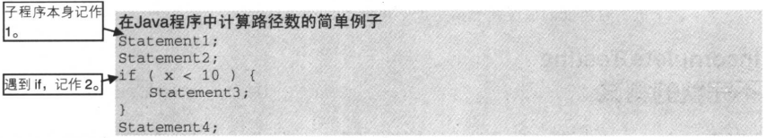

下面是一个复杂点的例子：

```c++
int i = 0;		//计数为1，表示下面全为真的情况

for(i = 0; i < MAX; i++)	//计数+1 = 2，增加的情况为 i >= MAX
{
	if(b < min)	//计数+1 = 3，增加的情况为b >= min
	{
		.....
	}
	
	if(c < max && d >min) //计数+2 = 5, 此处有if和&&。增加的两种情况为 c >= max和d <= min
	{
		.....
	}
	
	if(fun() ! = 0)	//计数+1 = 6，增加的情况为func() == 0
	{
		.....
	}
}
```

上面得到的计数是6，并不是说6个用例就能覆盖所有的基本情况，而是说至少要6个测试用例。这6个测试项只能保证所有的代码都得到了执行，但不能说明数据的变化情况。


**数据流测试**

错误的数据引发的错误和错误的逻辑引发的错误，在数量上不分伯仲。

数据的状态有以下三种：

- **已完成（defined）。**已初始化，未使用
- **已使用（used）。**已使用
- **已销毁（killed）。**已被回收，或者指针被free等

还有两种状态描述程序对某个变量进行操作之前和操作之后，控制流进入或退出某个子程序的状态：

- **已进入** 控制流进入一个子程序，还没使用该变量
- **已退出** 在对变量产生影响后，控制流立即退出子程序


**数据状态的组合**

正常的数据状态是已定义，经过几次使用后，可能被销毁（全局变量之类的不会销毁）。

下面是一些不常见的搭配形式：

- **已定义-已定义** 重复定义，一般会报错的
- **已定义-已退出** 定义后不使用就退出子程序，如果是局部变量，是不正常的
- **已定义-已销毁** 定义后直接销毁，也就是一个无用的变量
- **已进入-已销毁** 如果是个局部变量，那说明它也是无用变量。如果是函数的传参，那它可能在别的地方用过了，没问题:thinking:
- **已进入-已使用** 如果是局部变量，在使用前应该先定义（这样也编译不过的），如果是传参，就没有问题
- **已销毁-已销毁** 比如重复free指针，是危险的
- **已使用-已定义** 先使用再定义，一般编译不过

上面这些是容易出错的状态，开始检测前，可以检查下是否出现了如上状态的变量。

编写数据流测试用例的关键就是对所有可能的定义-使用路径进行测试，有两种方法：

- **所有的定义。**在每一个变量被赋值的地方进行测试
- **所有已定义-已使用的组合。**对所有某个变量在一处赋值，在另一处使用的情况进行测试。

**所有的定义** 是一种弱策略，因为它要求测的，结构化测试中要求的对每一行进行测试的要求已经覆盖到了。

**所有已定义-已使用的组合** 是一种强策略，它能覆盖到结构化测试不能覆盖到的更多的组合。

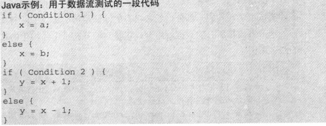

例如上面的例子，根据结构化测试的要求，只需要2个用例就能覆盖到所有代码，也就是

1. Condition 1 和Condition 2 都为真
2. Condition 1 和Condition 2 都为假

由于这两个用例也满足了对每个赋值语句进行测试的要求，所以也满足了**所有的定义**方法的要求。

但是如果按照**所有已定义-已使用的组合**的要求，需要测试的情况就更多：

- x = a 和 y = x  + 1
- x = a 和 y = x - 1  
- x = b 和 y = x  + 1
- x = b 和 y = x - 1

比较后可以知道**所有已定义-已使用的组合**覆盖的情况更多更全面。前文中计数为6的例子，也缺少一部分排列组合的场景。


**等价类划分**

对于输入数据的测试，如果两个数据在程序中，走的路径是一样的，那就可以合成一个

```c++
if(a > 10)
```

比如a = 1 和 a = 2对于上面的代码来说是一样的，写测试用例的时候写a <=10 和 a>10两种就行了


**猜测错误**

启发式的测试方法，猜测哪里会有错误。比如按协同构建中整理出来的常见错误清单猜测。

下面是一些可供猜测的方向：


**边界值分析**

最常见的边界值错误就是off-by-one(也就是超出边界)，下面是一些边界值测试用例的思路：

假设要对 <max 进行测试，那么可以测试下面三种情况


1、刚好小于max  2、刚好等于max  3、刚好大于max


**复合边界值**

有些边界值比较隐蔽。比如涉及到多个变量的时候，例如两个数相乘

```c++
int a = b*c;	//b和c可能是正数或者负数，求a的最大最小边界
```


**几类坏数据**

错误也可能出现在当坏数据输入的时候，下面是一些常用的坏数据

- 数据太少（没有数据）
- 太多的数据
- 错误的数据情况（无效数据）
- 长度错误的数据
- 未初始化的数据


**几类好数据**

正常的情况也可能暗含错误，常见的正常的数据有以下几种

- **正常的情形 - 大路正中间，所期望的值。**
- **最小的正常局面。**即最小值
- **最大的正常局面。**即最大值
- **与旧数据的兼容性。**


**采用容易手工检查的测试用例**

如果你的测试用例本身就容易出错，那就没有意义了，比如你测试一个算式：输入 / 3 = 输出。

如果你的测试用例是输入 = 563524384，那么，你算出正确的输出的出错概率就会增加。所以输入 = 1000这样的用例更好。


### 22.4 典型错误

**哪些类包含最多的错误**

错误不是平均分布在代码里的，而是很可能集中在某几个类中。


**错误的分类**

有个叫Boris Beizer的人得到的错误分类数据：


虽然每个人的代码错误分布各不相同，但上面的数据可以给我们一些启发：

- 大多数错误的影响是相当有限的
- 许多错误发生在构建的范围之内
- 大多数的构建期错误是编程人员的失误造成的
- 让人惊奇的是，拼写错误是一个常见的错误’
- 错误理解需求也是常出现的错误
- 大多数的错误都容易修正
- 需要总结所在组织中对付错误的经验


**不完善的构建过程一番错误所占的比例**

有一点是确定的：构建总是会出现大量的错误。下面是一些结论

- 在小型项目中，构建错误占了错误的大多数。
- 无论项目规模如何，构建缺陷至少占总缺陷的35%。
- 修正构建缺陷的代价虽然比需求和设计缺陷小，但是量大的话，代价还是很高昂的。


下面是项目规模和错误来源的大致关系


**你期望能发现多少错误**

预期发现的错误数量和你的开发过程质量有关：

- 业界经验：平均1000行发现1~25个错误
- 微软的经验是内部测试程序大概每1000行代码有10~20个缺陷
- Harlan Mills倡导的“净室开发”的技术，可以降低至每1000行代码3个缺陷
- 使用"团队软件开发过程"的开发小组，可以达到大约没1000行0.06个缺陷的水平


**测试本身的错误**

有时候测试数据就是错误的，如果测试的预期结果就是错误的，那就是浪费时间，要尽量避免

- **检查你的工作** 
- **开发软件的时候就要计划好测试用例**
- **保留你的测试用例**
- **将单元测试纳入测试框架**


### 22.5 测试支持的工具

本节介绍几种可以买到的或者自己开发的测试工具


**为测试各个类构造脚手架**

**哑类**、**桩函数**之类的方法，就是提供伪数据，提供给你想测试的函数或类，用于验证他们的正确性。


**Diff工具**

比较预期输出和实际输出的工具、有了这种工具，就很容易发现不一致，找到错误。


**测试数据生成器**

有时候我们需要给程序提供很长的测试数据，这些测试数据手动生成很麻烦，可以考虑借助工具或者自己写程序生成。


**覆盖率监视器**

一种跟踪代码有没有都被测试过的工具


**数据记录器/日志记录器**

log日志文件或者运行日志文件


**符号调试器**

`gdb`和`coredump`


**系统干扰器**

对系统进行干扰，用于测试程序在干扰下是否会出错，或者用于压力测试，暴露小概率出现的错误

这类测试支持工具有如下多种功能：

1. **内存填充** 

   如果你想检查程序是否对所有变量都进行了初始化，那你可以先用工具把内存都填充成一个非法值，然后运行程序，那些未初始化的变量就会保持成非法值。

2. **内存抖动**

   在多任务系统中，这种工具可以在程序运行时重新组织内存，用于确认代码只依赖于存放在相对位置的数据，而非绝对位置

3. **选择性内存失败**

   模拟内存不足的情况

4. **内存访问检查（边界检查）**

   监察指针操作

   

**错误数据库**

也就是以前经常犯的错误的记录


### 22.6 改善测试的过程


**有计划的测试**

在项目开始之初就拟定测试计划


**重新测试（回归测试）**

原先测试了没问题的测试用例也需要再测一遍，防止缺陷修改过程将原先没问题的部分改坏了。


**自动化测试**

自动化测试的好处：

1. 发生错误的概率比手动测试小
2. 自动化测试容易推广
3. 如果是自动化的，那多做几次回归测试就很简单了
4. 可以提高问题刚出现就马上被发现的可能性
5. 由于能马上测马上发现问题，所以修改大量代码的时候可以马上得到反馈
6. 自动化测试在那些新的、不稳定的技术环境中特别有价值


### 22.7 保留测试记录

测试过程中要收集的数据：

- 缺陷的管理方面描述（日期、报告人、描述等）
- 问题的完整描述
- 复现步骤
- 绕过问题的建议
- 相关的缺陷
- 严重程度
- 缺陷根源
- 对编码缺陷的分类
- 修复缺陷的修改清单
- 缺陷影响的代码行数
- 查找缺陷原因花的时间
- 修复缺陷花的时间


## 第23章：调试

调试是确定错误根本原因并纠正错误的过程。调试可能占整个开发周期的50%。

本章介绍一些关于调试的建议。


 ### 23.1 调试概述

已故海军少将Grace Hopper相信，bug一词可以追溯到第一台大型数字计算机，即Mark I（IEEE 1992）。

程序员们在一次解决电 路故障的时候看到了一只大飞蛾,并发现这只飞蛾飞到了计算机里面。从此计算机故障就被归咎于"bug/虫子"。

现在的bug已经不太可能是虫子引起的了，往往是程序员的错误引起的，分为“error”（错误）、“defects”（缺陷）、或者“faults”（失误）。


**调试在软件质量中扮演的角色**

和测试一样，调试本身不能提高代码质量，而是诊断代码缺陷的一种方法。

最好是一开始就输出高质量的代码，尽量减少调试的过程。


**调试效率的巨大差异**

并不是所有人都知道怎么调试。有研究表明，对同一组缺陷，有经验的程序员找到缺陷的时间大概只是缺乏经验的程序员的1/20。

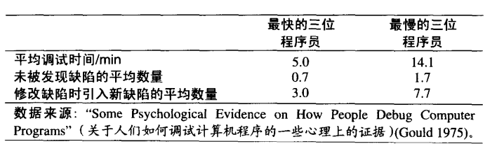

好的程序员应该能更快地找到缺陷、找到尽可能多的错误、在解决缺陷时引入尽量少的错误。


**让你有所收获的缺陷**

你应该尽量清晰地知道自己的软件要做什么，这样可以在一开始就避免缺陷的产生。

而由于疏忽，程序总会有缺陷，程序中的错误为你提供了学习很多好东西的机会。你可以从错误中得到如下的好处：

- **理解你正在编写的程序。**很多缺陷是因为你对需求的理解不清晰
- **明确你犯了哪些错误的类型。**发现缺陷的时候问下自己为什么会引入这个错误，怎么防止，代码中还有类似的缺陷吗之类的
- **从代码阅读者的角度分析代码质量。**代码易读吗
- **审视自己解决问题的方法。**你的发现问题的方法是否高效，能不能改进
- **审视自己修正缺陷的方法。**你修正问题的方法是否高效，能不能改进


**一种效率低下的调试方法**

学校一般不教你怎么调试，最多只是告诉你多加打印。


**调试之魔鬼指南**

一些不好的调试方法：

- **凭猜测找出缺陷。**到处加打印，如果还是找不出问题，随便修改点什么，直到它能工作
- **不要把时间浪费在理解问题上。**只解决当前的问题，不理解问题出现的原因。
- **用最唾手可得的方法修正错误。**做规避而不是找到根因解决，或者做量很大，但是能够治本的修改


**迷信式调试**

程序出错，肯定是你的问题，不要怀疑一些很渺茫的可能，比如是编译器错误、系统bug等


### 23.2 寻找缺陷

调试包括寻找和解决缺陷，其中寻找并理解缺陷通常能占到整个调试过程的90%。


**科学的调试方法**

运用经典的科学调试方法时，你会经历如下步骤：

- **通过可重复的试验收集数据** 

  也就是复现找规律

- **根据相关数据的统计构造一个假说**

  根据规律提出自己的猜测

- **设计一个实验来证明或反证这个假说**

  找个办法验证你的想法

- **证明或者反证假说**

  用上面的办法验证你的想法

- **根据需要重复进行上面的步骤**

  重复上面的操作

下面是一些寻找缺陷的有效方法：

1. 把错误稳定下来

2. 确定错误的来源（即那个失误“fault”）

   a.收集产生缺陷的相关数据

   b.分析收集的数据，并构造对缺陷的假设

   c.确定怎么去验证或验伪这个假设

   d.按`2c`的方法执行得出结论

3. 修补缺陷

4. 对所修补的地方进行测试

5. 查找是否还有类似的错误


**把错误稳定下来**

也就是找到复现的方法，如果是不定期出现的缺陷，寻找它的复现方法几乎是最难的部分。

如果一个错误无法复现，可能是：初始化错误、和时间相关的错误、野指针。

如果某个求和结果时对时错，那很可能是参与计算的某个变量未能正确初始化（有时候是0，有时候不是）。

如果问题变换莫测，你又在使用指针，很可能是指针引起的。

如果多个因素组合下发生了错误，可以尝试改变其中几个因素，看是否还发生错误，从而排查错误的原因。这样可以精简用例


**确定错误原因**

提出一个假设，修改代码验证它，如果发现不正确，再提出另一个假设重复执行。


**寻找缺陷的一些小建议**

能够复现了，那么找到问题的根源就不困难了，可以考虑以下的建议：

- **在构造假设时考虑所有的可用数据。**

  你提出的假设本身要站得住脚，不能是一些当前已知的现象就能否定的假设。

- **提炼产生错误的测试用例。**

  如果某项操作能够复现问题，修改这项操作的参数，观察现象的变化。

- **在自己的单元测试族中测试代码。**

  单元测试的时候出错，找问题要简单的多，所以要做单元测试。

- **利用可用的工具。**

  借助工具的力量，比如交互式的调试器、内存检查工具、编译器检查语法等等

- **采用多种不同的方法重现错误。**

  错误可能是多个因素交织产生的。发生错误后，修改某个怀疑的因素后再做测试，逐个排查因素是否合这个错误有关。

- **用更多的数据生成更多的假设。**

  更多的数据可以让你得到更多、更完善的假设

- **利用否定性测试用例的结果。**

  如果你的尝试推翻了你的假设，虽然还是不知道根因，但减小了排查范围

- **对可能的假设尝试头脑风暴。**

  不要提出一个假设后就停了，多提几个

- **在桌上放一个笔记本，把需要尝试的事情逐条列出。**

  把假设都记下来，不要怼着一个假设钻牛角尖

- **缩小嫌疑代码的范围。**

  删除部分代码再复现，注释某些函数后再复现、使用二分法查找等

- **对之前出现过缺陷的类和子程序保持警惕。**

  这些部分更容易出错

- **检查最近修改过的代码。**

  新错误往往是新引入的

- **扩展嫌疑代码的范围。**

  如果你验证后发现你怀疑的那部分代码都没有问题，要扩展排查范围

- **增量式集成。**

  一点点加模块，加一点测一下，会比较容易排查问题

- **检查常见缺陷。**

  开发问题列表里面查下有没有相似的缺陷

- **同其他人讨论问题。**

  向别人解释自己的程序的时候常常能发现自己的错误，这被人成为“忏悔式调试”:laughing:

- **抛开问题，休息一下。**

  休息一下，提高效率。


**蛮力调试**

费时费力，但最终确保能解决问题的方法，下面是一些普遍的方法：

- 对崩溃代码的设计和编码进行彻底检查 
- 抛弃有问题的代码，从头开始设计和编程 
- 抛弃整个程序，从头开始设计和编程 
- 编译代码时生成全部的调试信息 
- 在最为苛刻的警告级别中编译代码，不放过任何一个细微的编译器警告 
- 全面执行单元测试，并将新的代码隔离起来单独测试 
- 开发自动化测试工具，通宵达旦地对代码进行测试 
- 在调试器中手动地遍历一个大的循环，直到发现错误条件 
- 在代码中加入打印、显示和其他日志记录语句 
- 用另一个不同的编译器来编译代码 
- 在另一个不同的环境里编译和运行程序 
- 在代码运行不正确的时候，使用能够产生警告信息的特殊库或者执行环境来链接和运行代码 
- 复制最终用户的完整系统配置信息将新的代码分小段进行集成，对每段集成的代码段进行完整的测试


**在使用“快速肮脏调试法”的时候设置一个时间上限。**

如果正常的调试方法花费的时间很多，还不如用蛮力调试方法，所以给你的调试时间加个上限，超过了上限就考虑用蛮力调试。


**做出一张蛮力调试方法列表。**

想下，如果真的到了不得不用蛮力调试的时候，用蛮力调试的那种方法最合适。


**语法错误**

现在编译器越来越好，语法错误导致的缺陷已经很少看到了。

- **不要过分信任编译器信息里的行号。**

  编译器报错的时候，真正的错误可能在它给的行号的前后

- **不要迷信编译器信息。**

  编译错误时给的错误信息提示可能也没啥参考价值。

- **不要轻信编译器的第二条信息。**

  先处理第一条编译错误，可能第二条也就不会出现了

- **分而治之。**

  遇到编译错误，可以尝试先屏蔽一部分代码再编译，看看是否还报错，来排查错误原因

- **找出没有配对的注释或者引号。**

  找到这部分原因引发的错误


### 23.3 修正缺陷

修正缺陷的时候也容易引入缺陷，有研究表明程序员在第一次对缺陷进行修改的时候有超过50%的几率出错。

下面是一些减少出错概率的建议：

- **在动手之前先理解问题。**

  不要不懂装懂地解决缺瞎，要理解问题

- **理解程序本身，而不仅仅是问题。**

  要理解整个程序，这样才能知道自己的修改会不会影响别的地方

- **验证对错误的分析。**

  修改后要测试验证下

- **放松一下。**

  不要未经验证紧急上传代码，宁可因为没有考虑完全而不上传代码，休息后再来验证。

- **保存最初的源代码。**

  保存修改前的代码，出了问题可以回退。

- **治本，而不是治标。**

  不要做规避，要治本

- **修改代码时一定要有恰当的理由。**

  确定自己的修改是必要的有效的之后再执行

- **一次只做一个改动。**

  比较好确定是哪次修改引入的

- **检查自己的改动。**

  自己看或者找人看，确定修改没有问题

- **增加能暴露问题的单元测试。**

  完善你的单元测试用例，如果这次没测出来，那把这次的操作步骤更新到用例里

- **搜索类似的缺陷。**

  改掉一个后，看看有没有类似的缺陷了


### 23.4 调试中的心理因素

程序员总认为自己的程序是完美无缺的，所以让他做调试的时候要克服一些心理因素。


**心理取向如何导致调试时的盲目**


比如你看上面的图片的时候，大概率只会看到一个`the`。人们看到的是他们希望看到的东西。

程序员检查自己代码的时候也往往想不到它可能存在歧义或者已经不对了。


**“心理距离”在调试中的作用**

指区分两件事的难易程序，比如你很容易把`true`和`ture`混淆，但不会把`true`和`tone`混淆


### 23.5 调试工具--明显的和不那么明显的

**源代码比较工具**

Beyond Compare


**编译器的警告信息**

最高效的调试工具就是你的编译器

- 将编译器的警告级别调到最高级，尽可能不放过任何一个警告，然后修正编译器所报告的全部错误。

  [GCC/G++详细使用手册_编译(告警、优化、调试选项)_g++ 优化选项-CSDN博客](https://blog.csdn.net/mw_nice/article/details/87879892)

  

- 用对待错误的态度处理警告。

- 在项目组范围内使用统一的编译设置。


**增强的语法检查和逻辑检查**

使用检查工具，如`lint`或者`coverity`等


**执行性能剖测器**

用这类工具可以验证你“这边影响了性能”之类的猜测，如果不是，那就能找到缺陷


**测试框架/脚手架**

参看 23.2


**调试器**

好的调试器可以打断点，然后逐步测试。


## 第24章：重构

现在的开发环境，在开发过程中，代码总是会不断地进行修改。


### 24.1 软件演化的类型

有些修改使得程序更好，有些则使得程序更坏。要注意区分，如果发现软件质量正在变差，要警惕。

还有一种区分方法：构建中的修改和维护中的修改。构建中的修改往往由程序员发起，更随意代价也更小，维护中的修改则要更谨慎，代价更大。


**软件演化的哲学**

软件演变无法避免，一旦开始就充满危险，但也是一个把软件开发接近完美的天赐良机。

软件演化的基本准则就是：演化应该提升程序的内在质量。


### 24.2 重构简介

要实现软件演化基本准则, 最关键的策略就是重构。

Martin Fowler 将其定义为"在不改变软件外部行为的前提下,对其内部结构进行改变,使之更容易理解 并便于修改" (Fowler 1999)。

在现代编程理论中, "重构 (refactoring) "一词源自Larry Constantine在结构化程序设计中首次使用的 "factoring" 。当时指尽可能地将一个程序分解为多个组成部分。


**重构的理由**

代码从一开始质量就不好，或者改着改着质量变差，都会有一些信号，这些信号都是需要重构的信号。

- **代码重复。**

  要修改的话就得改多处，可以提成函数

- **冗长的子程序。**

  提升模块性，如果一部分能提炼成一个函数，就新建一个函数

- **循环过长或者嵌套过深。**

  过深的循环和嵌套往往也可以提炼出子程序

- **内聚性太差的类。**

  如果一个类包含了很多彼此无关的任务，那么这个类就应该被拆成多个类

- **类的接口未能提供层次一致的抽象。**

  改着改着出的问题

- **拥有太多参数的参数列表。**

  子程序应该小巧，定义精确。过多的参数是在警告程序员的子程序接口抽象不够

- **类的内部修改往往被局限于某个部分。**

  如果类的内部有两部分彼此不想关的功能，可以考虑拆成2个类

- **变化导致对多个类的相同修改。**

  改一个地方，要连带着改多个类，且改动方式差不多，应该改成修改某处仅影响一个类。

- **对继承体系的同样修改。**

  每次为一个类添加派生类的时候，发现自己不得不对另一个类做相同的操作，这样的情况要避免。

- **case语句需要做同样的修改。**

  这种情况下，使用继承是否更好

- **同时使用的相关数据并未以类的方式进行组织。**

  总是同时拿一组数据做操作，但他们又相互独立，是不是可以新建一个类，他们作为成员变量，对他们的操作作为成员函数

- **成员函数使用其他类的特征比使用自身类的特征还要多。**

  这暗示这个成员函数应该写到另一个类里面

- **过多使用基本数据类型。**

  int 可以表示钱的数额，也可以表示温度的值。那么编译器是无法检测出下面这样的错误的

  ```c++
  money = temperToday;
  ```

  如果你把钱和温度都创建成简单的类，上面这样的错误就不容易出现。:thinking:

- **某个类无所事事。**

  考虑删除

- **一系列传递流浪数据的子程序。**

  一些程序只是为了传递参数，如果抽象概念上一致，也没什么关系。

- **中间人对象无所事事。**

  考虑删除

- **某个类同其他类关系过于密切。**

  强调封装，也就是信息隐藏。如果某个类知道另一个类太多的细节，考虑修改。

- **子程序命名不恰当。**

  名字不好改一个

- **数据成员被设置为公用。**

  数据成员放public的情况，破坏了封装的原则。

- **某个派生类仅使用了基类的很少一部分成员函数。**

  说明可能并没有继承关系，只是需要父类的某个函数，可以改成A包含B，而不是A继承B，A中有个B的数据成员。

- **注释被用于解释难懂的代码。**

  难懂的代码可以写成简单的

- **使用了全局变量。**

  应该避免使用全局变量，因为难以阅读

- **在子程序调用前使用了设置代码（setup code），或在调用后使用了收尾代码（takedown code）。**

  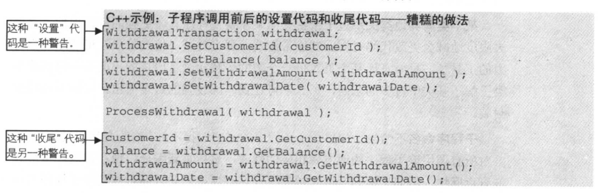

  像上面这样，每次调`ProcessWithdrawal`前后都要执行一些固定的代码，那是不是应该把这些固定的代码都搬到`ProcessWithdrawal`里面做

  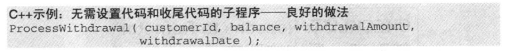

- **程序中的一些代码似乎是在将来的某个时候才会用到的。**

  超前设计的问题：

  ① 这部分超前设计的代码是没有完备的需求的，所以程序员对未来需求的猜测可能是错的。

  ② 就算程序员猜测的部分是正确的，他也不可能猜到所有的需求内容。

  ③ 有些程序员不知道这部分代码是超前设计，会对它有不切实际的期望，总在想“这个功能应该已经实现了啊”，实际上可能根本没实现。 

  ④ 超前设计增加了复杂度，带来了额外的测试、修补缺陷的工作等


**拒绝重构的理由**

重构不是为了修复而修改代码，而是深思熟虑的，为了改善质量而做的修改。


### 24.3 特定的重构

**数据级的重构**

以下的重构方法可用于改进变量和其他数据类型的使用：

- **以具名常量取代神秘数值。**

  使用宏或者`const`数据取代数字或字符串常量

- **使变量的名字更清晰且传递更多的信息。**

  取名要取好

- **将表达式内联化。**

  把一个中间变量换成给它赋值的那个表达式本身（为了减少变量个数，方便阅读？:thinking:）

  ```c++
  //不好的
  a = b + c;
  d = a + e;
  
  //好的
  d = b + c + e;
  ```

- **用函数来替代表达式。**

  如果表达式比较复杂，用函数取代它

- **引入中间变量。**

  如果表达式比较复杂，也可以用中间变量，变量名要能体现它的意义

- **用多个单一用途变量取代某个多用途变量。**

  方便阅读理解

- **在局部用途中使用局部变量而不是参数。**

  局部变量能做的事，不要增加参数让参数来做。

- **将基础数据类型转化成类。**

  上面讲过

- **将一组类型码转化为类或者枚举类型。**

  

- **将一组类型码转化为一个基类及其相应派生类。**

  如果与不同类型相关联的不同代码片段有不一样的功能，请考虑为该类型创建一个基类，然后针对每个类型码创建派生类。

  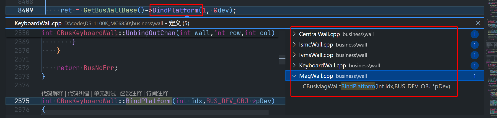

- **将数组转化为对象。**

  数组中的每个成员类型不一样的情况，C/C++不存在这种情况

- **把群集封装起来。**

  不清楚集群的概念，别的语言的概念？

- **用数据类来代替传统记录。**

  创建一个类来管理记录。


**语句级的重构**

下面的重构方法可以改善单个语句的使用：

- **分解布尔表达式。**

  引入中间变量，变量名要能表达意思。

- **将复杂布尔表达式转换成命名准确的布尔函数。**

  过于复杂的话提炼成函数

- **合并条件语句不同部分中的重复代码片段。**

  如果`if`和`else`都执行一段相同的代码，把它放判断的前面或后面

- **使用break或return而不是循环控制变量。**

  检测到可以退出的时候，直接break或者return，而不是给一个`done`赋值，然后再去判断它再退出

- **在嵌套的`if-else if`语句中一旦知道答案立马返回，而不是去赋一个返回值。**

  和上面的一个意思

- **用多态来替代条件语句（尤其是重复的case语句）。**

  “将一组类型码转化为一个基类及其相应派生类”一个意思

- **创建和使用null对象而不是去检测空值。**

  [C++设计模式：空对象模式_c++ 空对象-CSDN博客](https://blog.csdn.net/m0_73443478/article/details/129767020)


**子程序级重构**

下面的重构方法可以用于改善单个子程序一级的代码。

- **提取子程序或代码。**

  把内嵌的代码从一个子程序里提取出来做成单独的子程序。

- **将子程序的代码内联化。**

  如果子程序很简单且含义不言自明，可以撤销这个子程序，直接把代码写到调用的地方

- **将冗长的子程序转化为类。**

  子程序太长，可以将其转化为类，拆成多个子程序来改善代码可读性

- **用简单算法取代复杂算法。**

  如果有的话，用更简单的算法

- **增加参数。**

  如果由于各种原因需要，增加参数

- **删除参数。**

  如果子程序已经不需要某个参数，删除它

- **将查询操作从修改操作中独立出来。**

  查询操作应该不影响被查询的值，如果查询接口修改了值，需要修改这个接口

- **合并相似的子程序，通过参数区分它们的功能。**

  如果两个相似子程序的唯一区别只是用到的常量值不同，那可以合并成一个，将常量值作为参数传进去

- **将行为取决于参数的子程序拆分开来。**

  如果一个子函数里面有两种不同的操作，由入参决定走哪种操作，那可以拆成两个函数，分别做这两种操作

- **传递整个对象而非特定成员。**

  如果函数的多个入参都属于同一个对象，那可以考虑直接传这个对象

- **传递特定成员而非整个对象。**

  如果你特地为了调用某个函数而创建一个对象，考虑下这个函数的入参类型是不是可以不是对象类型，而是其中要用到的几个特定成员

- **包装向下转型的操作。**

  当子程序返回一个对象时，应当返回其已知的最精确的对象类型，比如返回迭代器、群集、群集元素等。


**类实现的重构**

下面的方法可用于类一级的重构：

- **将值对象转化为引用对象。**

  从维护多个类的对象改为维护同一个类对象的值。

  如果发现自己维护并创建着多个一模一样的大型复杂对象，请改变使用方法，只保存一份主拷贝(值对象)，然后其他地方使用该对象的引用。

- **将引用对象转化为值对象。**

  从引用同一个类的对象改为引用同一个类的不同成员

  如果自己对一个小型的简单对象进行了多次引用，请将这些对象都设置为值对象。

- **将数据初始化替代虚函数。**

  如果有一组派生类的虚函数，它们的差别仅仅是返回的常量不同。与其在派生类中覆盖成员函数，不如让派生类在初始化的时候赋不同的初始值。

  然后用基类的通用代码来处理这些数据。

- **改变成员函数或成员数据的位置。**

  考虑对类的继承体系做出修改，这些修改通常可以减少派生类的重复工作：

  ① 将子程序上移到基类

  ② 将成员上移到基类

  ③ 将构造函数中的部分代码上移到基类

  下面这些则可以用来对派生类进行特殊化：

  ① 将子程序下移到派生类

  ② 将成员下移到派生类

  ③ 将构造函数下移到派生类

- **将特殊代码提取为派生类。**

  如果基类中的部分代码仅仅被部分实例所使用，应该把这部分特殊的代码放到派生类中。

- **将相似的代码组合起来放置到基类中。**

  如果两个派生类有相似的代码，可以把这部分代码合并放到基类里。

  

**类接口的重构**

下面的方法可以给你带来更好的类接口：

- **将成员函数放到另一个类里。**

- **将一个类变成两个。**

  如果一个类具备两个或多个截然不同的功能，可以拆成多个类。

- **删除类。**

  如果某个类无所事事，可以删除它

- **去除委托关系。**

  如果A类调用了B类和C类，但是实际上A应该调用B，然后B去调用C来实现，那么需要修改下A和B之间的接口

- **去掉中间人。**

  功能由A类调B类，B类再调C类的方式实现，如果A类直接调C类也能实现，考虑下是否要删掉B类。

- **用委托代替继承。**

  如果某个类A要用到另一个类B，又打算获取对类B的接口更多的控制权，可以把类B作为类A的一个成员，并开放类B的部分成员函数

- **用继承代替委托。**

  如果某个类公开了委托类（成员类）所有的成员函数，那 么该类应该从委托类继承而来，而不是使用该类。

- **引入外部的成员函数。**

  如果A类要调用B类的某个额外的成员函数，而又无法修改B类，可以直接在A类新增一个一样的函数

- **引入扩展类。**

  如果有个A类，你需要新增一些函数，但你不能修改A类，那你可以新增一个类来实现。

  新增的方式可以是创建一个B类继承A类，然后新增函数，也可以是B类里面去调用A类的和功能的形式。

- **对暴露在外的成员变量进行封装。**

  如果数据成员是public的，把它改为private并通过成员函数访问它

- **对于不能修改的类成员，删除其set函数。**

- **隐藏那些在类之外不会被用到的成员函数。**

  写到private里

- **封装不使用的成员函数。**

  写到private里

- **合并那些实现非常相似的基类和派生类。**

  如果派生类不能提供特殊的功能，那就把它合并到基类里


**系统级重构**

这里的重构方法可以在系统一级改善代码。

- **为无法控制的数据创建明显的索引源。**

  如果数据需要统一管理，创建一个类专门用于管理它，外部访问和修改数据都通过这个类

- **将单向的类联系改为双向的类联系。**

  如果A类B类之间需要相互调用，但是只有A能调用B，那么应该改成AB间都能相互调用

- **将双向的类联系改为单向的类联系。**

  和上面的相反

- **用Factory Method模式而不是简单地构造函数。**

  在需要基于类型码创建对象, 或者希望使用引用对象而非值对象的时候, 应当使用 Factory Method (函数)。

- **用异常取代错误处理代码，或者做相反方向的变换。**

  取决于你的错误处理策略


### 24.4 安全地重构

重构能改善代码质量，但做的不好的话也会带来麻烦，下面是一些建议：

- **保存初始代码。**

  要确保你还能回得去

- **重构的步伐请小些。**

  尽量小的步伐才能理解修改对程序的全部影响，不容易出错

- **同一时间只做一项重构。**

  在进入下一次重构前，对当前的修改编译并测试

- **把要做的事情一项项列出来。**

  列出重构的先后顺序并实施

- **设置一个停车场。**

  在重构过程中发现的很多可以优化的点，可以先记下来下次再改

- **多使用检查点。**

  如果重构后的代码没有按你想的那样正常运行，可以增加检查点来排查问题

- **利用编译器警告信息。**

  把编译器的警告级别拉高

- **重新测试。**

  要有测试用例，修改后测试一遍

- **增加测试用例。**

  新引入的代码要用新的测试用例验证

- **检查对代码的修改。**

  

  检查代码修改，就算它改动很小也要仔细检查。

- **根据重构风险级别来调整重构方法。**

  重构的对象风险越大，需要做的检查和测试就越多

**不宜重构的情况**

- **不要把重构当成先写后改的代名词。**

  重构是改进代码，而不是修复缺陷

- **避免用重构代替重写。**

  改动过大的时候考虑下是不是直接重写会更省事。


### 24.5 重构策略

不同的重构方法都能改善质量，但遵守收益递减定律，和80/20法则（80的结果来自于20%的原因），下面是一些选择方法上的建议：

- **在增加子程序时进行重构。**

  检查新的函数是否有必要重构

- **在增加类的时候进行重构。**

  检查新的类是否有必要重构

- **在修补缺陷的时候进行重构。**

  改缺陷的时候会有一些心得体会，可以应用到代码上

- **关注易于出错的模块。**

  易于出错的模块需要重构的必要性最大

- **关注高度复杂的模块。**

  关注这部分有助于提高程序质量

- **维护环境中，改善你手上正在处理的代码。**

  维护代码应该越改越好

- **定义清楚拙劣代码和干净代码之间的边界，然后尝试把代码移过这个边界。**

  老系统的代码很混乱，可以把他们一点点改写成能看懂的新代码


## 第25章：代码调整策略

当计算机/微型计算机/嵌入式设备的资源（内存）紧张时，提升程序性能就被提上日程。

可以在两个层次上考虑性能问题：策略上和技术上。本章将的是策略上的。

策略指的是：什么是性能、它的重要性、以及提高性能的一般方法。技术指的是代码一级的提升性能的技术。


### 25.1 性能概述

调整代码只是提升性能的一种方法，还有别的方法，如果能使用更多的技术，就能花更少的时间，对代码做更少修改。


**质量特性和性能**

程序员可能看重的是程序运行的速度，但是用户在意的可能是按时交付软件，有简洁的界面，功能容易操作，不会经常死机。所以要关注客户需求，看客户对质量特性中的哪一点最看重，不然一味地追求运行速度会得不偿失。


**性能和代码调整**

一旦你把提升效率作为头等大事来做，在考虑怎么提升速度，降低资源占用之前，应该先考虑下下面这些因素：

- **程序需求。**

  如果有一个对性能要求很高的需求，先确认下这个需求是否真的要这么严格才能满足要求

  

- **程序的设计。**

  程序的设计包括了整个程序的框架，有时候一个好的框架能让实现一个高性能的系统变得简单，一个不好的框架则相反。

  如果程序的资源占用和速度至关重要，那在设计架构时，应该优先考虑性能，然后再为单个的子系统、特性和类设置要达到的资源目标，这样的好处有：

  ① 设置单个的资源占用目标使得这个系统的性能可以预测。

  ② 把这些目标描述得越详细，越有可能使子系统满足这些目标。

  ③ 设置一些本身并不能提升效率的要求，比如高度模块化，可以给后续优化提供很好的支持

  

- **类和子程序的设计。**

  用更合适的数据类型和更高效的算法

  

- **程序同操作系统的交互。**

  有时候程序慢是因为和操作系统交互的接口臃肿或低效

  

- **代码编译。**

  高效的编译器能把你的代码优化成更高效的机器语言

  

- **硬件。**

  最方便有效的办法是采购更好的硬件，如果你对接的只是少用的用户，可以考虑

  

- **代码调整。**

  代码调整是一种对正确代码进行优化的过程，也是本章后面要着重讲的部分。

  它是一种小修小改，并不是框架或者设计上的修改，但是多个小修小改累计的提升也是很客观的。


### 25.2 代码调整简介

为什么代码调整这种小修小改对程序员吸引力这么大呢？

它不是改进性能最有效的办法，修改框架、修改类的设计、选择更好的算法带来的提升幅度最大。

它不是最方便的方法，购买硬件或使用优化更好的编译器是最方便的。

它也不是成本最低的方法，初期你花在调试代码上的时间越多，成本越低。

在于它的成就感！修改几行代码起到性能提升很多的成就感、掌握高效代码技术的成就感等

代码调整的问题在于，高效的代码并不一定就是更好的代码，下面我们会讨论这个问题。


**Pareto法则**

也就是常说的20/80法则：用20%的努力获得80%的成效，或者说80%的不足来自于20%的部分。

有研究表明，20%的程序花费了80%的程序运行时间，程序员应该关注这部分，集中火力来解决这部分占用绝大部分资源的少量的代码。


**一些无稽之谈**

- **在高级语言中，减少代码行数就能提升所生成的机器代码的运行速度，或者是减少资源占用。**

  减少代码行数只会显得简洁而已

- **特定运算可能比其他的快，代码规模也更小。**

   不要可能，要实际测一下，因为环境变化也可能会导致结论变化，比如编译器变化，运行环境变化等

- **应当随时随地地进行优化。**

  一些人认为如果每个子程序都是最简洁高效的，那拼凑出的程序也是最简洁高效的，这样会让程序员拘泥于细节，而不关注框架上的优化

  如果你有这种思想，可能会遇到如下的问题：
  ① 一般很难在事前预测出哪部分是最耗时的，所以如果每个都优化，大部分做的都是无关紧要的无用功

  ② 就算预测对了最耗时的部分，如果不关注全局，这部分的修改后另一部分可能会成为新的制约因素

  ③ 如果程序员一开始就沉浸在对细节的优化上，会干扰他们对程序目标的判断

- **程序的运行速度同正确性一样重要。**

  程序都不能正常运行，再快的速度都没有意义

  

**何时调整代码**

程序员应该在编写代码时就用高质量的设计，把程序编写正确，使之模块化，易于修改维护。在程序正确运行后再去做优化。

除非你对程序非常熟悉，否则不要轻易的做修改。


**编译器优化**

更好的编译器带来更好的优化，是一种最方便的提升效率的方法。

下面是同一个程序在关闭和打开编译器优化选项前后的执行时间，可以看到不同的编译器的优化效果是不一样的。


[gcc/g++ -O 优化选项说明-CSDN博客](https://blog.csdn.net/weixin_34417635/article/details/92230199)


### 25.3 蜜糖和哥斯拉

指有些代码像哥斯拉一样臃肿，但是运行起来像冬天的蜜糖一样黏糊糊的。你的目标是让他们变小变快。


**常见的低效率之源**

- **输出输出操作。**

  程序效率低下的根源之一就是不必要的输入输出操作。如果能在内存中的做的事情，就不要通过磁盘、数据库等实现。

  读取100个随机数据，访问内存和访问外部设备的速度比较。

  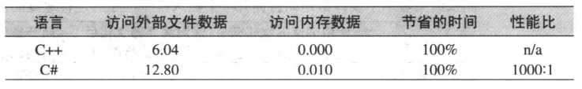

  顺序访问100个数据的比较，结果也类似

  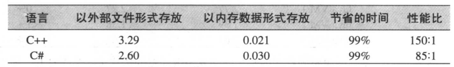

  网络也有一样的问题

  

- **[分页](https://baike.baidu.com/item/分页/2888444?fr=ge_ala)**

  引发操作系统交换内存页面的运算会比在内存同一页中进行的运算慢 许多。因此，有时一点简单的修改也能让你的程序性能焕然一新。

  在下面这个例 子中，一个程序员写下了一个初始化循环，这段程序在一个内存页面大小为4k的系统上将产生很多的缺页中断 (page faults)。

  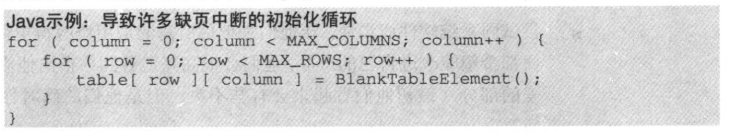

  上面的程序的问题在于，每一行的数据大小是4K，所以，如果行数太多，程序每次换行访问时，都要切页，造成磁盘和内存间的页面交换。

  上面的程序可以改成下面的样子，这样的话最多只会切页MAX_ROWS次，而非原先的MAX_ROWS*MAX_COLUMNS次。

  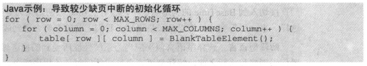

- **系统调用。**

  调用系统函数的开销是很大的，会涉及到系统上下文切换、对磁盘、键盘、显示器等设备的输入输出等。如果你有使用，检查下它的消耗是多少。

  如果消耗很大，可以考虑下面的方法：

  ① 编写自己的服务程序。有时候你需要的只是某个系统调用中的一部分功能，可以自己实现。

  ② 避免进入系统。

  ③ 和软件系统商联系，让他们改系统调用的实现。:scream:

- **解释型语言。**

  语言本身的差异，解释型语言在机器码创建和执行前，必须要处理每一条指令。

  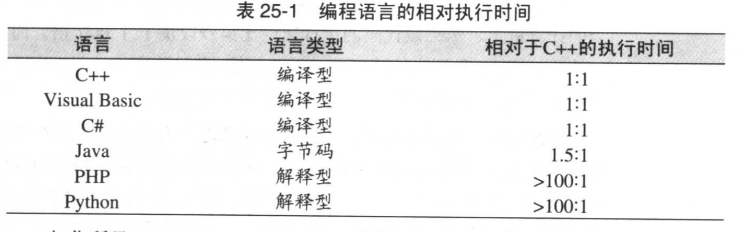

- **错误。**

  没去掉调试代码、忘记释放内存、不合理的数据库访问方式、轮询不存在的设备直到超时等等


**常见操作的相对相效率**

一些常见操作的耗时表如下：


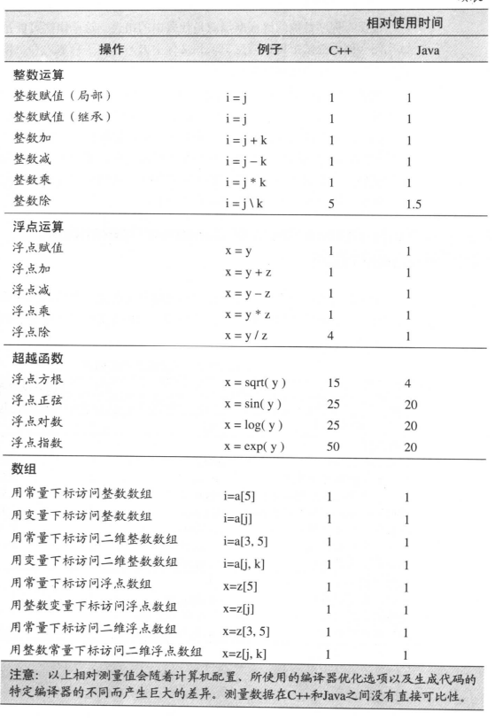


### 25.4 性能测试

为了找出那20%拖累整个程序的代码，应该对代码进行性能测试。在这方面，经验对人来说往往没有用，还是测试靠谱。

作者举了一个例子，自己以为有用的优化，实际上编译器已经帮他做了，所以并没有起到优化的作用。


**性能测试应当精确**

比如，CPU切到别的程序消耗掉的时间不应该计入你的程序运行时间、你的性能测试程序的消耗也要被刨除。


### 25.5 反复调整

一点点的优化累积带来的提升也是巨大的


### 25.6 代码调整方法总结

如果还对代码调整能否有助于提高某个程序的性能心存疑虑，按照以下的步 骤去做吧。 

1.用设计良好的代码来开发软件，从而使程序易于理解和修改。 

2.如果程序性能很差。 

​	a.保存代码的可运行版本，这样你才能回到"最近的已知正常状态"；

​	b.对系统进行分析测量，找出热点； 

​	c.判断性能拙劣是否源于设计、数据类型或算法上的缺陷，确定是否应该做代码调整，如果不是，请跳回到第一步； 

​	d.对步骤c中所确定的瓶颈代码进行调整； 

​	e.每次调整后都对性能提升进行测量； 

​	f.如果调整没有改进代码的性能，就恢复到步骤a保存的代码（通常而言，超过一半的调整尝试都只能稍微改善性能甚至造成性能恶化）。 

3.重复步骤2。


## 第26章：代码调整技术

本章重点讲述提高代码运行速度的方法，同时也对如何减少资源占用提供一些建议。

本章和24章的重构看着有些相似，但重构是去改善程序的内部结构，而本章的改动是以牺牲程序的内部结构的某些特性来提升速度，所以可以称之为“反重构”。

下面的方法都是一些“可尝试”的方法，具体效果要在适用于你的程序后查看实际的效果。


### 26.1 逻辑

很多程序都是由逻辑构成，本节指导怎么使用逻辑表达式。


**在知道答案后停止判断**

两个场景：判断的条件和判断的执行内容

```c++
//判断条件
if(x > 5 || x > 10) //只要 x > 5 成立，则不执行后面的判断，这个依赖于语言的编译器
```

```c++
//判断的执行内容
for(i=0; i<10; i++)
{
	if(a[i] < 0) 
	{
		break;	//如果程序只是为了判断数组内是否有负数，找到第一个就可以退出了
	}
}
```


**按照出现频率来调整判断顺序**	

安排判断的顺序，把执行快的和最常见的case写在最前面。

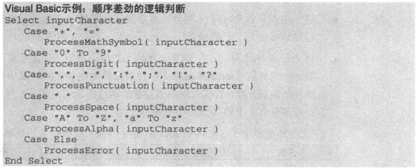

上面的判断是按照ASCII码排列的，当输入最常见的字母时，需要先经过3重判断

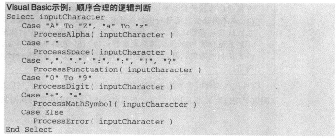

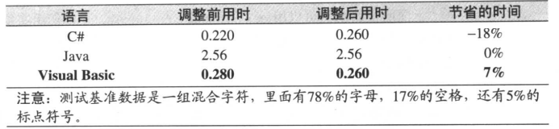

上面可以看到，C#和Java的优化后效果反而更差，是因为这两种语言的case语句不支持范围，每个值必须对应一个case。这也说明了实际效果要实际测试才能得出结论。

如果把`case`语句替换成等价的`if-else`语句，优化的效果如何呢？


虽然三种语言都得到了优化，但从使用的时间上看，可以看出三种语言使用`case`和`if-else`的耗时是不一样的。编译器给它们生成了不同的代码。

这也引出了下面的这个方法：


**相似逻辑结构之间的性能比较**

上面的例子中可以看出三种语言使用`case`和`if-else`的耗时是不一样的，整理后得到的数据是这样的：


所以，测量一下语法的耗时，并选择耗时更少的那个


**用查询表替代复杂表达式**

和[**第18章：表驱动法**](# 第18章：表驱动法)中介绍的例子一样，先把各种判断结果整理成表，然后直接通过关键字查表获取相应的数据或者处理函数。


**使用惰性求值**

惰性求值类似于即时完成策略，即仅到工作必须完成的时候才去处理。

比如有一张表，有5000个值，在程序启动时生成，在程序运行中使用，如果你只用其中的一小部分，那与其在一开始算好它全部的5000个值，

不如在要使用的时候再计算需要的值，并把计算结果存到表里（即所谓的缓存）。


### 26.2 循环


**将判断外提**

如果循环中的某个判断一直是成立的，可以把这个判断往外提。这样就不需要再每次循环执行的时候都走一遍判断。

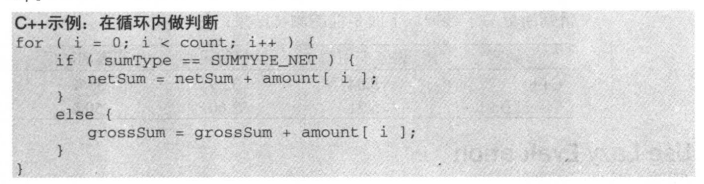

如果上面的`sumType == SUMTYPE_NET`一直是成立的，那么可以把循环改成：


上面的问题就在于写了两个一样的for语句，这样在后面的修改的时候需要一起修改，容易忘记。降低了可读性和可维护性。但这章介绍的是性能，就先不管了。

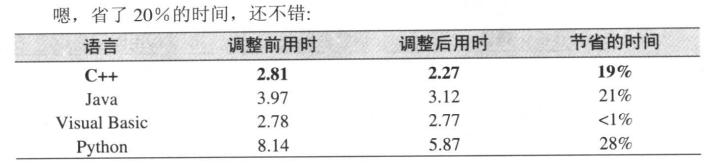

上面这样修改后得到的提升效果。


**合并**

如果有两个循环，它们的循环条件一样，那可以考虑合并成一个。


 可以合并成：


下面是节省的时间：

 


**展开**


第25章的时候有个例子，像这样展开循环，运行速度变快（例子统计的是VB：63%和Java：74%）

但是这样的写法会降低程序的可读性，要慎重使用。


**尽可能减少循环内部需要做的事情**

如果可以在循环外计算某语句，而只在循环内用它的计算结果，那就把它放到外面。

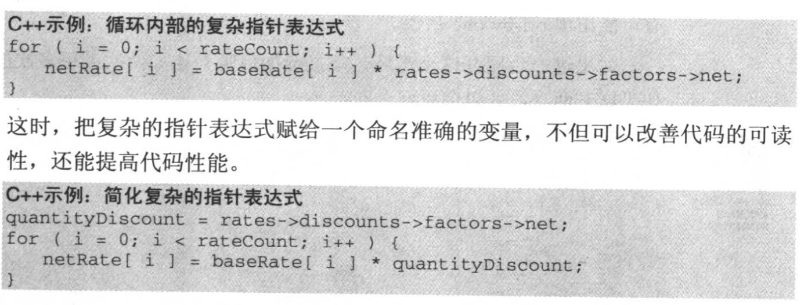

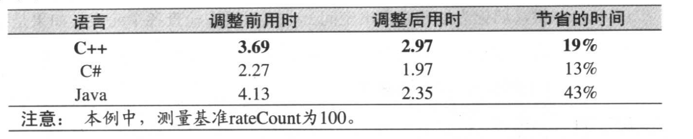


**哨兵值**

当循环的判断条件是一个符合判断，可以通过简化判断来节省时间。如果循环是一个**查找循环**，简化方法之一就是使用一个哨兵值，

你可以把它放在循环范围的末尾，从而保证循环一定能终止。

下面是一个例子，这个循环既要遍历所有值，又要判断是否有要找的值：


上面的循环要进行三个判断：`!found`、`i < count`、`item[i] == testValue`。

如果能把三个判断合并成一个的话，就可以节省时间，此处可以用到哨兵值。


也就是在数组末尾加一个元素，放你要查找的那个值，然后遍历数组，在遇到查找的值的时候退出，根据退出时遍历的元素个数，来判断是否包含要查找的值。


**把最忙的循环放在最内层**

改进的关键在于解决外部循环执行的次数远多于内层循环的情况。

```c++
int colum,rowm,sum=0;
for(colum = 0; colum < 100; colum++)
{
	for(row = 0; row < 5; row++)
	{
		sum += table[row][colum];	//colum变化100次，row变化5*100 = 500次，总计600次
	}
}
```

可以优化为：

```c++
int colum,rowm,sum=0;
for(row = 0; row < 5; row++)
{
	for(colum = 0; colum < 100; colum++)
	{
		sum += table[row][colum];	//colum变化5*100=500次，row变化5次，总计505次
	}
}
```

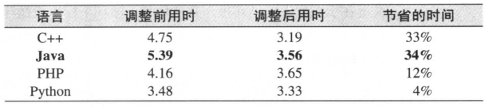


**削减强度**

削减强度意味着用多次轻量级运算（如加法）来替换一次代价高昂的运算（如乘法）。

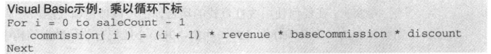

可以优化为：


i会变成0、1、2......，对应1、2、3......个`revenue * baseCommission * discount`也就是`incrementalCommission`，上面的例子中将乘法转化成了加法。


### 26.3 数据变换


**使用整型数而不是浮点数**

整型数的加法和乘法比浮点数的相应运算要快很多。


**数组维度尽量少**

下面是遍历50行20列的数组，使用二维数组和优化后使用一维数组的比较：


**尽可能减少数组引用**


对内层循环而言，红框的部分是不变化的，这样每次循环都去访问discount数组是比较耗时的，可以修改为：

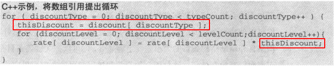

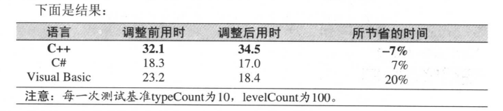


**使用辅助索引**

添加相关数据，使得对某种数据类型的访问更为高效。你可以把相关数据添加到主数据类型中，或存放在并行结构中。


**字符串长度索引**

像C语言中字符串被一个值为0的字节中止，VB语言字符串的开始位置隐藏有一个长度字节。这就是一种辅助索引。

你可以把这种为长度添加索引的思想应用到任何可变长度的数据类型上，在需要知道数据长度的时候，相比于临时计算，提早维护这样的结构长度显然更有效。


**独立的平行的索引结构**

有时候，与操作数据类型本身相比，操作数据类型的索引会更为有效。尤其是数据类型的条目很大或者难以移动（或存放在磁盘上），那么对索引排序和查找会比对数据直接进行操作会更快。遇到这种情况，你可以创建一个辅助结构，里面存关键码和指向详细信息的指针，后续维护这个辅助结构。


**使用缓存机制**

缓存机制就是把某些值存起来，使得最常用的值比不常用的值更容易获取。以计算直角三角形的斜边长度为例：


如果你知道有相同的值常常被重复要求计算，可以如下优化


如果你连续让程序算直角边长为3、4的斜边长度，那优化后的程序第二次可以直接返回结果


### 26.4 表达式

程序中的很多工作都是在数学或者逻辑表达式中实现的。复杂的表达式往往更昂贵，本章就将讨论减少其代价的方法。


**利用代数恒等式**

参考第19章的 [用狄默根定理简化否定的布尔判断](# 第19章：一般控制问题) 选择简单的表达式


**削减运算强度**

下面是一些可能的替代方法：

- 用加法替代乘法
- 用乘法代替幂乘
- 利用[三角恒等式](https://baike.baidu.com/item/%E4%B8%89%E8%A7%92%E6%81%92%E7%AD%89%E5%BC%8F/4304519?fr=ge_ala)代换等价的三角函数
- 用long或int来替换long long整数(但要注意使用机器字长的整数和非机器字长整数带来的差异)
- 用定点数或者整型数代替浮点数
- 用单精度数代替双精度数
- 用位移操作取代整数除以2或者乘以2


**编译器初始化**

一些表达式里面包含了某个算式，不会变化，但是需要运算出来，可以考虑直接替换成运算的结果。


其中log(2)可以替换为常数


替换后的效果


**小心系统函数**

系统函数运行起来很慢，提供的精度常常也不是需要的。举例来说，标准的系统数学函数是按照把宇航员送上月球着陆点的误差不超过两英尺的精度设计的。

如果你的程序不需要这么精确，可以不去计算，而像上面log(2)那样直接给个近似值。


**使用正确的常量类型**

赋给变量对应的数值类型，否则会额外进行类型转换，耗时。

```c++
int x;
float i;

x = 5;
i = 3.14;

x = 3.14;	//需要类型转换
i = 5;
```

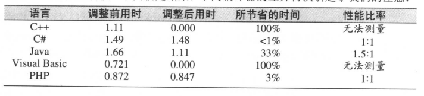


**预先算出结果**

有两种选择：在需要用的时候即时算出数值后使用，或者事先把数值算出来，要用的时候查找。

这个和上面19章讲的表驱动法类似

通过预先计算优化程序可以有如下几种形式：

- 在程序执行之前算出结果，然后把结果写入常量，在编译时赋值。
- 在程序执行之前算出结果，然后把他们硬编码在运行时使用的变量中。
- 在程序执行之前计算结果，把结果保存在文件中，在运行时载入。
- 在程序启动时一次性计算出全部结果，每当需要时去引用。
- 尽可能在循环开始之前计算，最大限度地减少循环内部需要做的工作。
- 在第一次需要结果时进行计算，然后将结果保存起来以备后用。


**删除公共表达式**

如果你发现某个表达式经常出现，则把它赋给一个变量，后续使用这个变量。


### 26.5 子程序

**将子程序重写为内联**

在计算机编程历史的早期，在一些机器中调用子程序可能严重地影响性能。

利用C++的`inline`关键字可以直接把程序放到程序内部。


### 26.6 用低级语言重写代码

对C++而言就是用汇编，此处不考虑了。


### 26.7 变得越多，事情反而越没变

作者说这么多年过去了，虽然编程技术和硬件内存一直在进步，但是对性能提升的需求却一直没变


## 第27章：程序规模对构建的影响

如果你习惯于开发小项目，你的第一个大项目很可能会严重失控，本文会告诉你你会遇到什么困难，以及如何克服。

如果你已经习惯于开发大项目，那么你所用的方法对小项目而言可能太正规了，本章会教你怎么节约，防止小项目被自己的额外负担压垮。


### 27.1 交流和规模

随着项目人数的增多，项目人员之间的交流路径会快速增加。


交流路径越多，你花在交流上的时间就越多，因交流而出错的概率就越大。更大的项目要求采取一些组织技术来改善交流效率，或者有意识地对其加以限制。

改善交流效率的常用方法是采用正式的文档。让他们阅读和撰写文档，文档可以是文本、图形，纸质的或者电子的。


### 27.2 项目规模的范围

评估项目规模的方法之一是考虑项目团队的规模。

下面这张图是不同规模的项目出现的频率。


下面是不同规模的项目中程序员的占比，项目越大，程序员占的比重越大。


### 27.3 项目规模对错误的影响

项目规模会影响错误的数量和类型，随着项目规模的增大，会出现更多的需求和设计缺陷。


在小项目里，代码构建的错误大约占所发现错误的75%。在更大的项目中，逐渐降低到50%，而需求和架构错误会相应增加，

推测是因为项目增大导致需求分析和架构设计就越多，产生的错误也就相应增加。

缺陷的数量也会随项目规模而变化，代码量增加为原先的2倍，缺陷并不会简单地增加为原先的2倍，因为缺陷密度会增加。

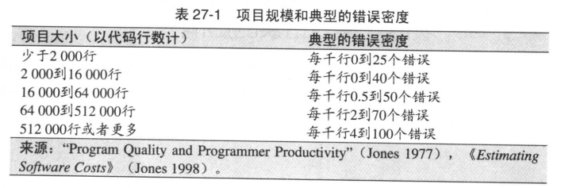


### 27.4 项目规模对生产率的影响

对小项目（2000行代码或者更少），影响生产率的最大因素莫过于单个程序员的技巧。

随着项目规模和团队规模的增大，组织方式对生产率的影响也随之增大。


从表中可以看出，小项目的生产率会比大项目高出2~3倍，最大和最小的项目间生产率可以达到5~10倍


### 27.5 项目规模对开发活动的影响

单人项目的话成败在于你，多人项目的话更大的影响因素是组织结构。


**活动比例和项目规模**

项目越大，需要的交流越多，所需的各种额外的活动也越多。


（这张图里面的构建和架构写反了？:thinking:）

对小项目，构建是最主要的内容，约占整个开发时间的65%，对中型项目，下降到约50%，对于大型项目，架构、集成和系统测试会占用更多的时间，构建不再那么占主导地位了，但它还是按比例增长的。


不同活动的比例发生变化，是因为他们对于不同规模的项目重要性不一样。更大的项目，花在架构上的时间要更多。

随着项目规模的增加，下面这些活动的工作量增加超过线性：

- 交流
- 计划
- 管理
- 需求分析
- 系统功能设计
- 接口设计和规格说明
- 架构
- 集成
- 消除缺陷
- 系统测试
- 文档生成


**程序、产品、系统和系统产品**

代码行数和团队规模还影响了最终软件的质量和复杂度。

单人开发的软件可能只有一个程序，因为可能只有开发者用它，或者极少数几个人非正式地用它。

稍微复杂一点的软件可能是一个产品，需要做充分的测试，提供文档，还要有人维护。

更复杂的是开发一组能够组合起来工作的程序，这种被称为软件系统。这种系统的开发成本更高。


**方法论和规模**

越大的项目，越有使用方法论的必要。项目越大，你不得不写的文档就越多，用于确认你已经完成自己的工作。


## 第28章：管理构建

如果你是一位开发人员，本章将帮助你了解管理者需要考虑的一些问题。

如果你是一位管理者，本章将帮助你了解开发人员如何看待管理者，以及如何才能有效地管理构建。

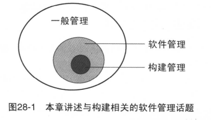


### 28.1 鼓励良好的编码实践

代码是构建活动的主要产出，那么怎么鼓励良好的编码实践呢？从管理者的角度看，不要强制采用一套严格的技术标准，

因为程序员并不认可管理者在技术上的地位，如果要指定标准，需要由德高望重的架构师来做，但这个架构师需要对程序员们正在做的事情足够了解。


**设定标准的考虑事项**

标准对一些组织有用，对另一些组织则用处不大。有些程序员喜欢标准，因为可以减少项目中的分歧。如果你的团队反对采用严格的标准，也可以采用其他的选择，比如灵活的指导原则、一些建议、或者一组能够表现最佳实践的例子。


**鼓励良好的编码实践的技术**

本节讲一些推行良好的编码实践的若干技术：

- **给项目的每一部分分派两个人。**

  两个人写出来的代码可以确保至少两个人认为可行，可读

- **逐行复查代码。**

  由作者和两个评审员进行代码复查，能为作者离职提供保障、改善代码质量

- **要求代码签名。**

  类似于我们公司的文件头上的签名

- **安排一些好的代码供人参考。**

  用一份清楚的样例说明自己的质量目标，直接贴样例代码更容易懂，细节更丰富

- **强调代码是公有财产。**

  程序虽然是某个人写的，但是代码属于项目的一部分，应该对其他人公开。

- **奖励好代码。**

  激励体制，需要把下面的这些方面纳入考量：

  ① 所给与的奖励应该是程序员想要的。

  ② 只有非常出色的代码才应得到奖励。

- **一份简单的标准。**

  如果你是管理者并由技术背景，可以宣称“我必须能阅读并理解这个项目里的所有代码”，由于管理者不是技术尖子，可以避免聪明的或者难理解的代码出现。

  

**本书的角色**

本书不是为呆板的标准做辩护，也不是想作为一个标准而存在，只是为了讨论。🤣


### 28.2 配置管理

**什么是配置管理**

配置管理是：系统地定义项目工件和处理变化，以使项目一直保持其完整性的实践活动。它的另一种说法是“变更控制”。

其中的技术包括评估所提交的变更、追踪变更、保留系统在不同时间点的不同版本。

如果你不对需求变更进行控制，你可能会写出一些不需要的或者不兼容的代码。

如果你不对代码变更进行控制，你可能会修改一个别人也正在修改的子程序，没有版本控制，会无法回退到修改前的版本等

配置管理不是程序员发明的，但是对程序员非常有用，配置管理也常被称作**“软件配置管理（SCM）”**，它关注程序的需求、源代码、文档和测试数据。


**需求变更和设计变更**

在开发过程中可能会产生很多改善系统的想法，但也不能想到一个就实施变更，不然的话软件就没有开发的尽头了。

下面是一些控制设计变更的指导原则：

- **遵循某种系统化的变更控制手续。**

  要有变更的相应流程。

- **成组地处理变更请求。**

  如果你只在有时间的时候挑选几个变更请求实现，总是会挑选简单的变更实现，而且项目时间越紧急，越倾向于不去实现变更。

  解决的办法是记下所有想法和建议，不管它实现起来有多容易，然后等有时间的时候一次性把他们都实现掉。

- **评估每项变更的成本。**

  修改前都要评估需要花费的时间，包括修改代码的时间、重新测试的时间、修改对应文档的时间

- **提防大量的变更请求。**

  如果需求变更的量很大，它表明需求、架构或者上层设计做得不够好，对这两部分做修改可能更划算

- **成立变更控制委员会或者类似机构。**

  在收到变更请求时审核必要性

- **警惕官僚主义，但也不要因为害怕官僚主义而排斥有效的变更控制。**

  变更控制不要变得臃肿没有效率，但也不要因噎废食。


**软件代码变更**

配置管理的另一项内容就是源代码控制。主要是要做好版本控制。

版本控制软件的好处：

- 别人正在修改的时候，你修改这个文件不会和他发生冲突（冲突了至少能知道这一点）。
- 你能方便地将将本地代码更新到最新版本。
- 可以追溯版本。
- 你可以获取到一份对任何文件的任意版本所做的更改的清单（log）。
- 你无需担心个人文件备份，版本控制软件提供了安全保障。


**工具版本**

有些项目可能需要有“重新构造出‘创建软件的各个特定版本’的原样环境”的能力，包括编译器、链接器、代码库等。在这种环境下，你也要把所有这些工具也纳入版本控制。


**机器配置**

有些公司使用统一的开发机器，将统一的开发环境装在服务器上，每台办公电脑都从服务器上获取一样的环境运行（类似于网吧），这样可以避免因为配置不通、使用工具的版本不同等造成的各种麻烦。


**备份计划**

备份你的数据，把所有的东西保存下来：源代码、编译器、工具、需求、设计、文档等，把它们放在一个安全的地方。


### 28.3 评估构建进度表

软件项目管理是人类在21世纪面临的一项重大挑战。评估项目的规模和完成 项目所需的工作量是软件项目管理中最具挑战性的方面之一。

平均水平的大型软 件项目都要超时一年, 并且超过预算经费 100%才能完成 (Standish Group 1994, Jones 1997, Johnson 1999) 。 

在个人层面上, 对预估进度表和实际进度表的调查 显示, 开发人员的估计值比实际值要乐观 20%~30% (van Genuchten 1991) 。 

这 既与"对项目规模和工作量的评估"不准确有关,也与开发不力有关。本节将讨 论评估软件项目所涉及的一些问题,并指出到何处去获取更多的信息。


**评估的方法**

你可以采用下面的方法来评估项目的规模和完成它需要的工作量。

- 使用评估软件。
- 使用算法方法，比如Cocomo II，这是Barry Boehm提出的评估模型。
- 聘请外界的评估专家来评估有关项目。
- 为评估举行排练会议。
- 评估项目中的每一部分，然后加起来。
- 让成员评估各自的任务，然后再把各任务的评估值加起来。
- 参考以往的项目经验。
- 保留以往项目的评估，查看其准确度，用它来调整新的评估。


下面是一套评估项目的好方法：

1. **建立目标。**

   为什么要评估？要评估什么等

2. **为评估留出时间，并做好计划。**

   匆忙的评估是不准确的。

3. **清楚地说明软件需求。**

   要先确定需求，才能对需求进行评估。

4. **在底层细节层面进行评估。**

   评估要建立在对项目各项活动做出详细考察的基础上。考察得越细，评估地越准确。

5. **使用若干不同的评估方法，并比较其结果。**

   如题

6. **定期做重新评估。**

   软件项目的一些因素在最初的评估后有所变化，因此需要重新评估。

项目早期的评估不会很准确，随着项目的进行，准确性会越来越高。


**评估构建的工作量**

可以参考27.5的[**活动比例和项目规模**](# 27.5 项目规模对开发活动的影响) 中的构建比例。


**对进度的影响**

对软件项目进度影响最大的是所开发的程序的规模。但是很多其他的因素也会有影响，下面是一份统计：

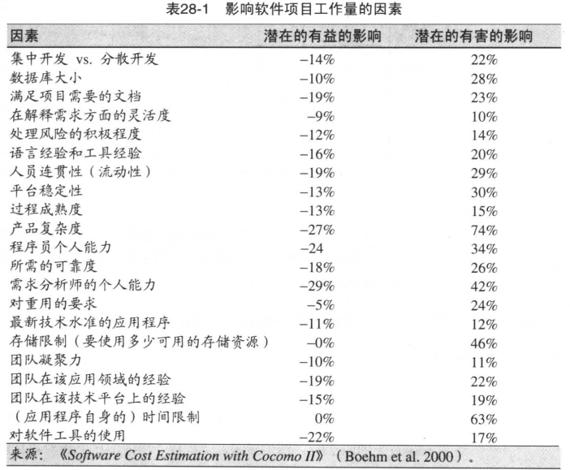

以下是一些能影响开发进度，但不容易被量化的因素：

需求开发者的能力和经验。

- 程序员的经验和能力。
- 团队的动力。
- 管理的质量。
- 重用的代码数量。
- 人员流动性。
- 需求变更。
- 客户关系的质量。
- 用户对需求的参与度。
- 客户对此类应用程序的经验。
- 程序员对需求开发的参与程度。
- 计算机、程序和数据的分级安全环境。
- 文档量。
- 项目进度。


**评估与控制**

评估好后，就是要控制人员和技术资源的开销，以便能按时交付产品。控制的重要性要更大。


**如果你落后了该怎么办**

前面提到过。项目平均都会超期，那当你落后的时候，如果延长时间不可能，可以考虑下面的办法：

- **希望自己能赶上。**

  希望后面能赶上进度，但经验上来看，一般不太会实现

- **扩充团队。**

  加人

- **缩减项目范围。**

  减少需求或者简单的实现某项需求


### 28.4 度量

度量软件项目有很多种方法，以下是对项目进行度量的两项根本原因：

- **任何一种项目特性都是可以通过某种方法度量的，而且总是会比根本不度量好得多。**

  度量也许很难，但不度量的话就根本不可能控制软件开发过程。并且度量必须得量化。

- **留心度量的副作用。**

  度量会对动机产生影响，人们会更关注被度量的部分。要谨慎地选择度量的部分。

- **反对度量就是认为最好不要去了解项目中到底在发生什么。**

  度量的过程也是一个获取认知的过程。

下面是一些从业者认为有用的量度。

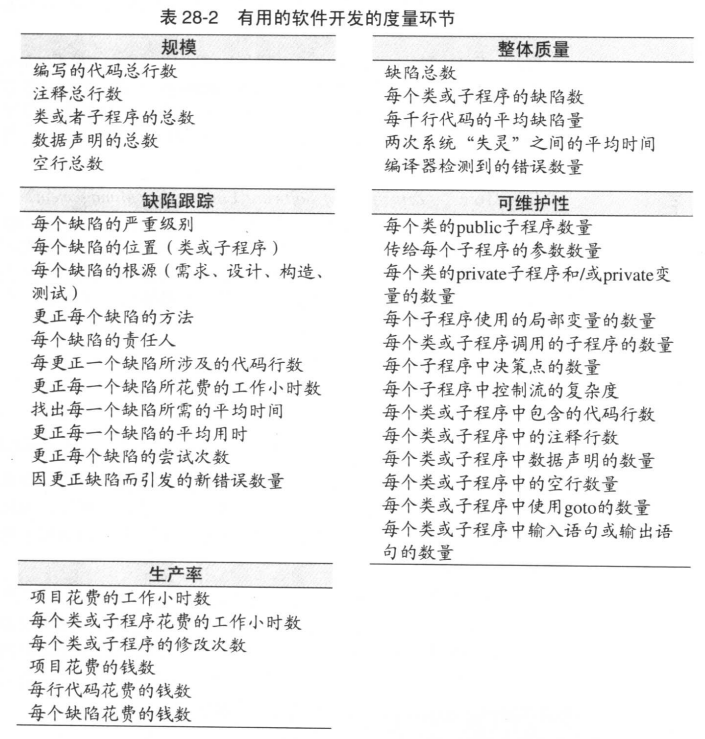

现在很多工具都能获取到这些数据，但也不要一次性获取所有数据，会头晕的。挑几个有用的，需要关注的数据进行跟踪。


### 28.5 把程序员当人看 

😂😂😂


**程序员怎样花费时间**

程序员不仅在编程上花费时间，也在开会、培训、阅读邮件和思考上花费时间。

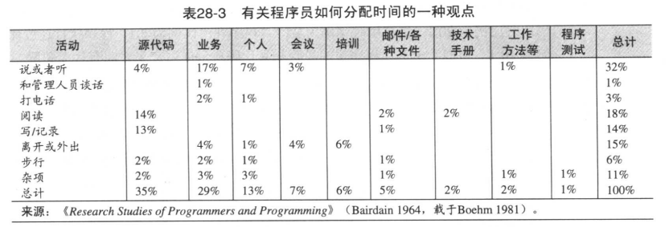

数据很旧了，现在可能不一样了。


**性能差异和质量差异**

个体存在差异，有研究表明最顶尖的20%人员的产出占全部的50%。在编程领域，编写的程序质量、大小和程序员的生产率等方面也一样。


**个体差异**

有关程序员编程生产力的个体差异的最早一项研究是由 Sackman、 Erikson 和 Grant 在 20 世纪 60 年代末期做出的 (Sackman, Erikson, and Grant 1968) 。 他们对平均工作经验为7年的专业程序员进行了调查，发现最好和最差程序员的初始编码用时比例为20:1，调试用时比例为25:1，程序规模比例为5:1，程序执行速度比例为10:1。他们并未发现程序员的经验与其代码质量或生产率之间有什么关联。


**团队差异**

不同的团队的开发效率也不一样，但是组成它们的程序员之间却并没有多大差别。


**信仰问题**

下面是一些管理者需要考虑的事关信仰的问题：

- 编程语言
- 缩进风格
- 大括号的摆放位置
- 所用的集成开发环境
- 注释风格
- 效率和可读性的取舍
- 对方法的选择 -  例如，scrum、极限编程、渐进交付
- 编程工具
- 命名习惯
- 对goto的使用
- 对全局变量的使用
- 量度，特别是对生产力的量度，比如每天编写的代码行数

上面这些都是一些程序员个人风格的反映，如果你想进行控制，请考虑：

- **要清楚地知道你在处理一个敏感问题。**

  先试探一下程序员们对此的反应再决定要不要干涉

- **对这些领域要使用“建议”或者“指导原则”。**

  避免指定僵化的规则

- **避免流露明显的意图。**

  出一些工具来规范或美化，不要显得在针对某一种方式

- **让程序员们执行自己的标准。**

  不要自己设立标准，但一定要有标准

  

**物理环境**

提供更好的办公环境，在更好的办公环境下生产效率更高。

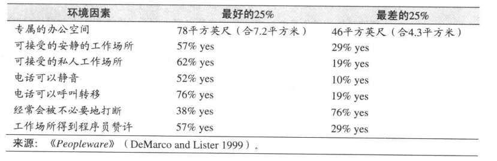


### 28.6 管理你的管理者

懂技术的管理者很少，如果你遇到的是不懂技术的管理者，需要告诉他应该怎样，不应该怎样。

下面是一些应对管理者的方法：

- 把你希望做什么的念头先藏起来、等着你的管理者组织一场有关你希望什么的 头脑风暴/集体讨论(你的想法)。
- 把做事情的正确方法传授给你的管理者。这是一项需要持之以恒的工作、因为管理人员经常会被提升、调迁或者解聘。
- 关注你的管理者的兴趣，按照他的真正意图去做，而不要用一些不必要的实现细节来分散其注意力。(请把它设想成是对你工作的一种"封装"。) 
- 拒绝按照你的管理者所说的去做,坚持用正确的方法做自己的事。
- 换工作。


## 第29章：集成

术语“集成”指的是一种软件开发行为：将一些独立的软件组件组合成为一个完整的系统。

集成这个主题和构建的先后次序这个主题相互纠缠，你构建类或组件的顺序肯定会影响到你将它们集成在一起的顺序。


### 29.1 集成方式的重要性

在软件以外的领域，正确集成的重要性已经广为人知。


如果按错误的顺序集成软件，那么会难于编码、难于测试、难于调试。如果只有全部完成才能工作，那么这个软件看起来永远不能完成。

因为集成是在开发人员完成开发者测试后才进行的，并且集成过程是与系统测试一并进行的，所以集成有时也被认为是一种测试行为。

然而集成本身已经很复杂了，足够被看做一项独立的行动。

从周到的集成中，我们预期获得以下的好处：

- 更容易诊断缺陷
- 缺陷更少
- 脚手架更少
- 花费更少的时间获得第一个能工作的产品
- 更短的整体开发进度表
- 更好的客户关系
- 增强士气
- 增加项目完成的机会
- 更可靠地评估进度表
- 更准确的现状报告
- 改善代码质量
- 较少的文档


### 29.2 集成效率 -- 阶段式集成还是增量集成

软件集成有两种方式：阶段式集成和增量集成。


**阶段式集成**

阶段式集成之前一直是规范，直到几年前才有所改变。它遵循下列明确的步骤：

1. 设计、编码、测试、调试各个类。这一步称为“单元开发”。
2. 将这些类组合为一个庞大的系统（系统集成）。
3. 测试并调整整个系统。这称为系统瓦解

阶段式集成的问题是：第一次把系统中的类放到一起的时候，会出现很多错误，但是又无法确认是哪个类的问题，所有类都是怀疑对象，这样难以诊断。

由于这种出现问题的位置不确定，而且所有问题一下子出现的场景，阶段式集成的另一个名称是"大爆炸集成"。


只有微小的程序，只包含两三个类的场景，适合使用阶段式集成，否则的话还是使用增量集成更加合适。


**增量集成**

在增量集成中，一小块一小块地编写并测试你的程序，然后一次次将它拼接起来。遵守如下步骤：

1. **开发一个小的系统功能组件。**

   它可能是最小的、最难的或者最关键的部件，对它进行测试调试后作为骨架。

2. **设计、编码、测试、调整某个类。**

3. **将这个新的类集成到系统骨架上。测试并调试骨架和新类的结合体。在进一步添加新类前，要确保结合体能正常工作。**

4. **如果做完了剩下的所有工作，就回到步骤2开始重复这一过程。**

有时候第3步新增的是大于单个类的一团代码，比如某个组件，后续步骤也是一样的。上面的方式有点像滚雪球


**增量集成的益处**

无论使用何种增量策略，增量集成都比传统的阶段集成更有优势：

- **易于定位错误。**

  新出现的问题肯定和新集成进去的类有关

- **及早在项目里取得系统级成果。**

  新集成进一个类，虽然可能一下子不能用了，但调试到可用总是简单的

- **改善对进度的监控。**

  在频繁集成时，能阶段性地明确哪些功能可以使用了

- **改善客户关系。**

  客户也能更明显地看到进度在推进

- **更加充分地测试系统中的各个单元。**

  在增量集成中，每个类作为系统的一部分被测试的次数更多（因为新集成一个类就要再测一遍）

- **能在更短的开发进度计划内造出整个系统。**

  如果仔细地安排集成过程，那么可以在**设计**某个组件的同时，对另一部分进行**编码**，可以并行开发节省时间。


### 29.3 增量集成的策略

使用阶段集成时，由于所有组件都是同时集成的，所以各个组件的构建顺序没有关系，只要在集成那天之前都做完就行。

使用增量集成时，要仔细计划。大多数系统要求先集成某些组件，再集成其他组件。因此为集成做计划也会影响到为构建做计划：构建的顺序要符合集成的顺序。

集成顺序的策略多种多样，没有一个是最好的，要根据自己项目的实际情况选择。


**自顶向下集成**

首先集成位于继承体系顶部的类。顶层类可能 是主窗口、程序的控制循环、Java 中包含 main （）的对象、Microsoft Windows 应 用程序的 WinMain （）， 或类似的东西。为了能演练该顶层类， 需要编写一些存根 （stub）。然后，随着从上而下地集成各个类，这些"存根类"逐渐替换为实际的类。 图29-5说明了这种集成过程。


自顶向下的一个重要方面是：类之间的接口必须仔细定义。类本身的缺陷并不难查，难查的是类之间交互的错误。所以要对类接口进行规格说明。

优点：

1. 能相对较早地测试系统的控制逻辑。继承体系顶部的所有类都进行了大量演练，因此较大的、概念上的设计问题就能及早暴露出来。
2. 如果你认真地进行计划，你能在项目早期就完成一个能部分工作的系统。如果用户界面位于顶层，那么你能很快获得一个基本的操作界面，然后再填充细节。"让某些看得见的东西早点工作起来"能提高用户和程序员双方的士气。 
3. 自顶向下的增量集成也能让你在完成底层的设计细节之前就开始编码。一旦各个部分都开始进行相当底层的细节设计，那么就可以开始实现并集成那些位于更高层的类，不必等到万事俱备。

缺点：

1. 纯粹的自顶向下集成将棘手的系统接口演练放到了最后。如果系统接口有很多bug，或者性能问题，就很难办了。
2. 你需要很多的stub，这些stub是为了应付测试的，编写需要额外耗时，而且可能存在错误，排查问题的时候也不能完全把它们的嫌疑去除。

所以纯粹的自顶向下集成是几乎不可能的。使用竖直分块集成是一种很好的替代品。按这种集成步骤，系统是分部件自上而下实现，多半先完成一块功能，再转而实现下一块功能。

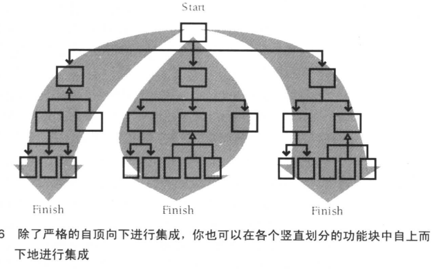


**自底向上集成**

在自底向上的集成中，首先编写并集成位于 hierarchy 底部的类。

自底向上集成采用一次一个地添加底层类的方式（而不是一次添加全部底层类），因此它是一种增量集成策略。

最初你需要编写 test driver （驱动测试的类）来演练这些底层类，随着开发的进行，将开发出的类添加到 test driver 脚手架中。

随着高层类的加 入，driver 类被替换为"真家伙"。图29-7展示了自底向上集成过程中类被集成的顺序。


自底向上的集成只具有增量集成的一部分优点：

1. 它能将错误的可能来源限制在正在被集成的那一个类上。
2. 可以在项目的早期就开始集成。
3. 能及早地发现可能存在问题的系统接口。

缺点：

1. 它将重要的高层系统接口的集成留到了最后。如果系统在高级层面设计有问题，要很后面才发现。

自底向上集成要求你在集成开始之前，已经完成整个系统的设计工作。否则会从下往上影响设计。

纯粹的自底向上集成也很罕见，取而代之的是某种混合式方法：

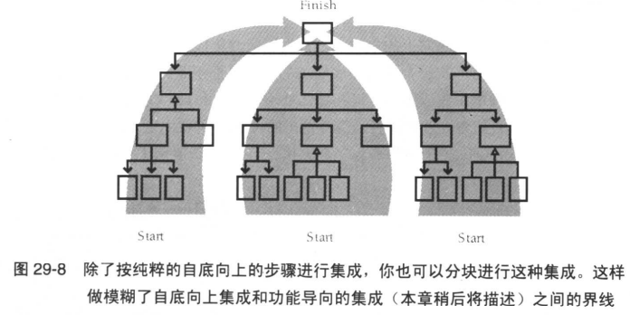


**三明治集成**

鉴于上面两种集成方式的缺陷，发明了这种三明治集成，也就是先集成继承系统顶部的高层业务对象类，再集成底部与设备接口的类和各种工具类。稍后开始集成中间层的类。


**风险导向的集成**

也被称为“困难部件优先集成法”。它和三明治集成一样，先集成顶部和底部，再集成中间层，不过动机不一样。

一般而言，系统顶层（关乎设计）和底层（关乎系统调用）的类的风险都较大，所以优先集成这两部分。如果中间部分有风险较大的类，也要优先集成


**功能导向的集成**

另一种方法是一次集成一个功能。如果单个功能需要多个类配合实现，那一次集成进去的也就是多个类。

通常要先搭好一个骨架，选择骨架的标准是它能够支撑起其他的功能。


功能导向的集成的优点：

1. 它基本上不需要脚手架（底层的程序库类除外）
2. 每个新集成的功能都增加了系统的功能性
3. 功能导向的集成与面向对象设计能很好地协同工作。因为对象通常能很好地映射功能。


**T 型集合**

它希望解决自顶向下和自底向上集成的问题。在这种方法中，它选一个竖直块，对它及早开发和集成，在这个过程中应该能发现全部问题。

也就是挑一个涉及面很广的功能从头到尾实现一下。


**集成方法小结**

上面的各种方法都只是一种启发，没必要严格遵守步骤一步步来，要根据自己的项目做选择和调整。


### 29.4 Daily Build与冒烟测试

无论用哪种集成策略，Daily Build与冒烟测试都是软件集成的好方法。也就是每天按最新的环境打个包，做下简单的测试。

这一简单的过程有若干重大的优点：

- 它降低了低质量的风险。由于每天测试，可以保持项目状态良好
- 便于诊断缺陷。新发现的缺陷一般是最近的修改引入，由于每天测试，新缺陷会发现得更快
- 它能提高士气。
- 它会使一些工作浮出水面。

以下是Daily Build的一些详情：

- **每日构建。**

  每天打包。

- **检查失败的build。**

  软件不可能，则认为是失败的build，需要查找原因。成功的build的标准：

  ① 成功地编译所有文件、库和组件。

  ② 成功地链接所有文件、库和组件。 

  ③ 不包含任何使程序无法启动、或者操作起来完全靠运气的致命bug，也就是能通过冒烟测试

- **每天进行冒烟测试。**

  每天打包是为了测试

- **让冒烟测试与时俱进。**

  集成的功能越多，测试用例要补充

- **将Daily Build和冒烟测试自动化。**

  节省人力

- **成立build小组。**

  找人专门负责这件事

- **仅当有意义时，才将修订写入build中。**

  我的理解是要写完一部分可供测试的代码再上传？

- **......但是别等太久才将修订写入build。**

  不要攒着代码到一个时间一次上传，不然每日构建找缺陷就没意义了

- **要求开发人员在将他的修改添加到系统前，先做冒烟测试。**

  基本要求 

- **为即将添加到build的代码准备一块暂存区。**

  先在暂存区验证，验证没问题再上传代码

- **惩罚破坏build的人。**

- **在早上发布build。**

- **即使有压力，也要进行Daily Build和冒烟测试。**


**哪些项目能用daily build过程**

作者的意思是再大的项目都能使用，因为虽然麻烦，但很有用


**持续集成**

希望代码每天都能集成一次，但短暂的暂停也是可以的（比如做较大的修改期间）


## 第30章：编程工具

现代编程工具能帮助我们减少构建的时间。使用最前沿的工具集--并熟悉你所使用的工具，能使生产力提升50%还不止。

本章只介绍构建的工具，且不会指明具体品牌，只有极少数非常常用的会给出名字，因为发展很快，工具迭代很快。


### 30.1 设计工具

设计工具主要是那些“能创建设计图表”的图形化工具。设计工具时常内含于“计算机辅助软件工程”（CASE）工具中。

图形化的设计工具通常能让你用标准的图形符号来描述你的设计，包括：UML、架构方块图、继承体系图、实体关系图、类图等。

从另一个角度看，设计工具要表达的东西使用纸和笔也能画出来，但设计工具提供了更为高效的实现方式。


### 30.2 源代码工具

针对源代码的工具比针对设计的工具更丰富也更成熟。


**编辑**

**集成开发环境（IDE）**

据某些程序员的估计，他们有差不多40%的时间在编辑代码，如果真的是这样的话，花钱买最好的IDE是很好的投资。

除了基本的文字处理功能外，好的IDE还有下面这些特色：

- 在编辑器中进行编译和错误检测。

- 与源代码控制工具、build工具、测试工具、除错工具集成。

- 显示程序的扼要视图或者大纲视图（只显示类名称或者逻辑结构，不显示内容，也称为“代码折叠”）。

- 跳转到类的定义、子程序定义、变量定义处。

- 跳转到使用某个类、子程序、变量的全部位置。

- 针对特定语言的格式编排。

- 针对正在编辑的语言的交互式帮助。（建议、自动补全？）

- 花括号匹配。

- 常用语言的结构模板（例如，编辑器在程序员输入for后，自动填完for循环的结构）。snippet功能

- 智能缩进。

- 自动化的代码转换或重构。

- 可以用熟悉的编程语言进行宏编程。

- 列出要查找的字符串，使常用的字符串无需重新键入。

- 在查找和替换时可以使用正则表达式。

- 在一组文件中进行查找和替换。

- 同时编辑多个文件。

- 双列式的diff对比。

- 多级编辑动作撤销。

  

**针对多个文件的字符串查找和替换**

可以使用工具配合正则表达式进行匹配查找。`grep`是一个广泛使用的搜索工具，使用`grep`查找数字的命令如下：

```shell
grep "\[*[0-9]+ *\]" *.cpp
```

[正则表达式在线测试 | 菜鸟工具 (jyshare.com)](https://www.jyshare.com/front-end/854/)

批量替换常用在重命名全局变量、子程序名等的时候，常用的能处理多个文件的字符串替换工具有Perl、AWK、sed。


**diff工具**

比较两个文件的差异。


**Merge（合并）工具**

对于同时允许多个人修改的文件而言，在上传的时候合并多人的修改使用到的工具。现在很多的工具能自动执行简单的合并，仅在遇到冲突的时候会向用户问询。


**源代码美化器**

格式美化工具，常用于处理陈年老代码。


**生成接口文档的工具**

有些工具能从源代码文件中提取详细的接口文档。源文件的代码中事先放入类似@tag的标记需要提取问文档的文字。Javadoc是此类工具的杰出代表。


**模板**

snippet功能，可以节省时间。


**交叉引用工具**

交叉引用工具能列出所有变量和子程序，以及使用这些子程序的所有位置。常放在web页面上


**类的继承体系生成器**

类的继承体系生成器能提供关于继承树的信息。


**分析代码质量**

本类工具对代码做静态检测，评定其质量。


**吹毛求疵的语法/语义检查器**

会检查一些编译器检查不出来的错误。比如下面的，虽然语法上没错，但很可能是错误的写法

```c++
if(i = 1)
```

像这样的工具有Lint、Coverity


**尺度报告器**

某些工具能分析你的代码,并报告其质量。

例如,可以用这类工具检查和报 告各个子程序的复杂度, 这样你能对最复杂的子程序(s)进行额外的复审、测试或者重新设计。

某些工具统计代码行、数据声明行、注释行、空行的行数,它既可 以对整个程序进行统计,也能对各个子程序进行统计。它能跟踪程序的缺陷,并 能找出是谁制造了这些缺陷、改正缺陷需要哪些改动、谁进行的改正等。它能统计对软件的修改,并找出改动最频繁的子程序。

据报道,复杂性分析工具在系统 维护的生产率方面有大约 20%的正面效应(Jones 2000)。


**重构源代码**

有一些工具可以帮助你把源代码从一种格式转化为另一种格式。


**重构器**

如果你希望把一段代码变成新的子程序（析出函数），只需要在重构器中选中这部分代码，输入新的程序名、调整参数列表中的参数顺序就行。

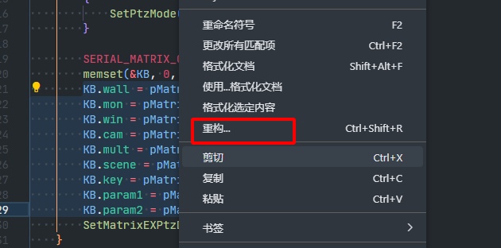


**结构改组工具**

结构改组工具将一堆结构不合适的语法（比如goto）转化成结构更合适的语法。

工具执行的效果要看原先代码的逻辑，如果原先代码的逻辑就很糟，使用工具的效果也会不好，但还是能给手动修改做参考。


**代码翻译器**

从一种程序语言直接转换成另一种语言。好处是方便，不好的是如果你原先的代码就很差，翻译过去就会是一堆充满错误的陌生代码😅


**Version  Control**

- 版本控制软件，进行：
  源代码控制。
- 依赖关系控制，类似于UNIX下的make
- 项目文档的版本管理
- 将项目的工件（需求、代码、测试用例等）关联到一起


**数据字典**

数据字典是描述项目中所有重要数据的数据库。比如用于防止命名冲突等


### 30.3 可执行码工具

针对可执行代码的工具与针对源代码的工具一样丰富。


**产生目标码**

本节描述生成目标码的工具


**编译器和链接器**

编译生成可执行码的工具，链接将编译生成的文件和它们依赖的标准代码进行链接。


**Build工具**

C/C++中的make


**程序库**

各种依赖库或者开源库，直接提供想要的功能，下面这些领域已经有高质量的程序库了：

- 容器类。
- 信用卡交易服务（电子商务服务）。
- 跨平台的开发工具。（你可以让编写的程序运行在各个系统上）
- 数据压缩工具。
- 数据结构与算法。
- 数据库操作工具和数据文件操作工具。
- 图解/图示/图标工具。
- 图像工具。
- 许可证管理器。
- 数学运算。
- 网络与互联网通信工具。
- 报表生成器与报表查询生成器。
- 安全与加密工具。
- 电子表格和数据网格工具。
- 文本和拼写工具。
- 语音、电话和传真工具。


**代码生成向导**

一些工具可以直接生成代码，虽然生成的代码基本上质量都不行。


**安装**

许多厂商都提供创建安装程序的工具。这些工具通常能创建磁盘安装程序、 CD 安装程序、DVD 安装程序以及 Web 安装程序。它能检查目标机器上有无常用的库文件、进行版本检查等。


**预处理器**

使用宏分割代码，使一部分暂时不用的代码无效


**调试**

下列工具有助于程序调试：

- 编译器的警告信息
- 测试用的脚手架
- Diff工具
- 执行剖测器
- 追踪监视器
- 交互式调试器 - 软件版和硬件版


**测试**

下列功能特性和工具有助于你进行有效的测试

- 自动化测试框架
- 自动化的测试生成器
- 测试用例的记录和回放工具
- 覆盖率监视器
- 符号调试器
- 系统扰动器（内存扩充、内存抖动、选择性的内存失效工具、内存访问检查器）
- diff工具
- 脚手架
- 缺陷注入工具
- 缺陷跟踪软件


**代码调整**

下列工具能帮助你调整自己的代码：

**执行剖测器**

执行并观察运行中的代码，查看每条语句执行的次数和耗时，找出热点并优化。


**汇编代码和反汇编**

基本可以不考虑。但是可以知道你的语言翻译成的机器语言效率如何。


### 30.4 工具向导的环境

像UNIX提供了很多工具：grep、diff、sort、make、crypt、tar、line、ctags、sed、awk、vi等


### 30.5 打造自己的编程工具

公司自研的工具往往更能符合自身的各种需求。


**项目特有的工具**

大多数中型和大型项目需要独特的项目专用工具。比如，你可能需要有生成 特定种类的测试数据的工具，以此验证数据文件的质量，或者仿真尚未到位的硬件。


**脚本**

脚本是一种能自动执行重复性杂物的工具。


### 30.6 工具幻境

工具越来越多，都希望能“消除编程”，但是最终都没实现。因为编程说到底还是有难度的。
