# 物理内存和虚拟内存

我们常说的内存容量，比方说我的笔记本电脑内存就是8GB，其实指的是**物理内存**。

物理内存也称为主存，大多数计算机用的主存都是动态随机访问内存（DRAM）。**只有内核才可以直接访问物理内存。**

那么，应用程序怎么访问物理内存呢？

linux内核给每个进程都提供了一个独立的虚拟地址空间，并且这个地址空间是连续的。这样，进程就可以很方便地访问内存，更确切地说是访问虚拟内存。

虚拟地址空间的内部又被分为**内核空间**和**用户空间**两部分，不同字长（也就是单个CPU指令可以处理数据的最大长度）的处理器，地址空间的范围也不同。

比如最常见的32位和64位系统。如下所示：

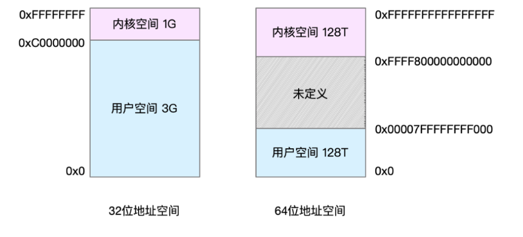

32位系统的内核空间占用1G，位于最高处，剩下的3G是用户空间。

而64位系统的内核空间和用户空间都是128T，分别占据整个内存空间的最高和最低处，剩下的中间部分是未定义的。

用户空间主要用于运行用户程序，而内核空间则负责操作系统的核心功能和硬件管理。

问：操作系统只有一个，为什么它上面的每个进程都有自己的内核空间？

答：多个进程的内核空间通常指向相同的物理内存区域。这是因为操作系统的内核代码和数据结构是共享的，它们对于系统中的所有进程来说都是相同的。这意味着，无论有多少个进程，它们在执行系统调用或者需要内核服务时，都会访问相同的内核代码和数据结构。

问：既然每个进程都有这么一个大的地址空间，几个进程不就把物理内存耗尽了吗？

答：并不是所有的虚拟内存都会分配物理内存，只有那些实际使用的虚拟内存才分配物理内存，并且分配后的物理内存，是通过**内存映射**来管理的。

# 内存映射

内存映射，其实就是将虚拟内存地址映射到物理内存地址。为了完成内存映射，内核为每个进程都维护了一张页表，记录虚拟地址与物理地址的映射关系。

如下图所示：

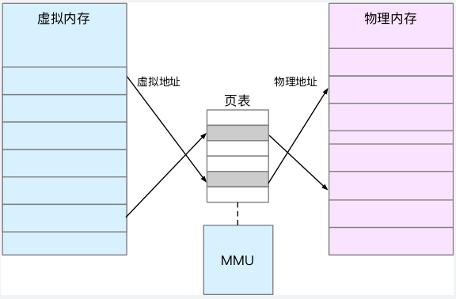

页表存放在CPU的MMU（硬件，内存管理单元Memory Management Unit）中。MMU能找到虚拟地址对应的物理地址，已查询过的页表对应关系会保存到它的高速缓存TBL（Translation Lookaside Buffer）中。

由于进程的虚拟地址空间是独立的，而TLB的访问速度又比MMU快的多，所以，通过减少进程的上下文切换（进程间切换），减少TLB的刷新次数，就可以提高TLB缓存的使用率，进而提高cpu的内存访问性能。

当进程访问的虚拟地址在页表中查不到时，系统会产生一个**缺页异常**，进入内核空间分配物理内存，更新进程页表，最后再返回用户空间，恢复进程的运行。MMU并不以字节为单位来管理内存，而是规定了一个内存映射的最小单位，也就是页，通常是4KB大小（或4K的整数倍）。这样，每一次内存映射，都需要关联4KB或者4KB整数倍的内存空间。

但是如果单页只有4K，那么32位的虚拟内存，4G就需要100万页（4G/4K），这么多页，怎么查找呢？

答：linux提供了两种机制：多级页表和大页（HugePage）

linux用的是四级页表来管理内存页，虚拟地址被分成5分部分，前4个表项用于选择页，而最后一个索引表示页内偏移。

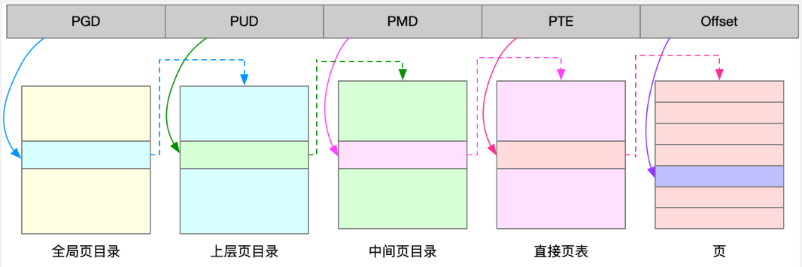

大页，顾名思义，就是比普通页更大的内存块，常见的大小有2MB和1GB，大页通常用在使用大量内存的进程上，比如Oracle，DPDK等

# 虚拟内存介绍

虚拟内存空间分布


**只读段**：包括代码和常量（为了保证不会因为堆栈溢出被覆盖，放在堆栈区下面）

**数据段**：包括全局变量、静态变量。又可以根据是否初始化、是否可修改细分。

```c++
int a;
const int b = 2;
int c = 0;
```

**堆**：包括动态分配的内存

**文件映射**：包括动态库、共享内存等

**栈**：包括局部变量和函数调用的上下文等，栈的大小固定（申请时指定），一般是8M

在这5个内存段中，堆和文件映射的内存是动态分配的。比如说，使用C标准库的malloc()或者mmap()，就可以分别在堆和文件映射动态**分配内存**

# 内存分配与回收

malloc()是C标准库的内存分配函数，对应到系统调用上，有两种实现方式，即brk()和mmap()。

对小块内存（小于128k），C标准库使用brk()来分配，也就是通过调用移动堆顶的位置来分配内存。这些内存**释放后并不会立刻归还系统**，而是被缓存起来，这样就可以重复使用。下图中的cached就是缓存中的内存大小。

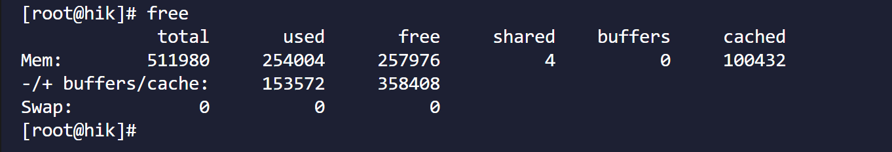

而大块内存（大于128k），则直接使用内存映射mmap（）来分配，也就是在文件映射段找一块空闲内存分配出去。而mmap()方式分配的内存，**会在释放时直接归还系统**。

从上面的描述可以看到，当这两种调用发生后，其实并没有真正分配内存。这些内存，都只在首次访问时才分配，也就是通过缺页异常进入内核中，再由内核来分配内存。

- **brk()方式：**

  优点：可以减少缺页异常的发生，提高内存访问效率

  缺点：由于这些内存没有归还系统，在内存工作繁忙时，频繁的内存分配和释放会造成**内存碎片**。
- **mmap()方式：**

  优点： 使用于大内存申请

  缺点：mmap()方式分配的内存，会在释放时直接归还系统，所以每次mmap都会发生缺页异常。在内存工作繁忙时，频繁的内存分配都导致大量的缺页异常，	   使内核的管理负担增大。

当然，系统也不会任由某个进程用完所有内存。在发现内存紧张时，系统就会通过一系列机制来回收内存，比如下面这三种方式：

- **回收缓存：**比如使用LRU(Least Recently Used)算法，回收最近使用最少的内存页面；
- **回收不常访问的内存：**把不常用的内存通过交换分区直接写到磁盘中；

  回收不常用访问的内存时，会用到交换分区（以下简称swap）。swap其实就是把一块磁盘空到当成内存来用。

  它可以把进程暂时不用的数据存储到磁盘中（这个过程称为换出），当进程访问这些内存时，再从磁盘读取这些数据到内存中（这个过程称为换入）

  

  可以通过 `cat /proc/swaps`查看开启交换分区的设备信息
- **杀死进程：**内存紧张时系统还会通过**OOM（Out of Memory）**，直接杀掉占用大量内存的进程。

让我们看下top命令的输出


与内存相关，我们主要看的是下面几项：

**VSZ**（Virtual Memory Size）：是进程虚拟内存的大小，只要是进程申请过的内存，即便还没有真正分配物理内存，也会计算在内。

**VSZ%**：本任务占用的虚拟内存占总内存（也就是free中的total）的百分比

# 内存管理

## 数据类型

不同的数据类型占用的内存大小不同，下表单位为字节

| **bool** | **char** | **short** | **int** | **long** | **float** | **double** |
| -------------- | -------------- | --------------- | ------------- | -------------- | --------------- | ---------------- |
| 1              | 1              | 2               | 4             | 4              | 4               | 8                |

所以在不同的数据类型之间做强制转换要考虑内存截断的问题

```c++
//这种情况下还不会出错
short S = 67;
char ch = S ;
cout<<"ch:"<<ch<<endl;

输出：ch:c
```

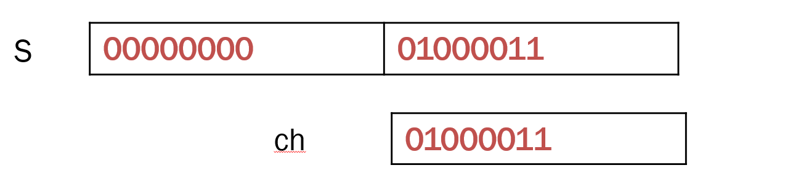

```c++
//下面的情况由于内存截断导致错误
int i= 2^23+2^21+2^14+2^2+2^1+2^0;
short S= i ;
cout<<“S:"<<S<<endl;

输出：S:16391
S=𝟐^𝟏𝟒+𝟐^𝟐+𝟐^𝟏+𝟐^𝟎
```


## 内存对齐

结构体需要考虑内存对齐的问题，对齐规则如下：

1. **首地址对齐**：结构体变量的首地址是其最长基本类型成员的整数倍。
2. **成员对齐**：结构体中每个成员相对于结构体首地址的偏移量（offset）都是成员大小的整数倍，如有需要编译器会在成员之间加上填充字节（internal adding）。
3. **结构体总大小对齐**：结构体的总大小为结构体最宽**基本类型**成员大小的整数倍，如有需要，编译器会在最末一个成员之后加上填充字节（trailing padding）。

```c++
typedef struct
{
    int num;
    char m;
    short denom;
}pi;
```

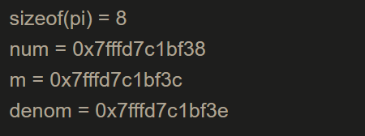

| int            | int           | int             | int             |
| -------------- | ------------- | --------------- | --------------- |
| **char** | **---** | **short** | **short** |

```c++
typedef struct
{
    char* name;
    char suid[8];
    int  numunit;
}student;
```


| char*          | char *         | char *         | char *         | char *         | char *         | char *         | char *         |
| -------------- | -------------- | -------------- | -------------- | -------------- | -------------- | -------------- | -------------- |
| **char** | **char** | **char** | **char** | **char** | **char** | **char** | **char** |
| **int**  | **int**  | **int**  | **int**  | **---**  | **---**  | **---**  | **---**  |

需要注意的是，上面的结果和你运行的环境有关，因为指针在32位和64位环境下的长度不同，如果处在32位环境下，结果是这样的：


| char *         | char *         | char *         | char *         |
| -------------- | -------------- | -------------- | -------------- |
| **char** | **char** | **char** | **char** |
| **char** | **char** | **char** | **char** |
| **int**  | **int**  | **int**  | **int**  |

我们来看一下键盘代码中，结构体内存对齐（+4）的的例子。是为了应对下面的情形：

```c++
typedef struct {
    int name;
	char suid[8+1];
	int c;
}student;
```

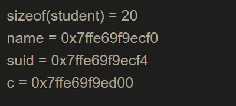

上面这样写，虽然看着是只占用了1位由于存放 `\0`，但是根据内存对齐原理，它的内存占用是这样的

| int            | int            | int            | int            |
| -------------- | -------------- | -------------- | -------------- |
| **char** | **char** | **char** | **char** |
| **char** | **char** | **char** | **char** |
| **char** | **---**  | **---**  | **---**  |
| **int**  | **int**  | **int**  | **int**  |

由于需要遵循**成员对齐**的原则，c的首地址偏移量应该是int的整数倍，所以 `suid`实际上占用了 `char suid[8+4]`的大小。

`char suid[8+4]`这样显式地展示出内存占用的实际情况，更加直观和正确，特别是在串口收发数据等对字节排布很敏感的场合。

另外，合理地使用内存对齐，也可以减小结构体的大小。

比如下面这两个结构体，虽然内容是一样的，但大小不同，这是因为 `student2`的 `a`和 `b`利用了内存对齐留下的空档：

```c++
typedef struct {
    int name;
	char suid[8+1];
	int c;
    char a;
	char b;
}student1;

sizeof(student1) = 24;
```

```c++
typedef struct {
    int name;
	char suid[8+1];
	char a;
	char b;
	int c;
}student2;

sizeof(student2) = 20;
```

## 常见问题

- **应用程序内存泄漏**
- 1. **线程泄漏**
  2. **共享内存**
  3. **堆内存泄漏**
- **文件系统内存泄漏**
- **内核占用内存泄漏**
- **内存碎片**

**系统内存查看的常用命令**

OOM-killer触发阈值 `cat /proc/sys/vm/min_free_kbytes`


**系统内存信息 `cat /proc/meminfo`**

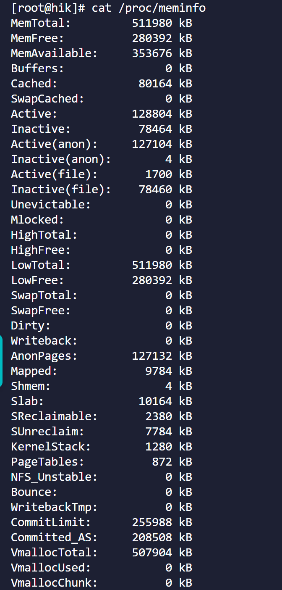

**查看文件系统目录大小** `du`


**查看共享内存** `cat proc/sysvipc/shm`

**查看内存分布状态** `echo m > /proc/sysrq-trigger`

**查看内存** `free`

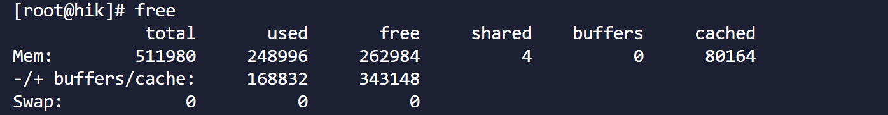

`top && top -m`

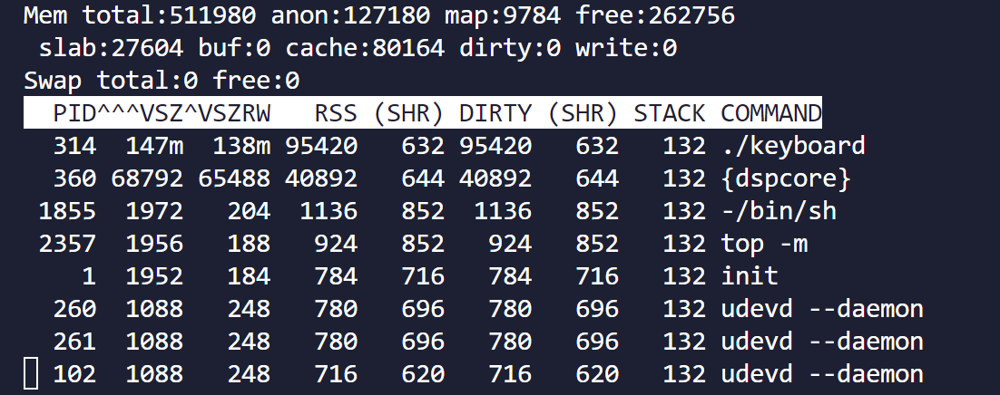

**清理页缓存和文件缓存** `echo 3 > /proc/sys/vm/drop_caches`


**查看进程内存**

```shell
cat /proc/<pid>/status
cat /proc/<pid>/statm
cat /proc/<pid>/maps
cat /proc/<pid>/smaps
```

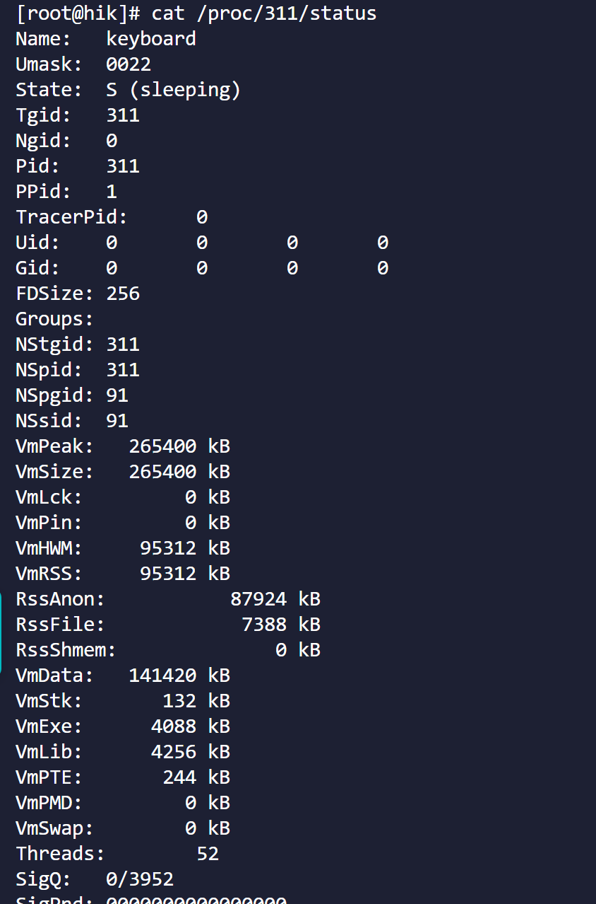

### **应用程序泄漏**

**1、先确认是不是内存逐渐减少。**可以隔段时间 `cat /proc/meminfo`查看 `MemFree`显示的剩余内存是否变少。

**2、确认是哪个进程导致的。**可以隔段时间 `cat /proc/<pid>/status`怀疑的进程查看 `VmRSS`、`VmData`字段的变化

```shell
VmSize: 进程当前使用的虚拟内存大小
VmRSS:  进程实际使用的物理内存大小
VmData: 进程的数据段大小
VmStk:  进程的栈大小
```

**3、是否是线程泄漏。**线程结束后未通过 `join`或者 `detech`回收导致，表现为进程的线程数持续增长，导致OOM或者虚拟内存不足，业务异常。
 可以通过 `cat /proc/<pid>/status`的 `Threads`字段查看

```shell
Thread: 进程中的线程数量
```

**4、是否是共享内存泄漏。**进程脱离共享内存区后，仅执行断开连接操作，但内存分区未被真正释放。表现为进程的内存（ VmRSS ）会逐渐增加，波动幅度较为明显，最终致使业务逻辑异常或设备崩溃重启。

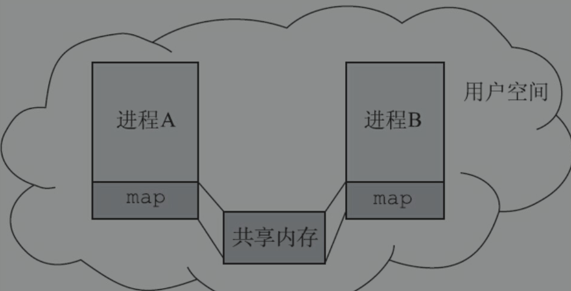

原理说明：`shmdt( )`是将共享内存从进程空间 `detach`出来，使进程中的 `shmid`无效化，但保留空间；`shmctl( )`则是删除共享内存，释放空间。

可以使用 `cat /proc/sysvipc/shm`查看当前系统中有几块共享内存，以及其大小


**5、是否是堆内存泄漏。**`malloc`申请后没有释放等导致，体现为free内存变小

有一些检测内存泄露的工具：

```shell
memleck：需要编译内核，主要查看内核的内存泄漏问题
memwatch:需要将memwatch的动态库导入键盘，需要检查的部分引用，可以查看应用层代码内存泄漏问题
mtrace:	嵌入式无法使用，除非重新编译glibc，增加对mtrace的支持
pc-lint:将源码放到指定目录后运行脚本可检测某些内存泄漏
valgrind：需要安装valgrind命令并使用次命令启动键盘程序
```

### 文件系统泄漏

**文件系统：**Linux文件系统中的文件是数据的集合，文件系统不仅包含着文件中的数据，而且还有文件系统的结构，所有linux用户和程序看到的文件、目录、软链接等都存储其中。

**原理说明：**当文件系统被映射进内存，并挂载在不同的文件夹节点中，使用该节点并写入数据时，占用的即是内存空间。

**现象及结果：**

1.随着文件数据增大，内存可用数量越来越少，最终导致oom （多出现在日志写入场景）

2.写入特殊节点如数据库节点等会导致系统业务异常

可以通过 `du`命令查看文件系统各个目录的大小变化


### 内核占用内存泄漏

**内核占用内存：**内核异常内存使用导致的内存泄漏问题。

**现象：**系统内存持续减少，但应用程序内存占用未增加

**结果：**系统内存不足物理内存不足：oom-kill

主要查看 `cat /proc/meminfo`的 `slab`字段

```shell
Slab：内核数据结构缓存
```


### 内存碎片

频繁申请\释放堆上的小块内存，频繁创建\销毁线程，这些操作都是导致内存碎片的产生

设备出现内存oom-kill内存不足，但是剩余内存大于内核设置的最小内存阈值。

所以比较一下 `free`的值和 `cat /proc/sys/vm/min_free_kbytes`的值基本上可以确定是不是内存碎片。

解决办法：

查找程序中频繁申请内存、fd、socket的地方、频繁调用system的地方（会fork进程）、频繁创建销毁线程的地方。

减少调用频率、使用线程池、内存池。
