# 安全算法

## 1、安全和算法

 数据传输中的4个问题：

**1、窃听**

A 向 B 发送的消息可能会在传输途中被 X 偷看（如右图）。这就是“窃听”。

**2、假冒**

A 以为向 B 发送了消息，然而 B 有可能是 X 冒充的；反过来，B 以为从 A 那里收到了消息，然而 A 也有可能是 X 冒充的。

**3、篡改**

即便 B 确实收到了 A 发送的消息，但也有可能像右图这样，该消息的内容在途中就被 X 更改了。

这种行为就叫作“篡改”。除了被第三者篡改外，通信故障导致的数据损坏也可能会使消息内容发生变化。

**4、事后否认**

B 从 A 那里收到了消息，但作为消息发送者的 A 可能对 B 抱有恶意，并在事后声称“这不是我发送的消息”

这种情况会导致互联网上的商业交易或合同签署无法成立。这种行为便是“事后否认”。

## 2、 解决这些问题的安全技术

对于**窃听**，我们使用 **加密** 技术。

对于**假冒**，我们使用 **消息认证码** 或者 **数字签名**

对于**篡改**，我们也使用 **消息认证码** 或者 **数字签名**

对于**事后否认**，我们使用 **数字签名**

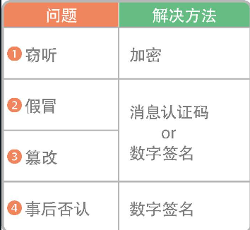

## 3、 加密的基础知识

如果数据直接在网络上传输的话，会被人抓包窃听，泄漏信息。因此我们需要给想要保密的信息加密。

发送方将数据加密后发给接收方，接收方再解密后得到原来的数据，这样就不用担心窃听了。

## 4、 哈希函数

哈希函数可以把给定的数据转换成**固定长度**的**无规律**数值。

哈希函数的特征：

1、输出的哈希数值长度不变。

即时输入相当大或者相当小的数据，输出的哈希值长度也保持不变

2、如果输入的数据相同，那么输出的哈希值也必定相同。

3、即时输入的数据相似，但哪怕只有一个比特的差别，输出的哈希值也会有很大差异

4、即时输入的两个数据完全不同，输出的哈希值也可能是相同的，这种情况概率较小，称作**哈希冲突**

5、不可能从哈希值反向推算出原本的数据

6、求哈希值的计算相对容易

**使用的算法：**

哈希函数的算法中具有代表性的是 `MD5` 、`SHA-1`  和 `SHA-2` 等。其中 `SHA-2` 是现在应用较为广泛的一个，而 `MD5` 和 `SHA-1` 存在安全隐患，不推荐使用。

**应用示例：**

将用户输入的密码保存到服务器时也需要用到哈希函数。

如果把密码直接保存到服务器，可能会被第三者窃听，因此需要算出密码的哈希值，并只存储哈希值。当用户输入密码时，先算出该输入密码的哈希值，再把它和服务器中的哈希值进行比对。这样一来，就算保存的哈希值暴露了，鉴于上文中提到的哈希函数的第五个特征（输入输出不可逆），第三者也无法得知原本的密码。

就像这样，使用哈希函数可以更安全地实现基于密码的用户认证。

## 5、 共享密钥加密（对称加密）

共享密钥加密是加密和解密都使用相同密钥的一种加密方式。由于使用的密钥相同，所以这种算法也被称为“对称加密”。

**使用的算法**

实现共享密钥加密的算法有凯撒算法、`AES`、`DES`、动态口令等，其中 `AES` 的应用最为广泛。

**存在的问题：**

上图中A需要把**密钥**和**密文**都经过网络传输给B，这样B才能解析出原文。

而攻击者同样可以通过网络拿到**密钥**和**密文**，这样的话攻击者也可以解密得到原文。

因此需要找到可以把密钥安全送出的问题，这个就是**密钥分配问题**

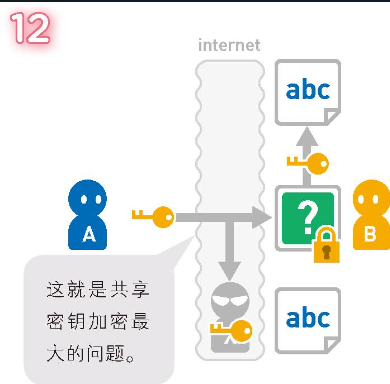

要想解决这个问题，可以使用**密钥交换协议** （后文的 迪菲 - 赫尔曼密钥交换）和**公开密钥加密**两种方法。

## 6、 公开密钥加密（非对称加密）

公开密钥加密是加密和解密使用不同密钥的一种加密方法。由于使用的密钥不同，所以这种算法也被称为“非对称加密”。

加密用的密钥叫作“公开密钥”，解密用的叫作“私有密钥”。

假设 A 准备通过互联网向 B 发送数据，需要由B生成公钥和私钥

B将公钥传给A，A拿着公钥加密数据后发给B，B拿私钥解密密文，得到原数据

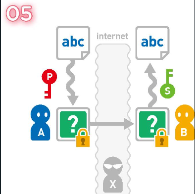

公开密钥和密文都是通过互联网传输的，因此可能会被 X 窃听。但是，使用公开密钥无法解密密文，因此 X 也无法得到原本的数据。

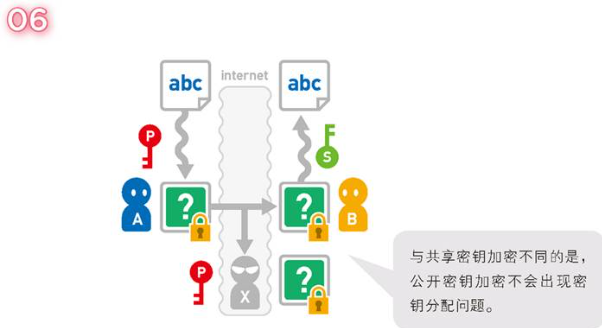

**使用的算法：**

实现公开密钥加密的算法有 `RAS` 算法、椭圆曲线加密算法等，其中使用最为广泛的是 `RSA` 算法。`RSA` 算法由其开发者 Rivest、Shamir、Adleman 的首字母命名而来，三人在 2002 年获得了图灵奖。

要想找到实现公开密钥加密的算法并不容易。考虑到加密所需的计算流程，算法必须满足如下条件。

①可以使用某个数值对数据进行加密（计算）。

②使用另一个数值对加密数据进行计算就可以让数据恢复原样。

③无法从一种密钥推算出另一种密钥。

稍微思考一下便知道，想要找到满足以上条件的算法难度有多大。所以，`RSA` 等可以实现公开密钥加密的算法的提出，对当今互联网社会的安全有着重要的意义。

**存在的问题**

不过，公开密钥加密存在公开密钥可靠性的问题。

X 想要窃听 A 发给 B 的数据，于是他也准备了公开密钥

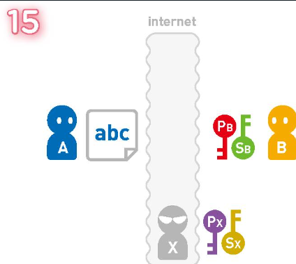

当B把公钥传给A的时候，X把公钥调包成自己的公钥

当A拿着调包后的公钥加密数据后发送给B，又被X截获

这样X就能拿自己的私钥解析出原文，然后再拿着调包得到的B的公钥加密原文，返给B，从而让A和B都无法察觉。

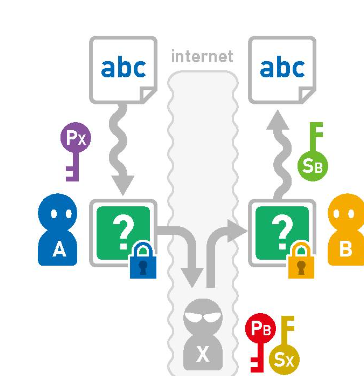

这种通过中途替换公开密钥来窃听数据的攻击方法叫作**中间人攻击（man-in-the-middle attack）**

公开密钥的可靠性会出现问题，就是因为 A 无法判断收到的公开密钥是否来自 B。要想解决这个问题，就要用到之后会讲到的**“数字证书”**。

公开密钥加密还有一个问题，那就是加密和解密都比较耗时，所以这种方法不适用于持续发送零碎数据的情况。要想解决这个问题，就要用到**“混合加密”**

## 7、 混合加密

共享密钥加密存在无法安全传输密钥的密钥分配问题，公开密钥加密又存在加密解密速度较慢的问题。结合这两种方法以实现互补的一种加密方法就是混合加密。

主要的步骤就是，使用接收方的公钥对发送方的密钥进行加密后再传输，然后接收方拿私钥解析出发送方的密钥。

假设A要向B发送数据，A先准备好密钥，B准备好公钥和私钥

然后B将公钥传给A，A拿这个公钥加密自己的密钥后传给B，B使用私钥就能解析得到A的密钥

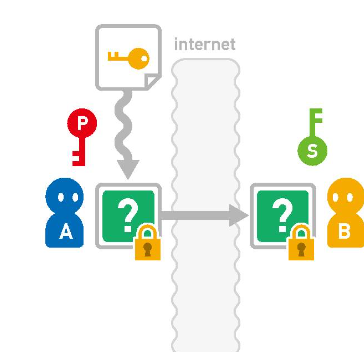

这样A就将自己的密钥安全地发给B了，后续就可以拿这个密钥发送数据了。

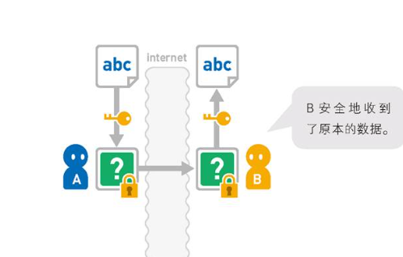

**使用的算法**

像这样，混合加密在安全性和处理速度上都有优势。能够为网络提供通信安全的 `SSL` 协议也应用了混合加密方法。

`SSL` 是 Secure Sockets Layer（安全套接层）的简写，该协议经过版本升级后，现在已正式命名为 `TLS`（Transport Layer Security，传输层安全）。

但是，`SSL` 这个名字在人们心中已经根深蒂固，因此该协议现在也常被称为 `SSL` 协议或者 `SSL / TLS` 协议。

## 8、 迪菲 - 赫尔曼密钥交换

和混合加密一样，迪菲 - 赫尔曼密钥交换也能够实现密钥的安全传输。

这种方法通过将双方共有的秘密数值隐藏在公开数值相关的运算中，来实现双方之间密钥的安全交换。

假设有一种方法可以合成两个密钥。使用这种方法来合成密钥 P 和密钥 S，就会得到由这两个密钥的成分所构成的密钥 P-S。

这种算法有3个特征：

① 即使持有密钥 P 和合成的密钥 P-S，也无法把密钥 S 单独取出来。

② 不管是怎样合成而来的密钥，都可以把它作为新的元素，继续与别的密钥进行合成。

比如上图中的这个例子，使用密钥 P 和密钥 P-S，还能合成出新的密钥 P-P-S。

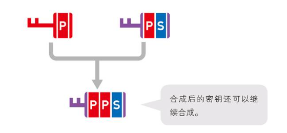

③ 密钥的合成结果与合成顺序无关，只与用了哪些密钥有关。

假设A和B之间要传递信息，有1个不需要加密传输的密钥和2个需要加密传输的私钥

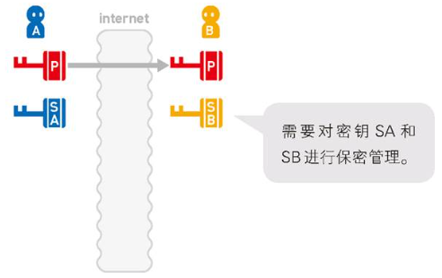

可以在共享密钥后，拿密钥分别和自己的私钥结合得到新的密钥

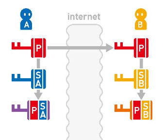

然后将各自得到的新密钥分享给对方后，再将自己的私钥和对方给的新密钥结合，得到最新的密钥

于是 A 和 B 都得到了密钥 P-SA-SB。这个密钥将作为“加密密钥”和“解密密钥”来使用。

由于网络上只能截获到P、P-SA、P-SB，而这三个无法组合得到P-SA-SB，所以也就得不到最终的密钥了。

## 9、消息认证码

密文的内容在传输过程中可能会被篡改，这会导致解密后的内容发生变化，从而产生误会。消息认证码就是可以预防这种情况发生的机制。

假设A给B发消息，虽然通过上面的方法确保了密钥是安全的，信息不会泄漏。

但是攻击者还是能篡改密文，使接收方收到的信息出错，而接收方还不知道(长句子可能能看出来，短句子就很难了)。

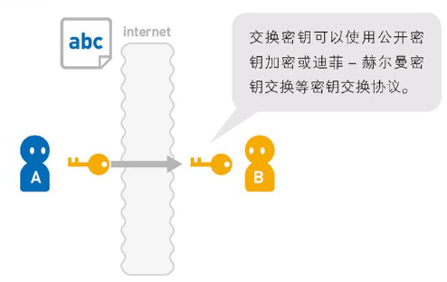

那怎么让B知道消息被篡改了呢？可以使用**消息认证码**

主要的逻辑就是A在传输密文前，拿密钥和密文算出一个值，这个值就是**消息认证码**，简称**MAC（Message Authentication Code）**

然后A把密文和MAC都发给B，B拿着密文和密钥也算出一个值，拿这个值和MAC比较，只有一致才认为密文未被篡改。

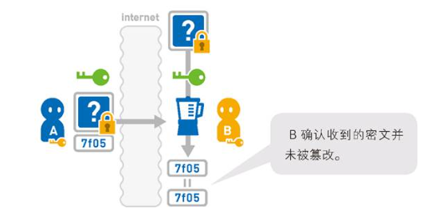

所以当密文被篡改后，B计算得到的值和传来的MAC不一致，B就能知道密文被篡改了，从而要求A再发一次

**使用的算法**

我们可以把 MAC 想象成是由密钥和密文组成的字符串的“哈希值”。计算 MAC 的算法有`HMAC`、`OMAC` 、`CMAC`等。目前，`HMAC` 的应用最为广泛。

**存在的问题**

然而，这种方法也有缺点。在使用消息认证码的过程中，AB 双方都可以对消息进行加密并且算出 MAC。

也就是说，我们无法证明原本的消息是 A 生成的还是 B 生成的。

因此，假如 A 是坏人，他就可以在自己发出消息后声称“这条消息是 B 捏造的”，而否认自己的行为。

使用 MAC 时，生成的一方和检测的一方持有同样的密钥，所以不能确定 MAC 由哪方生成。这个问题可以用下一节将会讲到的**数字签名**来解决。

## 10、数字签名

数字签名不仅可以实现消息认证码的认证和检测篡改功能，还可以预防事后否认问题的发生。

由于在消息认证码中使用的是共享密钥加密（对称加密），所以持有密钥的收信人也有可能是消息的发送者，这样是无法预防事后否认行为的。

而数字签名是只有发信人才能生成的，因此使用它就可以确定谁是消息的发送者了。

大致的原理是：

在A给B发送数据前，A给消息加上数字签名。数字签名只有A能生成。

B收到数据后，只要收到的消息上有A的数字签名，就可以确认数据是A发送的。（数据拿来用，签名做证据）

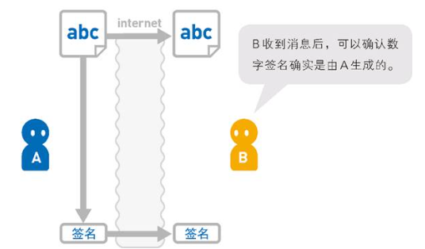

那这个数字签名是怎么生成的呢？**数字签名的生成使用的是公开密钥加密（非对称加密）**

上文中说的公开秘钥加密如下：

① 由接收方准备公钥和私钥

② 使用公钥加密，使用私钥解密

③ 任何人都可以拿公钥加密，但只有持有私钥的人能解密数据

但是，数字签名却恰恰相反。

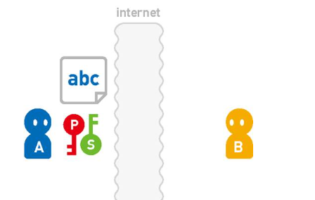

① 由发送方准备公钥和私钥，并准备一份数据。发送方将公钥发给接收方

② 发送方将数据使用**私钥加密**后，得到的加密数据就是**数字签名**

③ A将数据和**数字签名**都发给B（通过安全的方式）

④ B拿公钥解密数字签名，得到的数据如果和A发来的原始数据一致，结束。

解释：

1、由于公钥大家都有，所以谁都可以解析出原文，这里加密主要是为了引出这样的逻辑：

**能够用 A 的公开密钥解密的密文，必定是由 A 生成的。**因此，我们可以利用这个结论来确认消息的发送者是否为 A，消息是否被人篡改。

2、在公开密钥加密中，用公开密钥加密的数据都可以用私有密钥还原。而本节讲解的数字签名利用的是用私有密钥加密的数据，

用公开密钥解密后就能还原这一性质。也就是说，即使密钥的使用顺序不同，运行结果也都是一样的。

并不是所有的公开密钥加密都具有这个性质，不过 `RSA` 加密算法是可以的。

3、又由于B只有公钥，无法生成A的签名，所以也预防了“事后否认”这一问题

**存在的问题**

虽然使用数字签名后 B 会相信消息的发送者就是 A，但实际上也有可能是 X 冒充了 A。

也就是说，你怎么确认发给你公钥的真的是A呢？

其根本原因在于使用公开密钥加密无法确定公开密钥的制作者是谁。收到的公开密钥上也没有任何制作者的信息。

因此，公开密钥有可能是由某个冒充 A 的人生成的。

使用下一节将要讲到的**数字证书**就能解决这个问题。

## 11、数字证书

“公开密钥加密”和“数字签名”无法保证公开密钥确实来自信息的发送者。因此，就算公开密钥被第三者恶意替换，接收方也不会注意到。

不过，如果使用本节讲解的数字证书，就能保证公开密钥的正确性。

主要的思路是：

1、找第三方机构，用自己的邮箱向它发送认证请求，由第三方机构用它的私钥生成一个签名，将签名、个人信息、发送方公钥打包成数字证书文件

2、将数字证书文件发给接收方，接收方也找那个第三方，要到它的公钥，解析证书文件中的签名，看是不是里面存的的确是发送方的信息。

3、签名中存的信息正确的话，就可以确认证书中的公钥是发送方的。

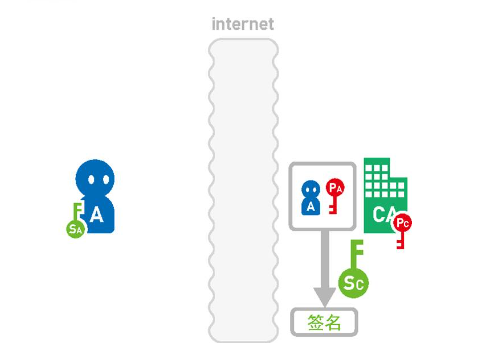

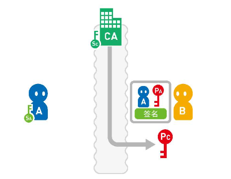

假设 X 为了假冒 A，准备在认证中心登记自己的公开密钥。然而 X 无法使用 A 的邮箱地址，因此无法获得 A 的证书。

