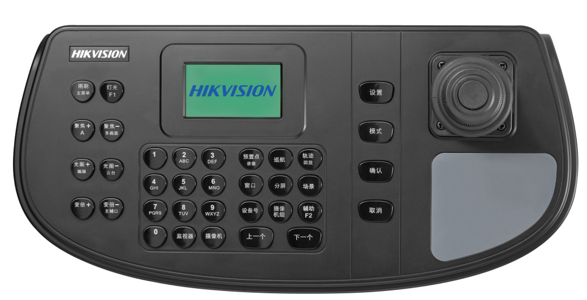
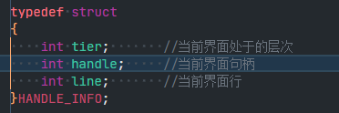
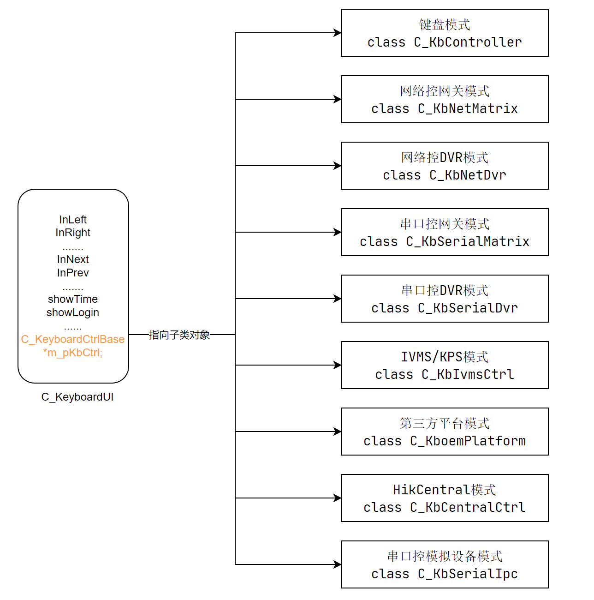
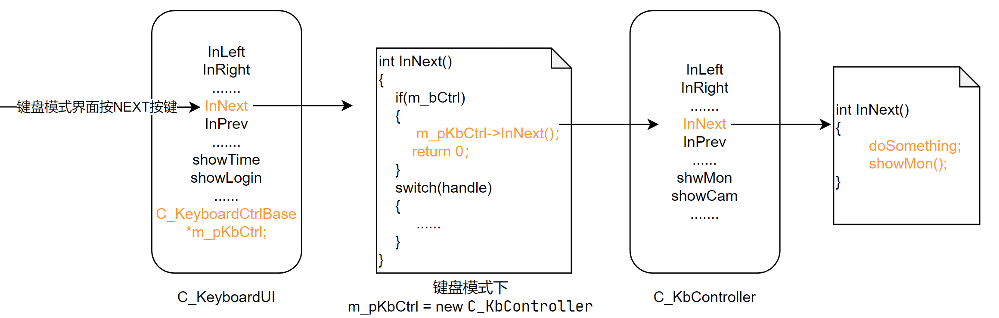
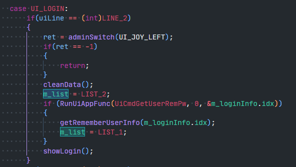

# 1200K UI重构说明

## 界面说明

1200K的正面照如下，界面显示在屏幕上，接收按键、摇杆消息做出相应反应。

1200K的界面按功能分为配置界面和控制界面。

**配置界面**：激活、登录以及配置各项参数的界面，共27个

**控制界面**：使用键盘网络、串口控制解码器、球机、NVR等设备的操作界面，共11个

## 原UI实现方式

原先的UI实现方式大致如下：

### 1、在`C_KeyboardUI`类中创建链表

仅针对配置界面，打开新界面时增加节点，退出界面时删除节点。每个节点储存的信息如下：

### 2、使用`C_KeyboardUI`类实现配置界面

执行步骤如下：

1. `C_KeyboardUI`的对象接收各种按键、摇杆消息
2. 根据链表最新节点的`handle`得知当前处于什么界面
3. 执行对应的按键、摇杆处理函数，绘制或刷新对应界面

### 3、使用`C_KeyboardCtrlBase`指针实现控制界面

`C_KeyboardUI`中存在一个`C_KeyboardCtrlBase`指针，`C_KeyboardCtrlBase`是一个控制模式的基类，每个控制模式派生出一个子类。

执行步骤如下：

1. `C_KeyboardUI`的对象接收各种按键、摇杆消息
2. 查询当前处于配置模式还是控制界面
3. 如果处于控制界面，调用对应子类对象的相应函数
4. 执行对应的按键、摇杆处理函数，绘制或刷新对应界面

## 原UI实现方式存在的问题

由于所有配置界面都在`C_KeyboardUI`类对象实现，存在如下问题：

**界面的实现相互影响**

由于所有配置界面均使用`C_KeyboardUI`类对象实现，因此它们共用`C_KeyboardUI`类的成员数据。

比如`uiLine`表示当前光标所在行，这个变量被基本上所有界面使用。

当A界面使用完数据后没有做好善后工作，可能会影响到下一个使用到该数据的B界面。

之前开发过程中遇到过几次修改A界面导致B界面出错的情况，不方便维护。

**界面变量限制**

比如登录界面无法为“记住密码”功能单独建一个变量，因为这样的话27个界面的变量就会非常多。

当前的解决方案是27个界面共同使用一个名称中性的变量`m_list`用以表示各种意义。

**代码不便阅读**

`C_KeyboardUI`类实现了27个界面，导致实现的源文件很庞大（1万余行），有些函数长达千余行。

想要查找一个界面的完整实现，需要从中整理出这个界面相关的代码，也由于上面讲到的变量限制，不方便阅读。

**界面实现方式不统一**

由上文可知，配置界面和控制界面的实现方式不统一，需要额外的阅读成本。

## UI重构思路

借鉴原UI实现中控制界面的实现方式，使用基类指针和子类对象的方式实现每个界面，**每个界面均创建一个子类对象**。

保留原有的界面链表，链表节点变为基类指针，指向子类的对象。基类对象仅用于提供工具函数和界面间共享的变量。

 

在进入界面时执行添加节点操作，并new子类对象。退出界面时执行删除节点操作，并delete掉子类对象。

链表用于决定将按键、摇杆消息发送给哪个子类对象，按上图的链表而言，下图最终执行的就是`uiCheckPwd`的`InNext`函数。

## UI重构后带来的优化

**界面相互独立，便于维护**

为每个界面都创建了子类并单独实现，避免了不同界面的实现相互影响。

**界面实现更加灵活**

解除了界面创建变量个数、变量命名的限制，实现界面更加灵活。

**增加了代码可读性和统一性**

将1万余行的配置界面实现源文件拆分成了20余个单独的源文件，更方便查找单个界面的全部实现。

统一了配置界面和控制界面的实现方式，降低阅读成本。

