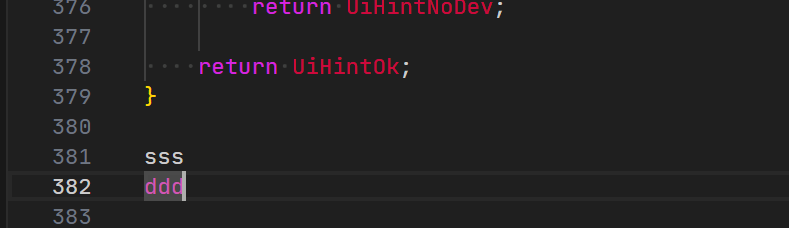
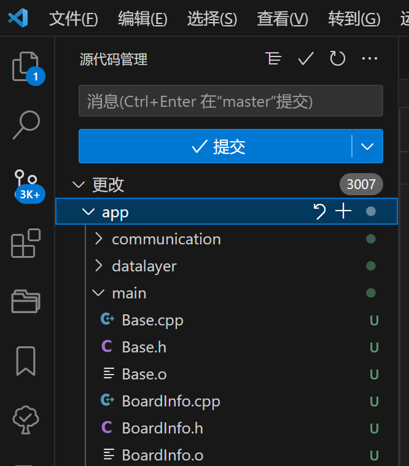

# VS CODE使用git管理代码

## 背景

本来是一直使用source insight看代码的，后来接触了VS CODE，被它丰富的插件和更顺眼的配色吸引，但是VS CODE缺少很多source insight上的功能（应该只是我不知道怎么配置）。比如source insight上可以一眼看出当前文件哪些部分是修改了的，哪些是修改了还没保存的。


绿色的表示修改了并且已经保存了的，黄色的表示修改了但还没有保存的，其他的表示未做修改的部分。

但是VS CODE 的界面就没有这种提示:



381、382行分别是我修改后保存和修改后未保存的，并没有任何提示能看出来这个信息。

研究了下，这个需要使用到VS CODE的git代码管理功能，写个文档记录下过程。

## 新建仓库

首先你得安装git并登录你的账号，这个就不赘述了。用VS CODE 打开工程后会看到下面的选项：


由于没有初始化git仓库，因此无法进行代码管理，也就无法知道代码到底有没有做过修改，可以直接点击“初始化仓库”创建一个git的代码仓库。



创建后可以看到多出了3007个更改，因为是初始化，所以所有文件都算修改，这个时候你可以直接在“消息”框中输入

你的上传说明并按“提交”进行上传。

但是，我们看到main文件下有类似Base.o这样的编译中间文件，我们不想把它上传到代码仓库，要怎么屏蔽呢？

## 屏蔽不想上传的文件/文件夹

#### .gitignore

现在工程下新建一个.gitignore文件，内容如下：

```
*.o
*.d
.git/
.vscode/
```

这个表示屏蔽后缀为.o .d和文件夹.git .vscode的内容，不上传

我们可能在开发的时候可能一时没有注意添加忽略文件配置（gitignore），把这些文件推送到远程仓库中，我们有以下两种做法解决：

1、把本地这些文件删除再提交到远端（前提是这些文件是环境变量文件，假如是无法自动生成的不推荐）。

2、使用以下git 命令：

```
//当我们需要删除暂存区或分支上的文件, 但本地又需要使用, 只是不希望这个文件被版本控制, 可以使用
git rm -r --cached file_path（文件路径）  //把file_path文件在当前分支的暂存区中删除
git add .                               //提交当前操作本地暂存区
git commit -m 'delete remote somefile'  //提交到本地git仓库
git push
```


刷新后可以看到更新的个数变少了, .o文件也不再出现在更改文件目录中了。

在消息框中输入上传说明后按提交，就将代码提交到仓库了。

## 效果


现在340和341分别是修改后保存了和修改后未保存的，可以看到左边有了绿色的标记

但是还是无法区分保存和未保存，这个的确没source insight做的好。
