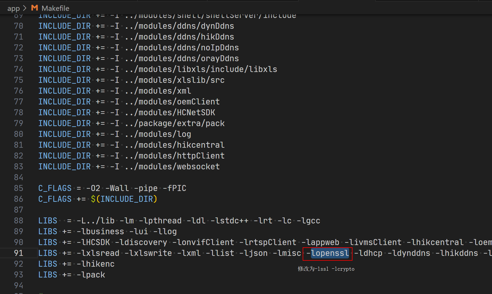
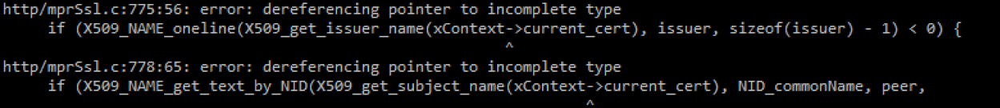
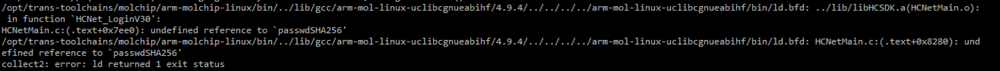
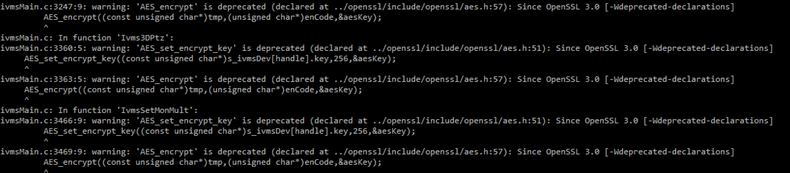

# 更新openSSL

## 编译

1、下载

[Tags · openssl/openssl (github.com)](https://github.com/openssl/openssl/tags)

从上述链接下载最新版本的openssl版本，本文下载的是openssl-3.1.2

2、环境准备

将下载的压缩包放到编译环境下解压后进入目录：

`tar -zxvf openssl-3.1.2.tar.gz `

`cd openssl-3.1.2`

3、配置

输入下文，配置交叉编译工具链、输出目录、裁减功能

`./config no-asm no-async linux-elf no-aria no-seed no-sm4 no-chacha no-rc2 no-rc4 no-rc5 no-md2 no-md4 no-poly1305 no-blake2 no-siphash no-sm3 no-dsa no-sm2 no-dso no-ssl no-mdc2 no-ripemd no-bf no-cast no-engine no-err no-comp no-ocsp no-idea no-camellia no-cms no-ts no-srp no-ec no-cmac no-ct -DOPENSSL_NO_ERR -DOPENSSL_NO_HW --cross-compile-prefix=arm-mol-linux-uclibcgnueabihf-`

其中--cross-compile-prefix指定了交叉编译工具链，请进行替换。

然后再输入下面的命令进行编译，将在当前目录下生成静态库等成果物。

`make -j`

## 替换

1、将当前文件夹下的libcrypto.a和libssl.a拷贝到代码的lib目录下，键盘代码原先只生成一个libopenssl.a，此处要把它删除。

2、将openssl-3.1.2目录下的include目录拷贝到代码的modules/openssl目录，替换掉其下的同名目录，并删除include下的非.h文件。

3、makefile修改：①将modules的makefile文件中的openssl相关语句删除 ②修改app中对openssl库的链接，从-lopenssl改为-lssl -lcrypto

4、在代码最外层执行make -j，就生成了使用openssl 3.0的应用程序。

## 遇到的问题

1、编译报错1：

这个是因为openssl升级后头文件位置变动导致的，只要在http/mprssl.h中加入下面的语句即可：

`#include    <crypto/x509.h>`

2、编译报错2

passwdSHA256不是openssl的函数，是键盘应用层实现的一个函数，写在了openssl源码的sha256.c中。

由于直接覆盖了openssl 3.0的代码，此函数的实现也就被抹掉了。

考虑到后期直接使用openssl的库文件而不保存其代码，还是将passwdSHA256的实现挪到应用层比较合适。

最终将passwdSHA256的实现从sha256.c搬到modules/misc/misc.c下面

3、编译警告

这个警告是由于openssl 3.0做了很多改动，弃用了很多接口，如果你还在程序中调用被弃用的接口的话，openssl库会给出这样的警告。

用于敦促使用者尽快更新成openssl 3.0推荐的替换函数。此处我们可以不管。
